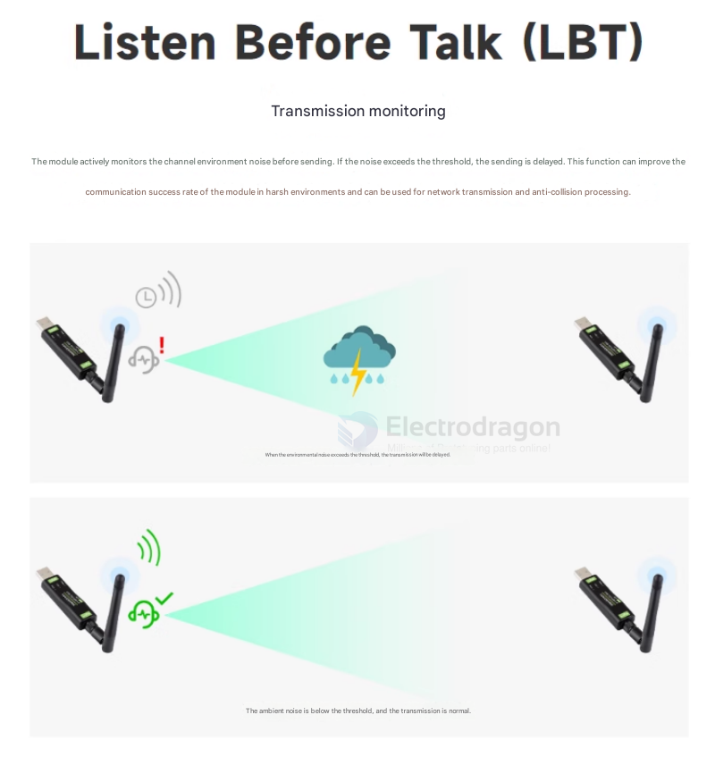

# lora-dat

- [[lora-hdk-dat]] - [[Lora-SDK-dat]]

legacy wiki page
- https://w.electrodragon.com/w/Lora_Tech
- https://www.electrodragon.com/w/Category:Wireless

AIT lora
- https://w.electrodragon.com/w/AIT_LORA_MOD

- [[lorawan-dat]]

- [[samtech-dat]]

## Info 

- LoRa is the physical layer or in simple words is the modulation, the modem or radio, the hardware.
- [[LoRaWAN-dat]] is the network protocol or architecture that works on LoRa.

### Lora 

LoRa ™ is a long-range radio technology "Lo ng- Ra nge" its main features:

- Its spread spectrum modulation allows a significantly greater scope to other technologies.
- High sensitivity (-168dB) combined with high immunity to interference.
- Low Consumption (up to 10 years with a battery, good depends on certain characteristics).
- Low data transfer (up to 255 bytes).

- [[networking-dat]] - [[encryption-dat]]

[[Semtech-dat]] LoRa is a long-range, low-power wireless platform for IoT, generally referring to RF chips using LoRa technology. Its main features are as follows:

LoRa (short for "long range") uses spread spectrum modulation technology derived from Chirp Spread Spectrum (CSS). It is a type of long-distance wireless transmission and LPWAN communication technology. Spread spectrum technology trades bandwidth for sensitivity; Wi-Fi, ZigBee, and others also use spread spectrum, but LoRa modulation is close to the Shannon limit, maximizing sensitivity. 

Compared to traditional [[FSK-dat]] technology, **at the same data rate, LoRa is 8~12dBm more sensitive than FSK**. 

Currently, LoRa mainly operates in the sub-GHz ISM band.

LoRa technology integrates digital spread spectrum, digital signal processing, and forward error correction coding, greatly improving long-distance communication performance. 

LoRa’s link budget is superior to any other standardized communication technology. Link budget refers to the main factor determining distance in a given environment.

The main LoRa RF chips are the SX127X series, SX126X series, and SX130X series. The SX127X and SX126X series are used for LoRa nodes, while the SX130X is used for LoRa gateways. For details, refer to Semtech’s product list.

### Lora Tech 

- [[RSSI-dat]]

#### LBT 

The module actively monitors channel environmental noise before transmitting. If the noise exceeds a threshold, transmission is delayed. 

This feature improves communication success in harsh environments and can be used for networking and collision avoidance.

## Board 

- [[arduino-dat]] == [[DVA1007-dat]] - [[DVA1008-dat]] - [[loraduino-dat]] 

- [[DAS1069-dat]]

- [[MPC1056-dat]]

## Module 

### EE1 - common series 
[[NWL1071-dat]] - [[NWL1072-dat]] 

### classic
HPD Series - [[NWL1074-dat]] - [[NWL1075-dat]] - [[NWL1077-dat]]

### high power lora series 
- [[EE2-dat]] - [[NWL1078-dat]] - [[NWL1081-dat]] - [[NWL1079-dat]]
- antenna connection type = 内孔 = internal hole

## Chip 

- [[semtech-dat]]

- [[ASR6500-dat]] - [[ASR-dat]]

- [[crystal-dat]]

## lora power and tranmission 

| dbm    | mW   | range (km) | range (miles) |
| ------ | ---- | ---------- | ------------- |
| 30 dbm | 5000 | 10         | 6.2           |
| 22 dbm | 500  | 5          | 3.1           |

## lora APP 

- USB + Lora = [[Lora-USB-dat]]
- [[loraduino-dat]]

LoRa devices and networks (such as LoRaWAN) enable smart IoT applications to help address major global challenges like energy management, depletion of natural resources, pollution control, infrastructure efficiency, and disaster prevention. Semtech’s LoRa devices have achieved hundreds of successful application cases in smart cities, homes and buildings, communities, metering, supply chain and logistics, agriculture, and more. LoRa networks now cover hundreds of millions of devices in over 100 countries/regions, aiming to create a smarter planet.

## lora frequency 

| Version | Frequency Range | Applicable Regions       |
| ------- | --------------- | ------------------------ |
| HF      | 850~930 MHz     | Europe, America, Oceania |
| LF      | 410~510 MHz     | Asia, Europe             |

## common configuration 

| Parameter Name           | Default Value     | Optional Values / Range                        |
| ------------------------ | ----------------- | ---------------------------------------------- |
| Spreading Factor         | 7                 | 7~12                                           |
| Bandwidth                | 0: 125KHz         | 1: 250KHz, 2: 500KHz                           |
| Coding Rate              | 4/5               | 4/5, 4/6, 4/7, 4/8                             |
| Transmit Power           | 22dBm             | 10~22dBm                                       |
| Network ID               | 0                 | 0~255                                          |
| LBT (Listen Before Talk) | 0: Disabled       | 1: Enabled                                     |
| **Working Mode**         | 1: Stream Mode    | 2: Packet Mode, 3: Relay Mode                  |
| **TX Channel (HF)**      | 18 (868MHz)       | 0~80 (850~930MHz or 410~490MHz)                |
| **TX Channel (LF)**      | 23 (433MHz)       | 0~80 (850~930MHz or 410~490MHz)                |
| **RX Channel (HF)**      | 18 (868MHz)       | 0~80 (850~930MHz or 410~490MHz)                |
| **RX Channel (LF)**      | 23 (433MHz)       | 0~80 (850~930MHz or 410~490MHz)                |
| **Address**              | 0                 | 0~65535 (65535 is broadcast listening address) |
| Interface Selection      | 3: RS232          | 1: RS422, 2: RS485, 3: RS232                   |
| Interface Baud Rate      | 115200bps         | 1200~115200bps                                 |
| Interface Parity         | None              | None, Odd, Even                                |
| Key                      | 0 (No encryption) | 0~65535                                        |

## museum module 

- [[RFM92-dat]]

## ref

- [[DTU-dat]]

- [[meshtastic-dat]] - [[opensource-dat]] 

https://randomnerdtutorials.com/esp32-lora-rfm95-transceiver-arduino-ide/

- [[RFM95-dat]]

- [[crystal-dat]]

- [[frequency-dat]]

- [[lora]]

