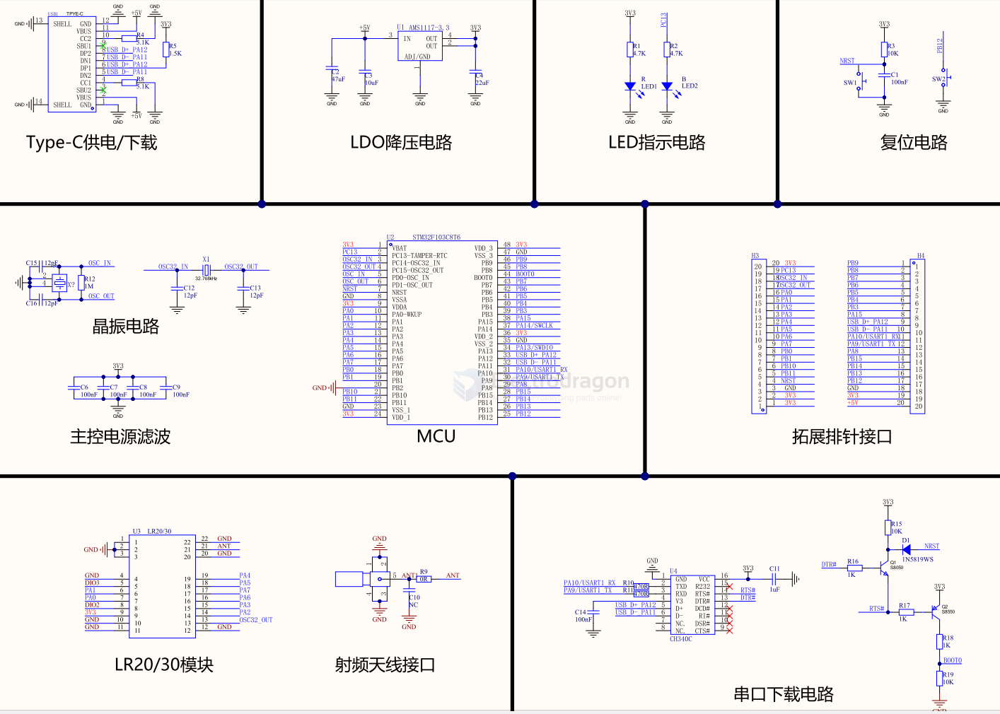
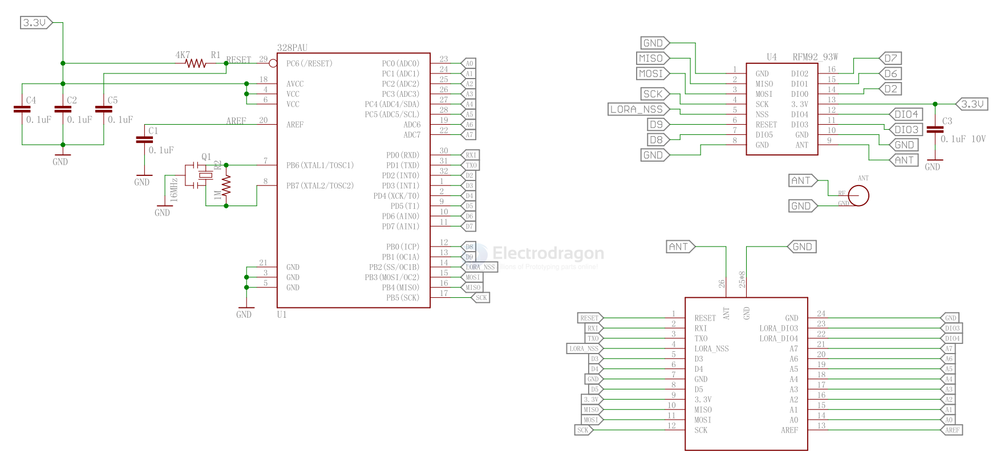
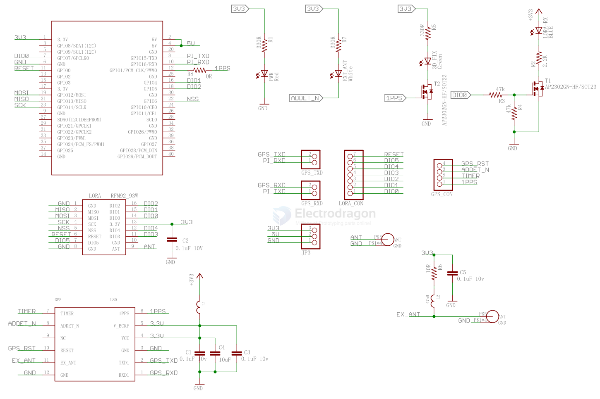

# lora-hdk-dat

- [[lora-SDK-dat]]

- [[LNA-dat]]

## Dev board SCH 

## 2025 [[SX1262-dat]] with [[STM32-dat]] - [[STM32-HDK-dat]]

- [[STM32-HDK-dat]]

- [[auto-serial-dat]]

def in UserConfig.h

    //spi
    #define LCC68_NSS_PORT   GPIOA
    #define LCC68_NSS_PIN    GPIO_PIN_4

    #define LCC68_SCK_PORT   GPIOA
    #define LCC68_SCK_PIN    GPIO_PIN_5

    #define LCC68_MOSI_PORT  GPIOA
    #define LCC68_MOSI_PIN   GPIO_PIN_7

    #define LCC68_MISO_PORT  GPIOA
    #define LCC68_MISO_PIN   GPIO_PIN_6

    #define LCC68_NRST_PORT GPIOA
    #define LCC68_NRST_PIN  GPIO_PIN_3

    #define LCC68_BUSY_PORT GPIOA
    #define LCC68_BUSY_PIN  GPIO_PIN_2

    #define LCC68_DIO1_PORT GPIOC
    #define LCC68_DIO1_PIN  GPIO_PIN_15

    #define LCC68_RXEN_PORT GPIOA
    #define LCC68_RXEN_PIN  GPIO_PIN_1

    #define LCC68_TXEN_PORT GPIOA
    #define LCC68_TXEN_PIN  GPIO_PIN_0

    //Uart
    #define LOG_UART_TX_PORT GPIOA
    #define LOG_UART_TX_PIN  GPIO_PIN_9
    #define LOG_UART_RX_PORT GPIOA
    #define LOG_UART_RX_PIN  GPIO_PIN_10

    #define LORA_FRE									915000000	// frequency
    #define LORA_PREAMBLE_LENGTH                        8        // PREAMBLE LENGTH
    #define LORA_SX126x_SYMBOL_TIMEOUT                  0         // Symbols(SX126x)
    #define LORA_FIX_LENGTH_PAYLOAD_ON                  false			// PAYLOAD FIX LENGTH
    #define LORA_IQ_INVERSION_ON                        false			// IQ INVERSION

    #define SIZE_DATA  255

## 2022 RFM92 with [[atmega328-dat]]

## RFM92 with [[RPI-dat]]

## wiring to ESP32

| Lora Module | ESP32   |
| ----------- | ------- |
| ANA         | Antenna |
| GND         | GND     |
| DIO3        | -       |
| DIO4        | -       |
| 3.3V        | 3.3V    |
| DIO0        | IO 2    |
| DIO1        | -       |
| DIO2        | -       |
| GND         | -       |
| DIO5        | -       |
| RESET       | IO 14   |
| NSS         | IO 5    |
| SCK         | IO 18   |
| MOSI        | IO 23   |
| MISO        | IO 19   |
| GND         | -       |

- based on [[ESP32-SPI-dat]]

## 

## ref 

- [[lora-dat]]