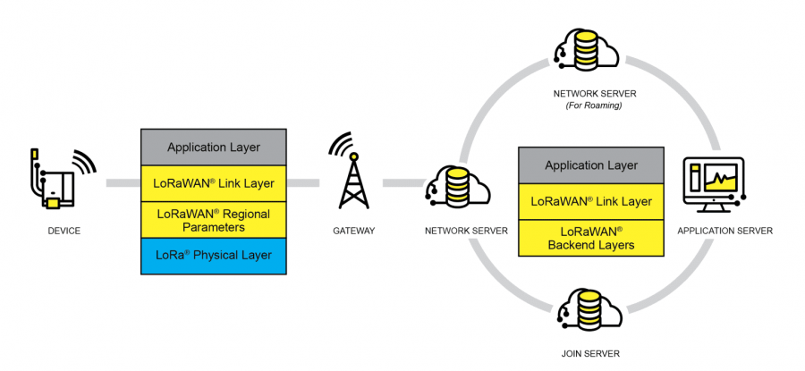

# lorawan-dat

# LoRaWAN Technology Explained

LoRaWAN (Long Range Wide Area Network) is a wireless communication technology designed for low-power devices to send small amounts of data over long distances. It is mainly used for IoT (Internet of Things) applications, like smart agriculture, smart cities, and industrial monitoring.

## Key Features

- **Long Range**: Can transmit data up to 10–15 km in rural areas and 2–5 km in cities.  
- **Low Power**: Devices can run for years on small batteries.  
- **Low Data Rate**: Best for sending small packets of data (e.g., sensor readings).  
- **License-Free Bands**: Uses unlicensed radio frequencies (e.g., 868 MHz in Europe, 915 MHz in the U.S.).  
- **Star Network Topology**: Devices communicate with gateways, which forward data to a central server.  

## Common Applications

- **Smart Agriculture**: Monitoring soil moisture, weather conditions, and livestock tracking.  
- **Smart Cities**: Managing streetlights, parking spaces, and waste collection.  
- **Industrial IoT**: Equipment monitoring, predictive maintenance, and asset tracking.  
- **Environmental Monitoring**: Tracking air quality, water levels, and weather conditions.  

LoRaWAN is widely used because of its long-range, low-power, and cost-effective connectivity for IoT devices.

What is LoRaWAN?

LoRaWAN is an open low-power wide-area network protocol built on LoRa radio modulation technology. It is designed to wirelessly connect battery-powered "things" to the Internet in regional, national, or global networks, and addresses key IoT (Internet of Things) requirements such as bidirectional communication, end-to-end security, mobility, and localization services. Nodes connect wirelessly to the Internet with network authentication, essentially establishing an encrypted communication channel between the node and the server. The protocol stack of LoRaWAN is shown in the diagram below.

- The MAC layer includes three types of node devices: Class A/B/C, which basically cover all IoT application scenarios. The main difference between them is the timing of node transmission and reception.
- The Modulation layer includes EU868, AS430, etc., indicating that different countries use different frequency band parameters. For regional parameters, please refer to the reference link.

To achieve LoRaWAN network coverage in a city or other area, four components are required: nodes (LoRa node RF chips), gateways (also called base stations, LoRa gateway RF chips), servers, and the cloud, as shown in the diagram below.

- DEVICE (node device) must first send a network join request packet to the GATEWAY (gateway), then to the server. Only after authentication can it normally send and receive application data with the server.
- GATEWAY (gateway) can communicate with the server via wired networks or 3/4/5G wireless networks.
- Main server operators include TTN, etc. For self-hosted cloud services, please refer to lorawan-stack and chirpstack.

## ref 

- [[lora-dat]]