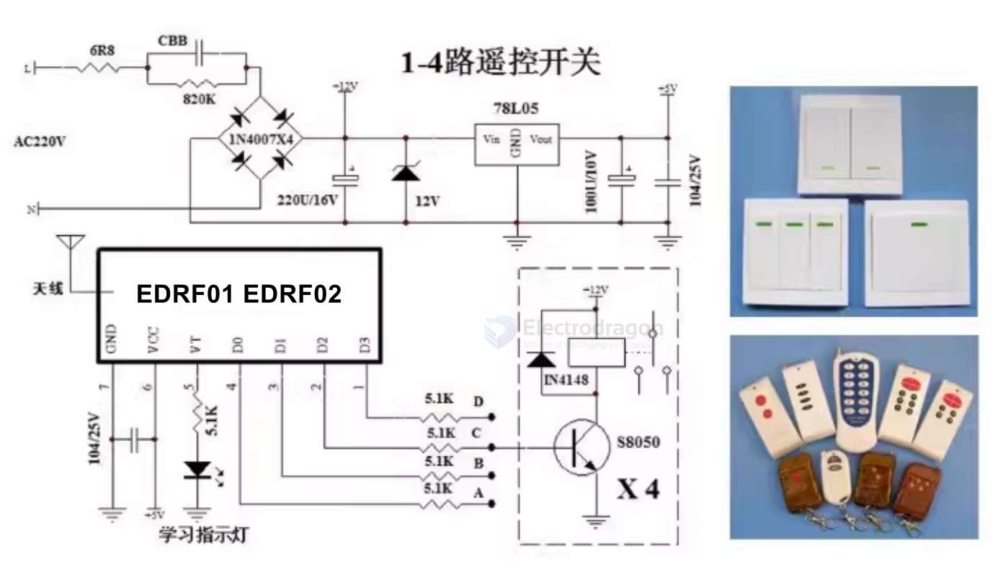
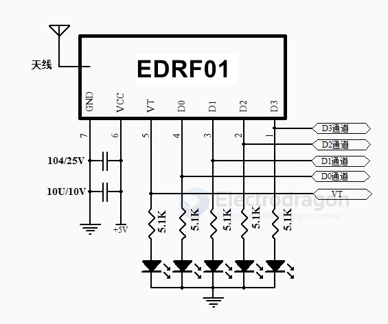

# RF-LINK-dat 

- [more info please find at legacy wiki page](https://w.electrodragon.com/w/Category:RF-Link)

[legacy wiki page 2](https://www.electrodragon.com/w/Category:Wireless)

## products 

- [[NWL1016-dat]] - [[NWL1017-dat]]

https://www.electrodragon.com/product/433m-rf-wireless-module-a-pair-of-receiver-and-transmitter/

- [[NWL1021-dat]] - [[NWL1022-dat]]

- [[NWL1026-dat]] - [[NWL1027-dat]]

## Transmitter 

- [[NWL1007-dat]] - [[NWL1008-dat]]

### snap button 

- [[NRF1003-dat]] == https://www.electrodragon.com/product/press-button-round-rf-ask-transmitter-433mhz-w-adhesive/

## Receiver == EDRF1 and EDRF2 Decoder

- [[NWL1089-dat]] - [[NWL1068-dat]] / [[NWL1070-dat]]

## APP 

### RF-LINK relay 

[[SCU1001-dat]] == https://www.electrodragon.com/product/wireless-relay-kit-learning-code/

## tech 

Manchester encoding

- [[PT2262-dat]] - [[PT2272-dat]] - [[EV1527-dat]]

learning code 
 
fixed (welding code) code

## working mode 

### Jog (M4) Single Working Mode Description:

When the transmitter button is pressed, the corresponding channel outputs a high level. When the button is released, it returns to a low level, with a VT (valid transmission) pulse output.  
Example: If button A has been learned by channel D0, pressing button A will make channel D0 output a high level; releasing the button will return it to a low level. Other channels are not affected.

### Interlock (H4)

When a valid signal is received, the corresponding output channel toggles its state:
If it was previously high, it becomes low; if it was low, it becomes high.

### Self-lock (T4)

When a valid signal is received, the corresponding output channel turns on, and all other channels turn off. Signal indication:
When a valid signal is present, VT outputs a high level; when the valid signal disappears, VT outputs a low level.

## Common Pairing 

Pairing Method:

Press the button on the receiver board and release it when the indicator light turns on; this means it has entered learning mode. Then, press any button on the remote control to transmit. If the indicator light on the receiver board flashes, pairing is successful, and the output pins are matched accordingly. Exit learning mode.

Note:

You only need to pair one button; the other buttons will also be paired and matched to their corresponding output pins. There is no need to pair each button individually.

清码方法:

持续按住学习键,指示灯会常亮，按住不放大约8秒后指示灯熄灭，表示代码已全部清除成功。

## schematic and APP 

**Application Fields**

- Wireless remote control switches
- Wireless remote control sockets
- Wireless burglar alarms
- Wireless remote control door locks
- Wireless doorbells
- Wireless remote control electric rolling doors and windows
- Wireless LED lighting
- Industrial wireless remote control products
- Wireless data transmission
- Wireless industrial controllers
- Wireless curtain controllers
- Remote keyless entry (RKE) for cars
- Wireless gate openers

min. SCH 

## Note 

Note about distance:

If the distance required for far, can be connected to the 1/4 wavelength of the antenna, generally use 50 ohm single conductor, the length of the antenna 315M of about 23cm, 433M of about 17cm;

The position of the antenna has also affected the reception of the module, install the antenna as straight as possible away from the shield, high pressure, and interference sources;

## RF Link Pair (Learning Code) – Typical Transmission Range

These modules typically use chips like **PT2262**, **EV1527**, or **SC2262**, operating on **433 MHz or 315 MHz** ISM bands.

### ✅ Typical Transmission Range

| **Environment**                     | **Max Range**                     |
|------------------------------------|-----------------------------------|
| Indoor (with walls)                | 10–30 meters                      |
| Outdoor, line-of-sight             | 100–200 meters (typical)          |
| Enhanced with good antenna         | Up to 500 meters                  |
| Directional antenna + LNA (ideal)  | 1–2 kilometers (rare, ideal)      |
| High-power RF modules (e.g. [[LoRa-dat]])  | 5–15 kilometers (different tech)  |

### ❗ Real-World Limitations
- **Antenna quality and placement**: Crucial for maximizing range.
- **Interference**: Metal, walls, and Wi-Fi can reduce effective distance.
- **Power supply**: Low voltage or poor regulation limits performance.
- **Design purpose**: Learning code RF links are made for **short-range** control, not long-distance data transmission.

### 📌 Summary
If you're using **common learning-code RF modules**:
- **Realistic range**: 50–200 meters outdoors, 10–30 meters indoors.
- For **kilometer-level range**, consider:
  - **[[LoRa-dat]] modules** (e.g., SX1278, SX1262)
  - **High-power modules** (e.g., EBYTE E32-433T30D)
  - Use **directional antennas** or **RF amplifiers**

## chip options 

- [[SYN480-dat]] - [[SYN115-dat]]

## code

### arduino 

## demo video 

https://www.youtube.com/watch?v=LDGr38Ie1L4

## ref 

- [[RF-LINK]]