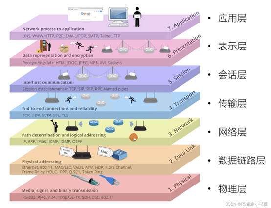

# Wifi  

## tech 

- [[IEEE-dat]] - [[WIFI-Halow-dat]]

## cheatsheet 

- AP = access point 
- STA = station 

- [[espressif-dat]] - [[esp8266-dat]] - [[ESP32-dat]] 

- [[bouffalolab-dat]] - [[BL616-dat]]

- [[realtek-dat]] - [[RTL8188-dat]]

- [[xradiotech-dat]] - [[XR829-dat]]

## boards 

- [[MPC1070-dat]]

## WPA/WPA2

## 七层网络模型：

记忆方法：“物数网传会表应”，记住这7个字，就记住了这七层

数据最终通过数据链路层+物理层传输到硬件网络，在数据链路层和物理层上的数据都是通过层层数据封装实现的。

- [[TCPIP-dat]] - [[TCPUDP-dat]]

## ref 

- [[ethernet-dat]]

- [[network-dat]]