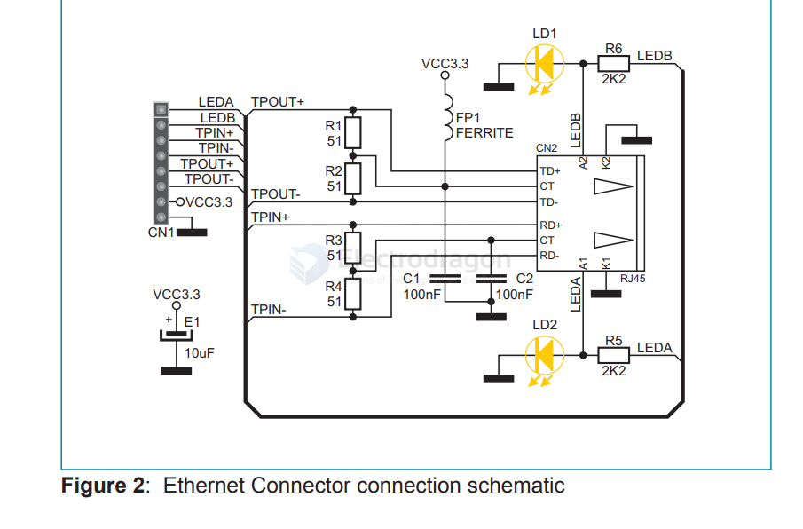
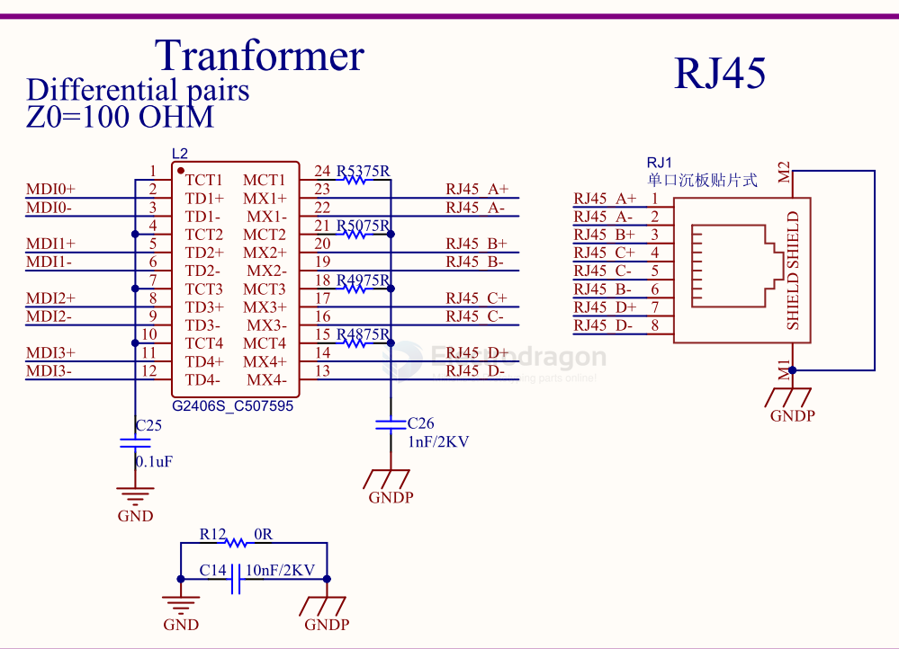

# ethernet-dat 

- [[TCPUDP-dat]]

- [[PHY-dat]]

## chip 

- [[W5500-dat]] - [[ENC28J60-dat]]

- [[LAN8720-dat]]

## RJ45 breakout board 

## SCH 

- [[RJ45-dat]]

RJ-45

HY951180A
HY931147C
HR931130A

RJ-45 w/[[CH579-dat]]

transfomer == G2406S_C507595 and RJ45

## CAT6

## ref 

- [[RGMII-dat]] - [[PHY-dat]] - [[TCPUDP-dat]] - [[TCPIP-dat]]

- [[RTL8211-dat]]

- [[ethernet]]