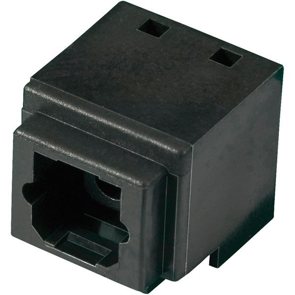

# Photolink-dat

## photo-link 

Photolink- Fiber Optic **Receiver** PLR237/T10BK 

https://www.everlighteurope.com/custom/files/datasheets/DPL-0000261.pdf

Photo-link Light **Transmitter** Unit PLT237/T10WH

https://mm.digikey.com/Volume0/opasdata/d220001/medias/docus/5335/PLT237-T10WH_Rev1_3-22-21.pdf

| Feature         | PLT131/T10WH                     | PLT237/T10WH                     |
|-----------------|----------------------------------|----------------------------------|
| **Type**        | Light Transmitter Unit           | Light Transmitter Unit           |
| **Wavelength**  | 650 nm (Typical, Red)            | 650 nm (Typical, Red)            |
| **Data Rate**   | Lower Speed (Often used for Digital Audio/TOSLINK, e.g., < 1 Mbps) | Higher Speed (Up to 16 Mbps)     |
| **Application** | Digital Audio, Low-Speed Data    | Data Communication             |
| **Package**     | Photo-link Connector             | Photo-link Connector             |
| **Manufacturer**| Everlight (Likely)               | Everlight                        |

Everlight PLT131/T1/12 Photolink Fiber Optic Transmitter 650nm

PLR135/T8

## ref 

- [[fiber-optic-dat]]