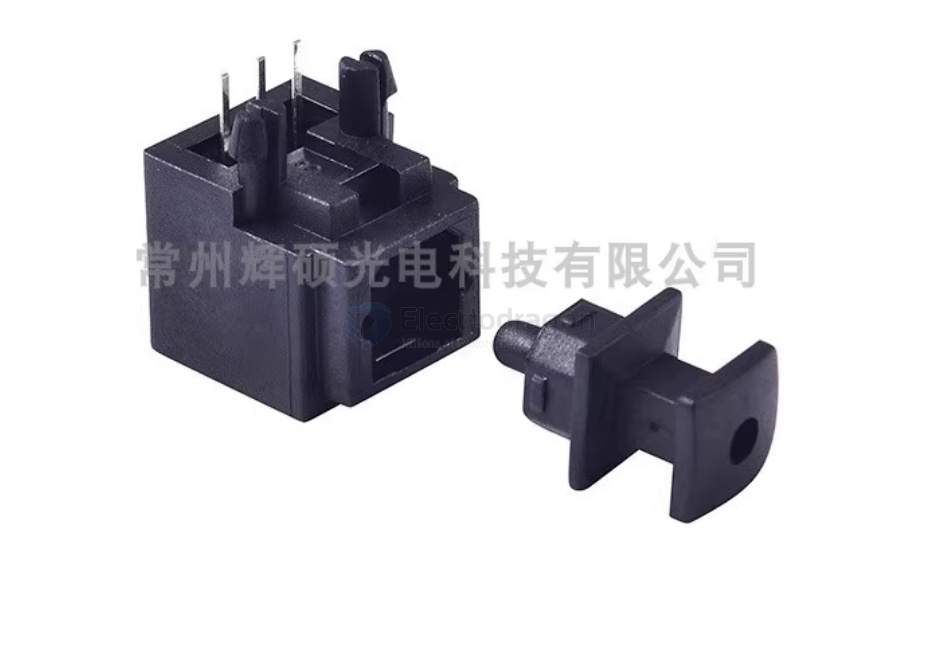
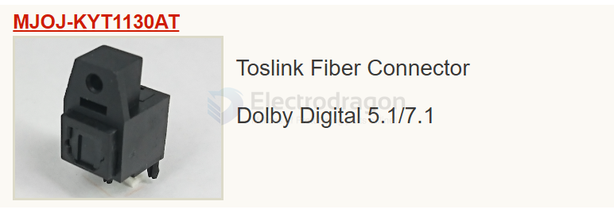
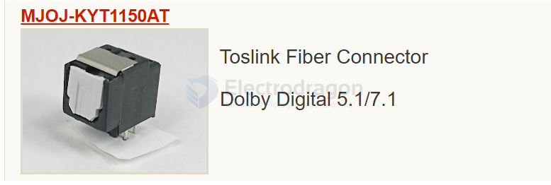
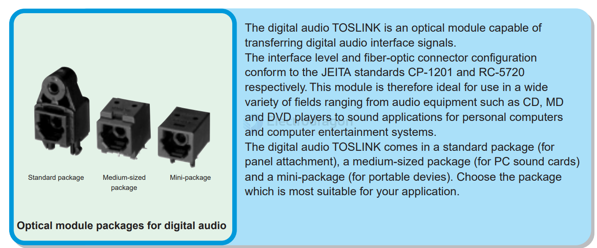
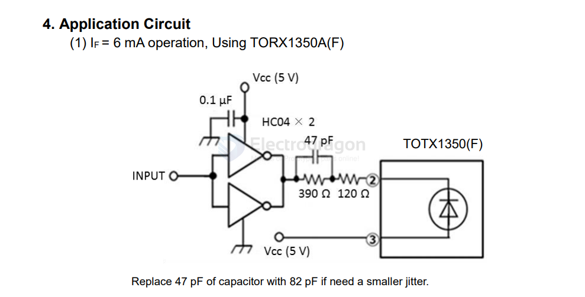
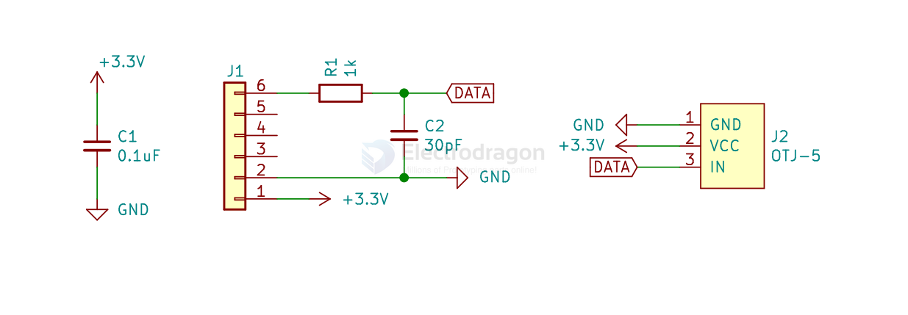
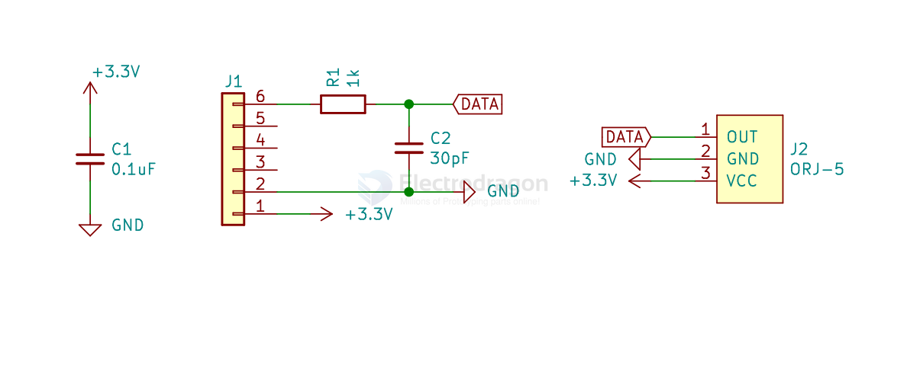

# TOSLINK-dat

- [[sharp-dat]] - [[toslink]]

- [[TOTX178-dat]]

## compare 

| Feature            | TOSLINK              | General Fiber Optic      |
| ------------------ | -------------------- | ------------------------ |
| **Purpose**        | Audio (S/PDIF)       | Data, telecom, internet  |
| **Fiber Type**     | Plastic (POF)        | Glass (SMF/MMF)          |
| **Distance**       | ~5–10 meters         | Up to kilometers         |
| **Bandwidth**      | Limited (audio only) | Very high (Gbps to Tbps) |
| **Connector Type** | Square TOSLINK       | LC, SC, ST, etc.         |
| **Wavelength**     | ~650 nm (red light)  | 850, 1310, or 1550 nm    |
| **Use Case**       | Home audio systems   | Enterprise, telecom, ISP |

in market the maximium length toslink cable is 30 meters 

## Are SPDIF and TOSLINK the Same?

- [[SPDIF-dat]]

**Short answer:**  
**TOSLINK is one type of SPDIF connection.**

---

### Detailed Explanation

| Term        | What it is                                             | Key Detail                                                                                                         |
| ----------- | ------------------------------------------------------ | ------------------------------------------------------------------------------------------------------------------ |
| **SPDIF**   | A digital audio **protocol/standard**                  | Stands for **Sony/Philips Digital Interface**. It defines **how** digital audio data is formatted and transmitted. |
| **TOSLINK** | A **type of physical connector** (using optical fiber) | Developed by Toshiba; one way of transmitting SPDIF using light (fiber optic).                                     |

---

### SPDIF Transmission Types

1. **Coaxial SPDIF** (electrical signal)
   - Connector: RCA (looks like typical video/audio jacks)
   - Uses **copper wire** (electrical signal)

2. **Optical SPDIF (TOSLINK)**
   - Connector: TOSLINK or Mini-TOSLINK
   - Uses **fiber optic cable** (light signal)

---

### Key Differences

| Feature            | Coaxial SPDIF                       | Optical SPDIF (TOSLINK)                     |
| ------------------ | ----------------------------------- | ------------------------------------------- |
| Signal Type        | Electrical (copper)                 | Optical (light)                             |
| Connector Type     | RCA                                 | TOSLINK (square) or Mini-TOSLINK (3.5mm)    |
| Susceptible to EMI | Yes                                 | No (immune to electromagnetic interference) |
| Cable Length Limit | Up to ~10m (longer with good cable) | Usually up to ~5m for reliable signal       |

---

### Summary

- **SPDIF** = the **format/protocol**
- **TOSLINK** = one **type of SPDIF connector** using optical fiber

## TOSLINK

- TOSLINK is a standardized optical fiber connection system for transmitting digital audio signals between devices.
- It uses a fiber optic cable with a plastic or glass core to carry the light signal, which represents the audio data.

https://en.wikipedia.org/wiki/TOSLINK

## TOSLINK Cable and connectors 

== [[SPDIF-dat]]

These cables and connectors are **TOSLINK optical digital audio cables** with **Mini-TOSLINK** adapters or plugs on the end.

Explanation:

**TOSLINK (Toshiba Link)** is a standardized optical fiber connection system used for transmitting digital audio signals.

The black rectangular connector with a square end is the **standard TOSLINK connector**.

The gold-tipped center pin is actually a **Mini-TOSLINK plug**, which is an optical connector in the shape and size of a standard 3.5mm headphone jack, used in some laptops and portable devices (e.g., MacBooks, MiniDisc players).

These cables are often used to **transmit high-quality audio (like Dolby Digital or DTS)** from a source like a DVD player, gaming console, or PC to an AV receiver or soundbar.

**OD: 2.2mm**

This refers to the outer diameter of the cable (2.2mm), which is relatively thin, indicating it's a lightweight optical fiber cable.

## DLT1120 fiber optic transmitter

Toslink DLT1120 fiber optic transmitter The light-emitting unit is a standard packaging product with connectors and optoelectronic components, and is packaged with LEDs and driver ICs. The function of the unit converts electrical signals into optical signals and transmits.

project [SPDIF to TOSLink Adapter Hat for Quartz64](https://github.com/CounterPillow/quartz64-toslink-hat)

## DLR 1121

## DLR 2180 

[toslink-guide](https://www.tme.eu/Document/3363e65f4c705941469014401686faf2/TOFC100-xx.pdf)

## Optical SPDIF (TOSLINK):

- Uses optical fiber (plastic or glass).
- Has a TOSLINK connector (square-ish plug).
- Carries light-based digital signals.
- Immune to electrical interference (a bonus in noisy environments).

## Why Not Use TOSLINK for Transferring 5V TTL Serial Signals?

While **TOSLINK** (optical) is a popular and widely used optical standard, especially for **consumer audio** (like SPDIF), it's **not ideally suited** for directly transferring TTL serial signals like 5V logic. Here's why **POF** (Plastic Optical Fiber) is often a better choice for serial TTL communication over **TOSLINK**:

### 🔍 Key Differences:

#### 1. Signal Type:
- **TOSLINK (SPDIF)** carries **digital audio** data, which is encoded in a **biphase-mark** format (a specific way of encoding 1s and 0s for audio).
  - It's not **raw TTL**, so you'd need a **decoder** or **receiver chip** to convert it back into useful serial data.
  - It's designed for **audio signals**, not serial communication.
- **POF (Plastic Optical Fiber)** with **TTL transceivers** is specifically designed to carry **digital data signals** such as serial UART, which is just **raw bits** (high and low voltages) transmitted directly over light.

#### 2. Electrical Compatibility:
- **TOSLINK** optical transmitters and receivers are **designed for audio** signals that operate at relatively lower frequencies (44.1kHz or 48kHz for audio sampling).
  - **TTL signals**, on the other hand, are **high-speed** and require a continuous **stream of binary data** (e.g., 115200 baud rate or higher) without the need for extra encoding schemes.
- **POF with TTL transceivers** directly handles **5V logic signals**, making it simpler and **more compatible** with serial communication.

## TOTX 

### TOTX147 

- connector-less 

### TOTX1350

## SCH? 

refer more info from [[pmod-dat]]
TX

RX

## ref 

- [[TOSlink]] - [[fiber-optic]]
 