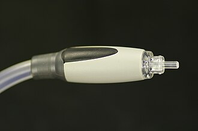
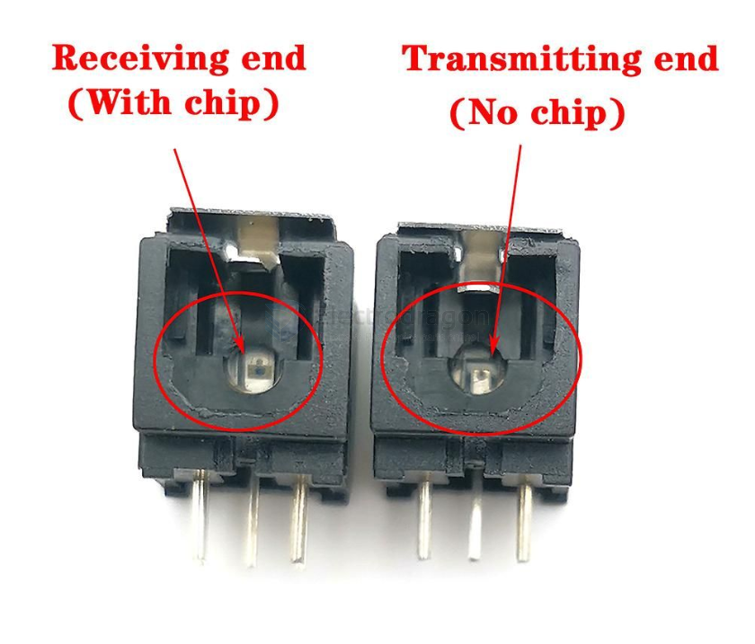
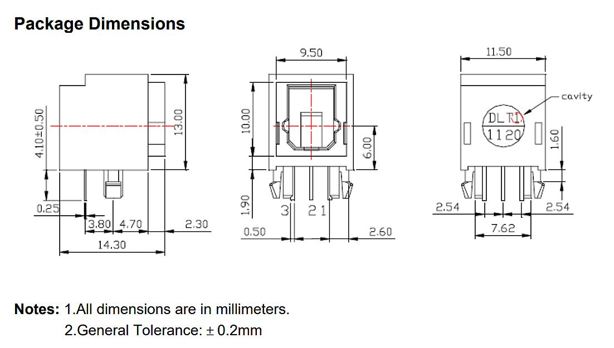

# TOSLINK-dat

## TOSLINK

- TOSLINK is a standardized optical fiber connection system for transmitting digital audio signals between devices.
- It uses a fiber optic cable with a plastic or glass core to carry the light signal, which represents the audio data.

https://en.wikipedia.org/wiki/TOSLINK

## DLT1120 fiber optic transmitter

Toslink DLT1120 fiber optic transmitter The light-emitting unit is a standard packaging product with connectors and optoelectronic components, and is packaged with LEDs and driver ICs. The function of the unit converts electrical signals into optical signals and transmits.

project [SPDIF to TOSLink Adapter Hat for Quartz64](https://github.com/CounterPillow/quartz64-toslink-hat)