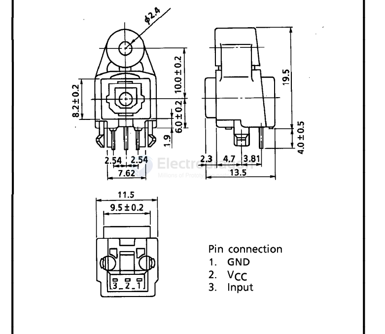

# TOSLINK-dat

## TOSLINK

- TOSLINK is a standardized optical fiber connection system for transmitting digital audio signals between devices.
- It uses a fiber optic cable with a plastic or glass core to carry the light signal, which represents the audio data.

https://en.wikipedia.org/wiki/TOSLINK

## DLT1120 fiber optic transmitter

Toslink DLT1120 fiber optic transmitter The light-emitting unit is a standard packaging product with connectors and optoelectronic components, and is packaged with LEDs and driver ICs. The function of the unit converts electrical signals into optical signals and transmits.

project [SPDIF to TOSLink Adapter Hat for Quartz64](https://github.com/CounterPillow/quartz64-toslink-hat)

## DLR 1121

## DLR 2180 

[toslink-guide](https://www.tme.eu/Document/3363e65f4c705941469014401686faf2/TOFC100-xx.pdf)

## TOTX178A

- [[totx178.pdf]]

## Optical SPDIF (TOSLINK):

- Uses optical fiber (plastic or glass).
- Has a TOSLINK connector (square-ish plug).
- Carries light-based digital signals.
- Immune to electrical interference (a bonus in noisy environments).

## Why Not Use TOSLINK for Transferring 5V TTL Serial Signals?

While **TOSLINK** (optical) is a popular and widely used optical standard, especially for **consumer audio** (like SPDIF), it's **not ideally suited** for directly transferring TTL serial signals like 5V logic. Here's why **POF** (Plastic Optical Fiber) is often a better choice for serial TTL communication over **TOSLINK**:

### 🔍 Key Differences:

#### 1. Signal Type:
- **TOSLINK (SPDIF)** carries **digital audio** data, which is encoded in a **biphase-mark** format (a specific way of encoding 1s and 0s for audio).
  - It's not **raw TTL**, so you'd need a **decoder** or **receiver chip** to convert it back into useful serial data.
  - It's designed for **audio signals**, not serial communication.
- **POF (Plastic Optical Fiber)** with **TTL transceivers** is specifically designed to carry **digital data signals** such as serial UART, which is just **raw bits** (high and low voltages) transmitted directly over light.

#### 2. Electrical Compatibility:
- **TOSLINK** optical transmitters and receivers are **designed for audio** signals that operate at relatively lower frequencies (44.1kHz or 48kHz for audio sampling).
  - **TTL signals**, on the other hand, are **high-speed** and require a continuous **stream of binary data** (e.g., 115200 baud rate or higher) without the need for extra encoding schemes.
- **POF with TTL transceivers** directly handles **5V logic signals**, making it simpler and **more compatible** with serial communication.
