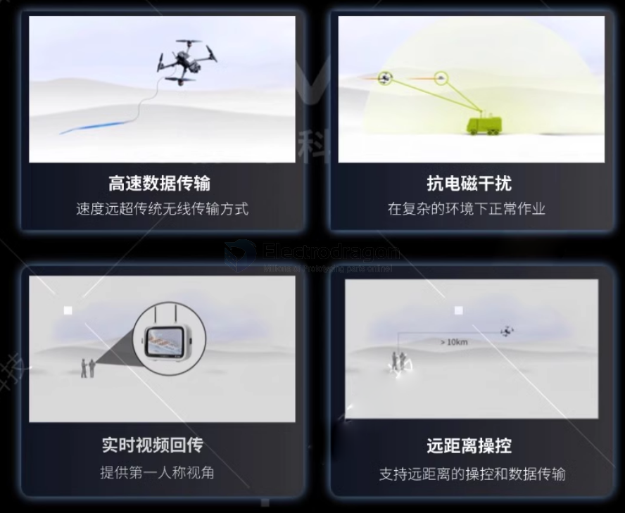
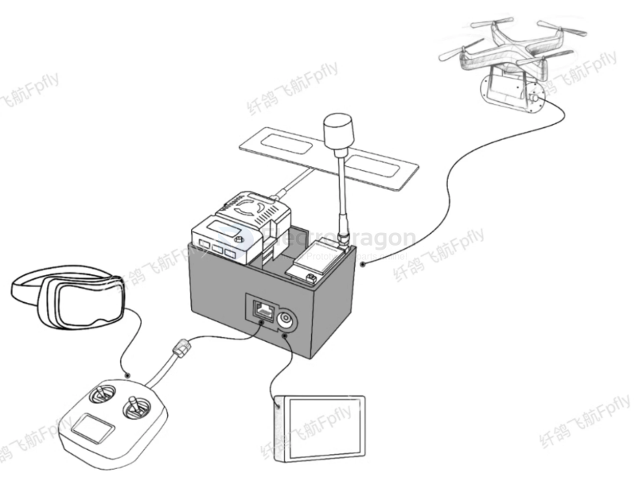
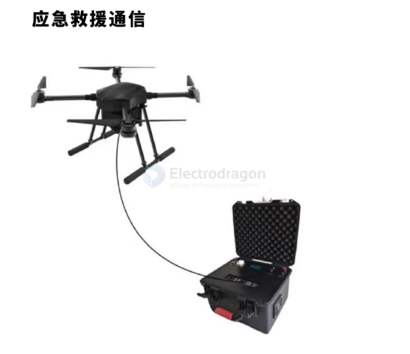
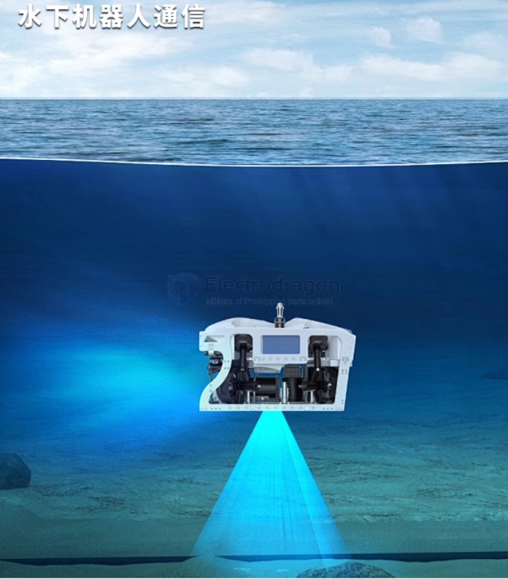
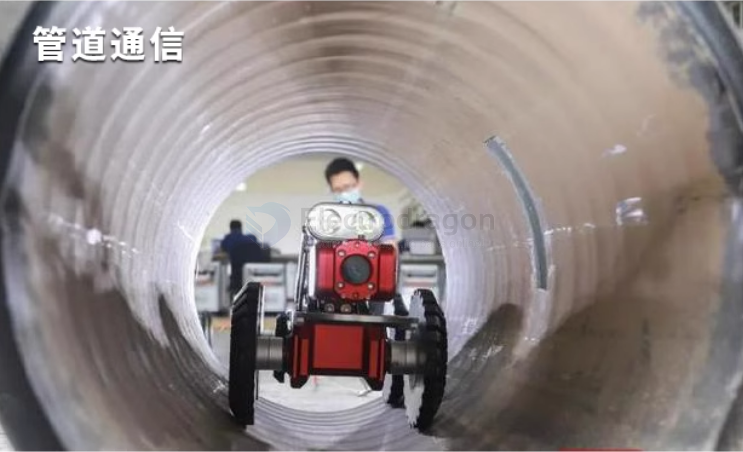

# fiber-optic-app-dat

small solutions based on [[POF-dat]]

- [[TI-audio-dat]] - [[USB-player-dat]]

[TOSLINK DAC](https://hackaday.io/project/181024-toslink-dac)

- [[fiber-optic-serial-dat]] - [[video-RC-car-dat]]

## Home networking 

[How to Run Fiber Optic Cable in Your Backyard - My 10 Gig Install for Starlink](https://www.youtube.com/watch?v=pOKZlwB-lKQ)

## Apps 

FPV remote communication

- [demo video how it works](https://www.youtube.com/shorts/GSPIDlSw020)

emergancy support 

underwater robot communication 

tube communication 

## ref 

- [[fiber-optic-dat]] - [[fiber-optic-app]]
