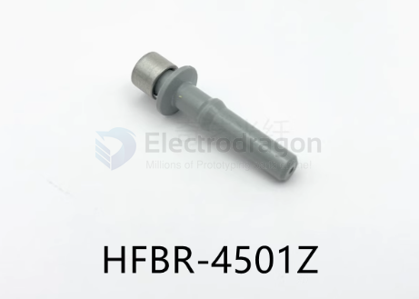
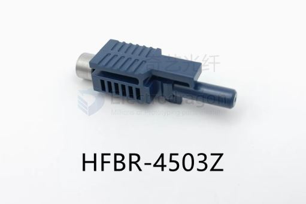
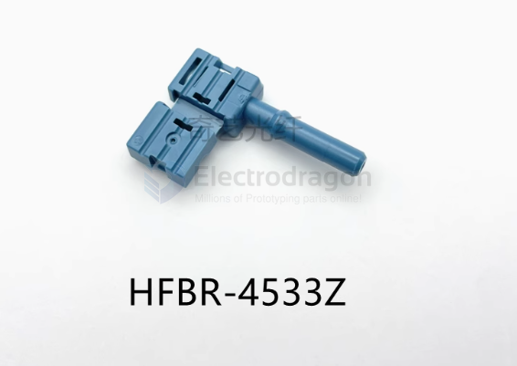
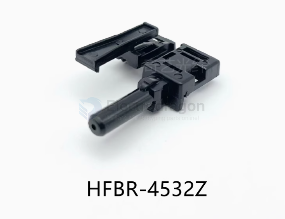
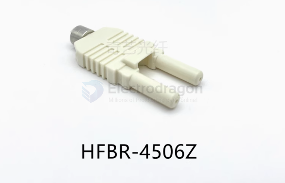
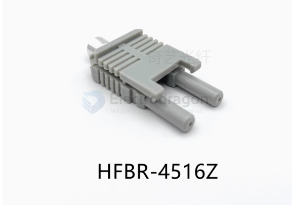
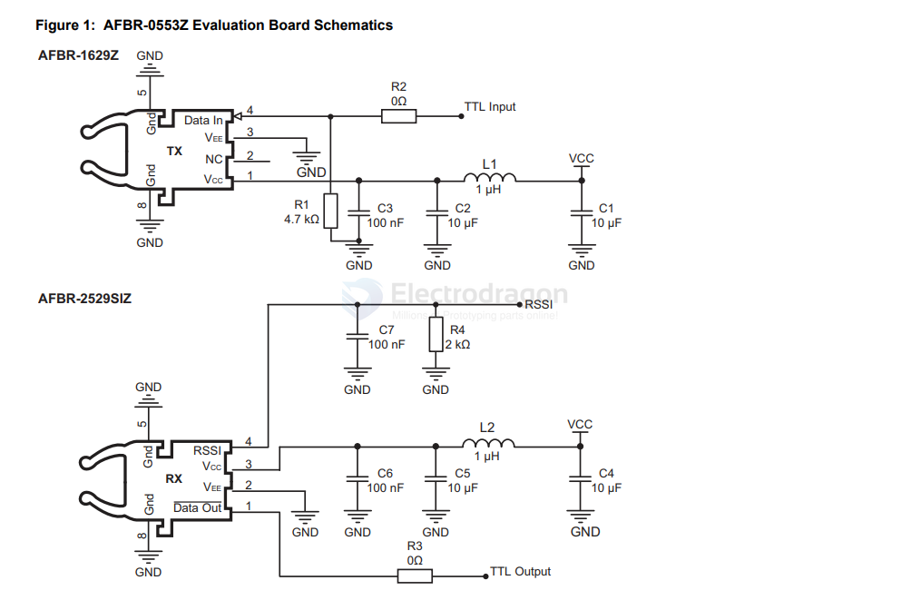

# HFBR-dat

HFBR-4503Z

- [[HFBR-0500Z-Series-dat]]

- [[HFBR]] - [[POF]]

## Best Way to Use POF for 5V TTL Serial:

    TX Side (Microcontroller)
    --------------------------
    MCU TX ──► HFBR-1521 (Transmitter)
    GND ─────┬──────────────────────┐
    Vcc (5V) ──────────────────────►

    RX Side (Receiver)
    -------------------
    POF Fiber ──► HFBR-2521 (Receiver)
    Output ─────► MCU RX
    GND ─────────┴──────────────────

## 🧩 2. Integrated Fiber Optic Transceivers

These are dedicated fiber optic ICs that handle the light/electrical signal conversion for **analog or digital baseband signals** — suitable for video.

### 🔹 Avago HFBR-0500 Series (Now Broadcom)
- **HFBR-1521** – Transmitter  
- **HFBR-2521** – Receiver

**✔ Features:**
- Accept **analog or digital signals** (bandwidth limited to ~50 MHz)  
- Compatible with **1 mm Plastic Optical Fiber (POF)**  
- Accepts **TTL or analog-like baseband** signals  
- Can work with **buffered composite/S-video signals**

> **Note:** For pure analog video, you’ll need **pre-emphasis or buffering** before the transmitter to match signal levels.

## HFBR series 

- [[HFBR-0500Z-Series-dat]] - [[HFBR-x4xx-dat]]

HFBR-4501 / HFBR-4511 == TX / RX

HFBR-4503 / HFBR-4513 == TX / RX

HFBR-4531 / HFBR-4533 == TX / RX

HFBR-4532 / HFBR-4532 == TX / RX

HFBR-4506

HFBR-4516

HFBR-4505对接器（灰色） / HFBR-4515对接器（蓝色）

## AFBR-0553Z Evaluation Kit

DC-to-50 MBd 650-nm Link with RSSI Versatile Link Fiber Optic Evaluation Kit

## ref 

- [[TOSlink-dat]]