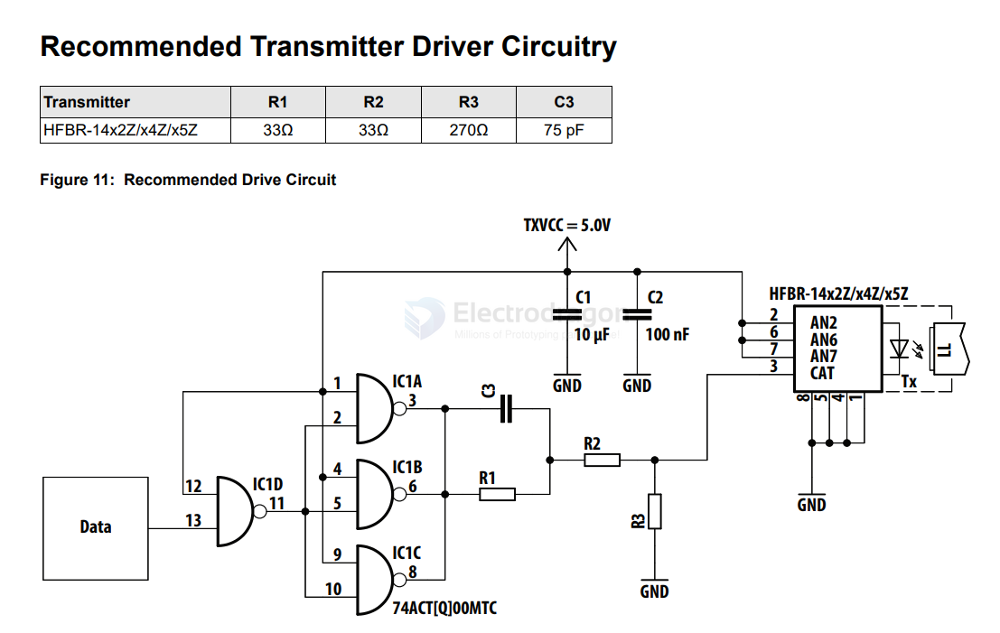

# HFBR-x4xx-dat

- [[NWL1116-dat]] - [[POF-dat]] - [[HFBR-x4xx-dat]]

The series includes HFBR-2414TZ and HFBR-1414TZ

HFBR-14xxZ and HFBR-24xxZ Series Low-Cost, 820-nm Miniature Link Fiber-Optic Components with ST, SMA, SC, and FC Ports

## APPs 

## rx - 2414TZ

## ref 

- [[broadcom-dat]] - [[TI-logic-dat]] - [[SN74541-dat]]

