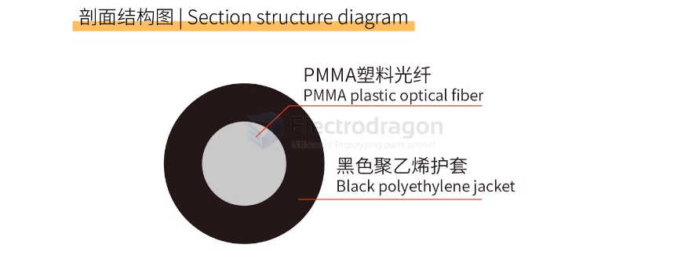
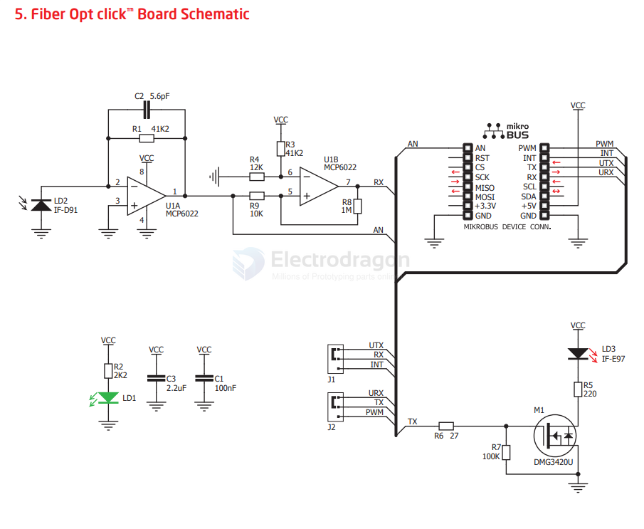

# POF-dat

- get more compare info here: [[glass-fiber-dat]]

- [[fiber-optic-app-dat]]

- [[FC300T-dat]] - [[Photolink-dat]] - [[HFBR-dat]] - [[HFBR-0500Z-Series-dat]] 

- [[DLR2180-dat]] - [[TCPT1200-dat]] - [[vishay-dat]] - [[sharp-dat]]

- [[toshiba-dat]] - [[TOTX-TORX-dat]] - [[toslink-dat]] 

- [[POF]]

## boards 

- [[NWL1116-dat]] - [[POF-dat]] - [[HFBR-x4xx-dat]]

## What is POF?

POF stands for plastic optical fiber with the term plastic being used a vulgarization for polymer materials.

The 1mm fiber diameter is about **500 times thicker** than a glass optical fiber. 

96% of the cores cross section conducts modulated light for data transmission similar to glass optical fiber applications. 

The maximal transmission distance amounts to about 100m without active repeaters. 

Polymer fibers are used for high speed data network in homes, commerce and industry as well as in cars and airplanes. POF is often regarded as an optical home network because POF is easy to install. The fiber is thin, can be shortened to the desired length by a sharp knife and requires no connectors on its ends. Anyone can set up a robust, high performance and Ethernet compatible network without any special tools.

## The key advantages of POF networks are:

- No electromagnetic radiation
- Electrically isolated network
- Immunity against electromagnetic coupling
- No electromagnetic cross talk
- Flexible, reliable and maintenance-free
- Low weight
- Resistant to humidity, heat and vibration
- Visible light that is eye-safe

🧵 POF (Plastic Optical Fiber)

## PMMA Fiber specs 

- Jacket: Black PE
- Core Refractive Index: 1.49
- Numerical Aperture: 0.5
- Heat Resistance Temperature: -55℃ ~ 70℃
- Transmission Loss: 200dB/km
- Minimum Bending Radius: 25mm
- Wavelength: 650nm
- Finished Fiber Products: Servo cables, sensor patch cords, plastic optical fiber patch cords
- Use Cases: Medical imaging, fiber optic sensing, servo machines, drilling machines...
- Recommended Storage Temperature: -55℃ ~ 85℃
- Suggested Operating Temperature: -25℃ ~ 70℃

## Feature	Description

- 🌟 Material	Core made from plastic (usually PMMA) instead of glass
- 📏 Core Size	Typically 1 mm (much thicker than glass fiber)
- 📡 Distance	Short range (up to ~100 meters)
- 🔌 Use Cases	Consumer electronics, asutomotive, home networks
- 💰 Cost	Cheaper and more flexible, easy to handle
- ⚠️ Limitation	High signal loss (attenuation), not suitable for long-ditance or high-speed telecom links

## POF distance 

| POF Type         | Max Distance | Typical Data Rate | Notes                          |
|------------------|--------------|-------------------|--------------------------------|
| PMMA (Standard)  | 50–100 m     | 100 Mbps–1 Gbps   | Common in home networks        |
| PF-POF           | 200–500 m+   | 1 Gbps+           | Used in industrial/high-speed  |

## POF transmitter/receiver (Analog Fiber Opticc Transceiver)

For the POF transmitter/receiver part was used the Firecomms Optolock FC300T. 

It includes the transmitting LED and the receiving PIN photodiode in one package. 

More information about the device can be found under the link: http://www.firecomms.com/ . The used Optolock is analog. 

Under desire a different type can be used (there are some which contain the receiver part embedded inside the same package), but the schematic and the PCB of the current implementation must be changed according the new requirements (in some cases differential to single ended conversion must be done).

### more transceiver 

https://www.mouser.com/c/optoelectronics/fiber-optics/fiber-optic-transmitters-receivers-transceivers/?q=POF%20Transceiver

## POF range == UART up to 100 Meters?

Yes, it's possible to use POF for UART over 100 meters, but it requires careful setup.

---

### ⚠️ Challenges

- **Attenuation:** ~0.15–0.20 dB/m → 15–20 dB loss at 100m
- **Transceiver Limitations:** Basic modules like HFBR-1521/2521 are rated for ~50m
- **Baud Rate:** Longer distances need lower baud rates for reliability

---

### 🔧 How to Make It Work

#### 1. Use Better Transceivers
- Choose high-power modules like:
  - **HFBR-1414TZ / 2412TZ**
  - Or similar industrial-grade parts

#### 2. Use Quality Fiber
- Use **ESKA SK-40/SK-80** POF
- Keep fibers clean and avoid tight bends

#### 3. Lower the Baud Rate
- Recommended for 100m:
  - **9600 or 19200 bps** (safe)
  - **38400 bps** (possible with care)

#### 4. Optional: Add Signal Conditioning
- Use Schmitt triggers or line drivers (e.g., 74HC14) to clean up weak signals

---

### 🧠 Alternatives
- For better reliability, consider:
  - **Glass fiber with serial-fiber converters**
  - **RS-485 over twisted pair** (up to 1200m)

---

### ✅ Summary

| Feature        | Up to 50m         | Up to 100m              |
|----------------|-------------------|--------------------------|
| Baud Rate      | 9600–115200 bps   | 9600–38400 bps           |
| Transceivers   | HFBR-15X1 series  | HFBR-14XX or similar     |
| Fiber Quality  | Basic POF         | High-grade POF (SK-40)   |

## IF

IF-D91, a fiber-optic photodiode, 
and one IF-E97, a fiber-optic LED, both from Industrial Fiber Optics. 

It provides a plastic optic connection feature over a plastic fiber cable with data rates of up to 512Kbps. 

Received data from the IF-D91 photodiode is filtered and amplified through dual operational amplifier, the [[MCP6022-dat]] from Microchip, and sent for further processing via selected mikroBUS™ lines. 

This Click board™ makes the perfect solution for high-speed digital data links, local area networks, video links, EMC/EMI signal isolation, fiber optic modems, and more.

## ref 

https://www.instructables.com/External-USB-audio-card-with-optical-SPDIF-POF-in/

- [[POF]] - [[fiber-optic]]
