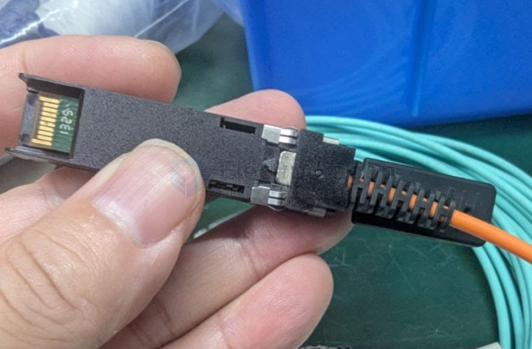
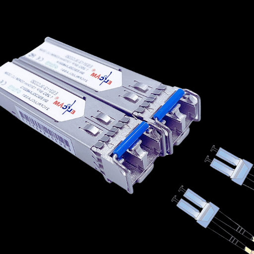

# LC-connector-dat.md

## LC module 

LC stands for Lucent Connector.

LC connectors are smaller versions of SC connectors, commonly used in high-density fiber optic applications.

### Features:

Small form factor: Half the size of SC connectors, making them ideal for space-limited environments like data centers.

Latch mechanism: Uses a clip-on design for easy and secure connection.

High-density applications: Commonly used in network switches, routers, and patch panels.

Fiber types: Can be used with both single-mode and multi-mode fibers.

## usage 

This device is a fiber optic transceiver module, specifically an SFP (Small Form-Factor Pluggable) transceiver with an LC (Lucent Connector) interface.

Here's a breakdown of what each part is and what it does:

**SFP Transceiver** (the main black body with the gold pins): This is a hot-pluggable module used for data communications. It converts electrical signals into optical signals for transmission over fiber optic cables, and then converts incoming optical signals back into electrical signals. SFPs are commonly used in network devices like switches, routers, and network interface cards to connect them to a fiber optic network.

**LC Connector** (the black part at the end of the orange cable that plugs into the SFP): As identified earlier, this is a type of fiber optic connector known for its small form factor, which allows for high-density connections.

**Fiber Optic Cable** (the orange cable): This cable is used to transmit data using light pulses. The color (orange in this case) typically indicates it's a multimode fiber optic cable, which is generally used for shorter distances.

In summary, this device facilitates high-speed data transmission over a fiber optic network, allowing network equipment to communicate using light signals.

## seperate 

Yes, you can often separate the LC connector, especially if it's a duplex LC connector.

Here's why and how:

**Duplex LC connectors** are essentially two simplex (single fiber) LC connectors held together by a clip or a "mating sleeve." This clip can often be carefully removed, allowing you to separate the two individual LC connectors. This is commonly done when you need to switch the polarity of the fibers (e.g., if you have an A-A wiring and need A-B).

**Simplex LC connectors** are designed for a single fiber and generally do not separate into smaller components in the same way. The connector itself is a single unit terminated onto the fiber.

