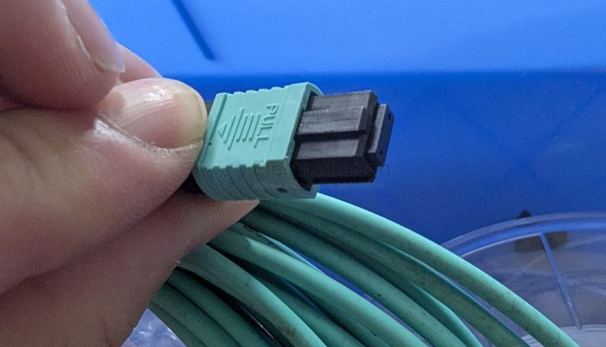
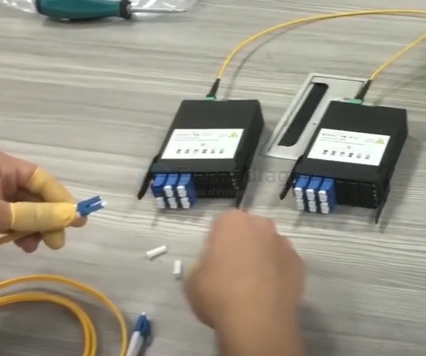
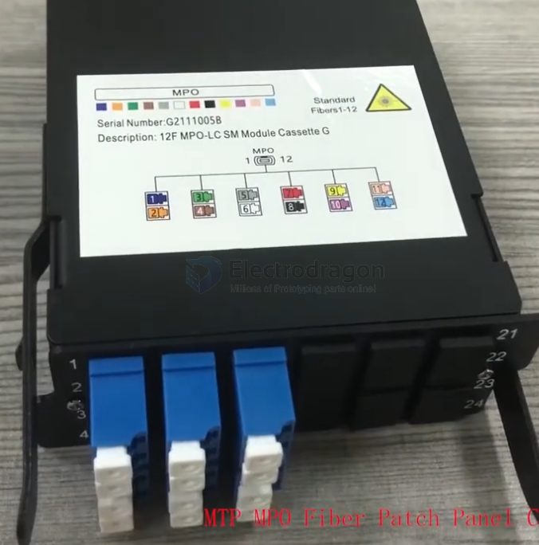
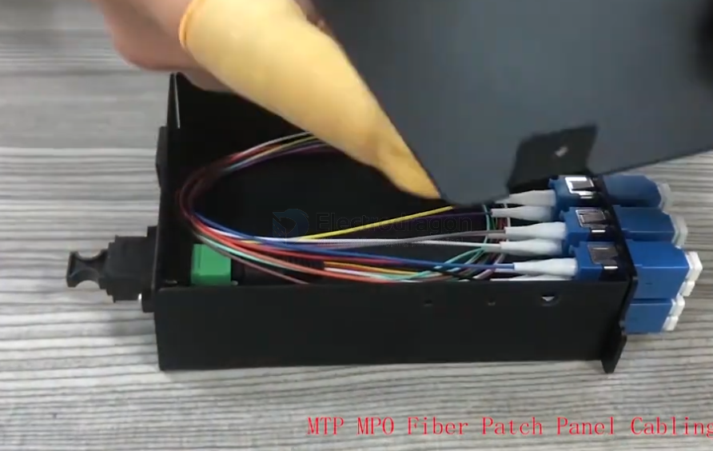

# MTP-MPO-Connector-dat

That connector is an **MTP/MPO (Multi-Fiber Push-On/Pull-off) connector**, commonly used in high-density fiber optic networks.

Details:

Connector Type: MTP or MPO (they look nearly identical; MTP is a higher-performance version by US Conec).

Fiber Count: Typically supports **12, 24, or more fibers** in a single rectangular ferrule.

Color: Aqua cable and connector usually indicate **OM3 or OM4 multimode fiber**, used for high-speed data (like **10/40/100Gbps Ethernet**).

Use Case: **Data centers**, backbone cabling, high-speed interconnects.

You’ll need an MTP/MPO adapter or cassette to fan out into **LC or SC connectors** if you're patching it to more standard fiber connections.

## use guide 

- [MPO housing remove guide](https://www.youtube.com/shorts/soxnNBGLyRI)

## ref 

- [[optic-fiber-dat]]