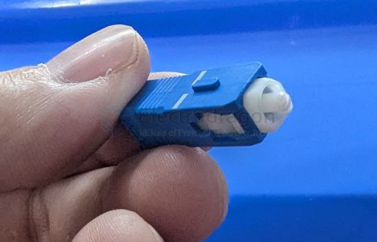
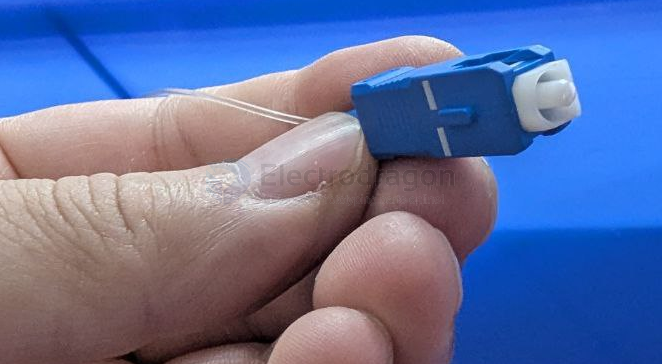

# SC-Connector-dat

The object you're holding is an **SC (Subscriber Connector) fiber optic connector**. These connectors are commonly used in network and telecom setups for fiber optic cables. Here's a quick rundown:

Connector Type: SC

- **Color**: Blue typically indicates single-mode fiber (usually used for long-distance data transmission).
- **Ferrule**: The white cylindrical part at the tip is the ferrule, which aligns the fiber and is crucial for precise data transmission.
- **Push-pull design**: SC connectors use a push-pull mechanism for easy insertion and removal.

## SC/APC

The connector shown is an **SC/APC (Angled Physical Contact)** type fiber optic connector, but let’s get specific:

Based on What I See:

The **blue housing** usually indicates an **SC/UPC (Ultra Physical Contact)** connector.

The **ferrule** end in your image looks flat, which is consistent with UPC rather than the angled end of an APC (which would be green and have an 8° angled polish).

## SC module 

SC stands for Subscriber Connector.

SC connectors are a type of fiber optic connector commonly used with fiber optic cables.

### Features:

Push-pull coupling mechanism: Allows easy insertion and removal of connectors.

Duplex design: Typically used in dual-core fiber optic cables (sending and receiving signals).

Durable and reliable, often used in telecommunications, data centers, and other long-distance fiber optic links.

Size: Relatively large compared to other connectors like LC.

## ref 

device - [[SFP-transceiver-dat]]

- [[fiber-optic-dat]]