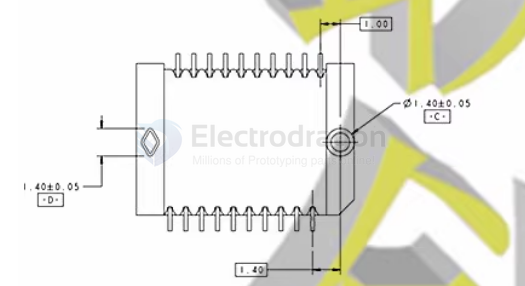

# SFP-transceiver-dat

- [[SFP-receiver-housing-dat]] - [[SFP]] - [[pmod-dat]]

Most SFP modules use LC connectors, though some may use SC (older gear) or others for special applications. - [[LC-connector-dat]]

## What is inside a SFP transceiver?

Fiber optic transceivers are key components of the fiber optic transmission network. They are designed in small form-factor with some integrated optical sub-assemblies which can be suitable for the high-density network. There are many SFPs available in the market with different features and specifications(SFP & SFP+). 

Aren’t you aware of the major functions of these transceiver modules?

- SFPs will transmit data and receive the data.
- Transceivers provide the conversion of electrical signals to optical signals and vice versa.

Inside the metal casing of a transceiver, there are several components and sub-assemblies that join together to form this.

- Transmitter Optical Sub Assembly (TOSA)
- Receiver Optical Sub Assembly (ROSA)
- Bi-Directional Optical Sub Assembly (BOSA)

## 🔌 Common SFP Solutions for Optical Fiber

SFP (Small Form-factor Pluggable) modules are compact, hot-swappable transceivers used to connect networking equipment (like switches and routers) to fiber optic or copper cables.

### 📦 Common Types of SFP Modules

| SFP Type | Description                 | Fiber Type | Wavelength         | Typical Distance |
| -------- | --------------------------- | ---------- | ------------------ | ---------------- |
| SFP SX   | Short-range (Multimode)     | Multimode  | 850 nm             | Up to 550 m      |
| SFP LX   | Long-range (Singlemode)     | Singlemode | 1310 nm            | Up to 10 km      |
| SFP ZX   | Extended reach (Singlemode) | Singlemode | 1550 nm            | Up to 80 km      |
| SFP BX   | Bidirectional (BiDi)        | Singlemode | 1310/1490 nm       | 10–40 km         |
| SFP CWDM | Coarse Wavelength Division  | Singlemode | 1270–1610 nm       | 20–80 km         |
| SFP DWDM | Dense Wavelength Division   | Singlemode | Various (ITU grid) | 40–100+ km       |

### 🔧 Things to Consider

- **Connector Type:** Most fiber SFPs use LC connectors.
- **Vendor Compatibility:** Some switches (e.g., Cisco, HPE) may require brand-specific or coded modules.
- **Fiber Type:** Match your module to either Singlemode (SMF) or Multimode (MMF) cable.
- **Wavelength Matching:** For BiDi or WDM modules, ensure the transmit/receive wavelengths match.
- **Distance Needs:** Choose SX, LX, ZX, etc., based on your required reach.

### ✅ Example Use Cases

- 🌐 Short-distance data center links: Use SFP SX with OM3/OM4 multimode fiber
- 🏢 Building-to-building links: Use SFP LX or BX with singlemode fiber
- 🌍 Long-haul backbone links: Use CWDM or DWDM SFPs for multiplexed transport

## What Type of Fiber Does SFP Use?

| SFP Type      | Fiber Type        | Connector | Description                                  |
| ------------- | ----------------- | --------- | -------------------------------------------- |
| SFP SX        | Multimode (MMF)   | LC        | Short-range, up to 550m (850 nm)             |
| SFP LX        | Single-mode (SMF) | LC        | Long-range, up to 10 km (1310 nm)            |
| SFP ZX        | Single-mode (SMF) | LC        | Extended-range, up to 80 km (1550 nm)        |
| SFP BX (BiDi) | Single-mode (SMF) | LC        | Bidirectional over 1 fiber, 10–40 km         |
| SFP CWDM/DWDM | Single-mode (SMF) | LC        | Wavelength-division multiplexing, 40–100+ km |

## SFP+ transceiver

### AFBR-709SMZ SFP+ transceiver module.

Here's a breakdown of the information on the label:

 * Avago: The manufacturer (now part of Broadcom).
 * AFBR-709SMZ: The specific model number.
 * 850nm LASER PROD: Indicates it uses an 850-nanometer wavelength laser. This is typically used for short-range communication over multi-mode fiber optic cables.
 * 21CFR(J) CLASS 1: Refers to its laser safety classification (Class 1 is generally safe under reasonably foreseeable conditions).
 * CHINA: Country of manufacture.
 * 1811: Likely a date code, possibly indicating it was manufactured in the 11th week of 2018.
 * SN: AD181130KK4: The unique serial number for this specific unit.

In simple terms, this is a pluggable module used in networking equipment (like switches or routers) to convert electrical signals to optical signals (and vice-versa) for transmitting data over fiber optic cables, likely at 10 Gigabit per second speeds (10GBASE-SR standard).

## 20-pin electrical edge connector of an SFP (Small Form-factor Pluggable) module. 

The pin functions are defined by the SFP Multi-Source Agreement (MSA), which ensures interoperability between different vendors' modules and host equipment.

Pin Numbering Convention:

When looking directly at the module's edge connector pins as shown in your picture (with the contacts facing you):
 * Top Row: Pins 20 down to 11 (from left to right in your image)
 * Bottom Row: Pins 10 down to 1 (from left to right in your image)
So, the leftmost pin on the top is Pin 20, the rightmost pin on the top is Pin 11. The leftmost pin on the bottom is Pin 10, and the rightmost pin on the bottom is Pin 1.

Standard SFP Pin Functions:

Here is the standard pinout based on the SFP MSA specification:

| Pin | Name         | Function Description                         | Row    | Side (looking at pins) |
| --- | ------------ | -------------------------------------------- | ------ | ---------------------- |
| 1   | VeeT         | Transmitter Ground                           | Bottom | Right                  |
| 2   | TX_FAULT     | Transmitter Fault Indication (Active High)   | Bottom |                        |
| 3   | TX_DISABLE   | Transmitter Disable (Input, Active High)     | Bottom |                        |
| 4   | MOD-DEF2/SDA | Module Definition 2 / Serial Data I/O        | Bottom |                        |
| 5   | MOD-DEF1/SCL | Module Definition 1 / Serial Clock Input     | Bottom |                        |
| 6   | MOD-DEF0/ABS | Module Definition 0 / Module Absent (Output) | Bottom |                        |
| 7   | RS0          | Rate Select 0 (Input, often unused/grounded) | Bottom |                        |
| 8   | LOS          | Loss of Signal Indication (Active High)      | Bottom |                        |
| 9   | VeeR         | Receiver Ground                              | Bottom |                        |
| 10  | VeeR         | Receiver Ground                              | Bottom | Left                   |
| 11  | VeeR         | Receiver Ground                              | Top    | Right                  |
| 12  | RD-          | Inverted Received Data Output                | Top    |                        |
| 13  | RD+          | Non-Inverted Received Data Output            | Top    |                        |
| 14  | VeeR         | Receiver Ground                              | Top    |                        |
| 15  | VccR         | Receiver Power Supply (+3.3V)                | Top    |                        |
| 16  | VccT         | Transmitter Power Supply (+3.3V)             | Top    |                        |
| 17  | VeeT         | Transmitter Ground                           | Top    |                        |
| 18  | TD+          | Non-Inverted Transmit Data Input             | Top    |                        |
| 19  | TD-          | Inverted Transmit Data Input                 | Top    |                        |
| 20  | VeeT         | Transmitter Ground                           | Top    | Left                   |

How to Identify Them on Your Module:
 * Orientation: Hold the module so you are looking directly at the gold contacts as in your picture.
 * Locate Pin 1: It's the bottom-rightmost pin.
 * Locate Pin 10: It's the bottom-leftmost pin.
 * Locate Pin 11: It's the top-rightmost pin.
 * Locate Pin 20: It's the top-leftmost pin.
 * Refer to the Table: Use the table above to know the function associated with each pin number/position.

Key Pin Groups:
 * Power: VccR (Pin 15), VccT (Pin 16) provide the 3.3V power. VeeR and VeeT are the corresponding grounds.
 * High-Speed Data: RD+/RD- (Pins 13, 12) are the differential receiver output pair. TD+/TD- (Pins 18, 19) are the differential transmitter input pair.
 * Control/Status: TX_FAULT (Pin 2), TX_DISABLE (Pin 3), LOS (Pin 8) are important status and control signals.
 * Management/ID: SDA (Pin 4), SCL (Pin 5), and MOD_ABS (Pin 6) are used for the I2C interface to read module information (like vendor, model, S/N, DDM/DOM values).

While this pinout is standard, the datasheet for the specific SFP module model (like the Avago AFBR-709SMZ from your first image) is always the definitive source. However, for standard SFP/SFP+ functions, this MSA pinout is reliable.

## TE/AMP 1367073-1 20-pin connector 

## APPs 

SFP to [[RJ45-dat]]

The optical-to-electrical module converts the SFP optical port of the device into an RJ45 network port/electrical port.

光转电模块是将设备SFP光口转成RJ45网口/即电口

##  sfp transceiver module

SFP stands for Small Form-factor Pluggable.

It is a compact, hot-pluggable fiber optic transceiver used for data transmission over fiber optic or copper cables.

SFP is short for Small Form-factor Pluggables, which is a small package pluggable optical transceiver module. SFP can be regarded as a pluggable version of SFF. Its electrical interface is 20pin gold finger, and the data signal interface is basically the same as the SFP module. The SFP module also provides an I2C control interface that is compatible with the optical interface diagnostics of the SFP-8472 standard.

万兆光口SFP+模块分为多模和单模 

SFP+ 多模: 850nm波长，最大可传550米

SFP+ 单模: 1310nm到1550nm波长，可传10~80千米。

### working scenario 

## customized analog-video plus serial data fiber-optic transceiver

## ref 

- [[SFP]]

- [[fiber-optic-dat]]

- https://forum.huawei.com/enterprise/intl/en/thread/What-is-inside-a-SFP-transceiver/667249762887417856?blogId=667249762887417856
