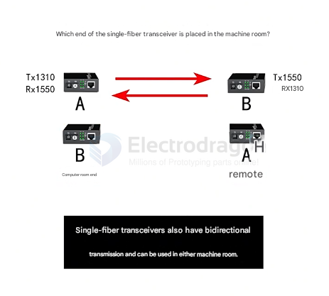
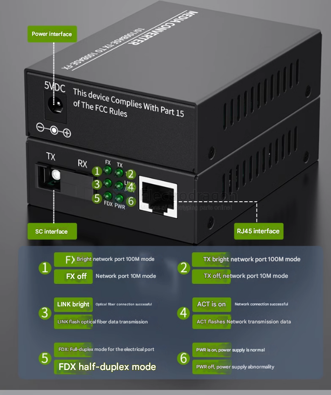

# fiber-optic-transceiver-dat

**SFPs** in the network switch can offer alarming and failure reporting (DOM) so that technicians can check the network failure by the information. 

**Media converters** are a solution where a switch or connected device does not support optical or needs to extend the transmission distance.

- [[fiber-optic-dat]] to [[ethernet-dat]]

- connector type = [[SC-connector-dat]] 

## ref 

- [[fiber-optic-connector-dat]]

- [[SFP-transceiver-dat]]

- [[fiber-optic-dat]] - [[fiber-optic]]
  
- [[fiber-optic-transceiver]] - [[maker]]

- [[SPF]]