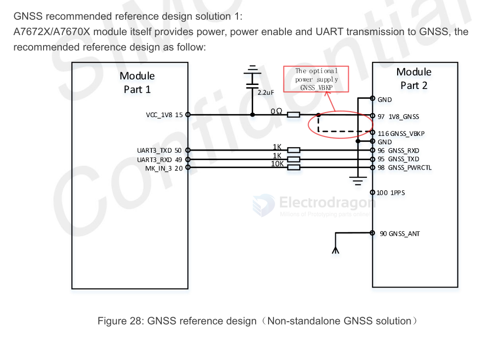

# GNSS-dat 

- [[beidou-dat]] - [[GPS-dat]] - [[GLONASS-dat]]

- gnss protocol - [[quectel_l76-lbl26-lblc86l_gnss_protocol_specification_v2-2.pdf]]

- GSV - GNSS Satellites in View. 

- GSA - GNSS  DOP  and  Active  Satellites.  GNSS  receiver  operating  mode,  satellites  used  in  the  navigation solution reported by the GGA sentence, and DOP values. 

- GLL - Geographic Position – Latitude/Longitude. 

- GGA - Global Positioning System Fix Data. Time, position, and fix-related data for a GNSS receiver.

- VTG - Course Over Ground & Ground Speed. 

- RMC - Recommended Minimum Specific GNSS Data. Time, date, position, course, and speed data provided by a GNSS receiver.

## GNSS Start 

COLD start GNSS:
- When first used;
- Loss of ephemeris information due to battery depletion;
- Move the receiver more than 200 km under shutdown. 

HOT start GNSS:
- Boot less than two hours from the last location

WARM start GNSS:
- Boot more than two hours from the last location

## GNSS bands 
| Type    | Frequecy          |
| ------- | ----------------- |
| GPS     | 1575.42±1.023MHz  |
| GLONASS | 1597.5~1605.8MHz  |
| BeiDou  | 1561.098±2.046MHz |

## GNSS Antenna Requirements

| Antenna Specification      | Specification Requirement          |
| :------------------------- | :--------------------------------- |
| Operating Frequency Band   | L1: 1559~1609MHz                   |
| Directionality             | Hemisphere, face to sky            |
| Impedance                  | 50 Ω                               |
| Maximum Input Power        | 50W                                |
| VSWR                       | < 2                                |
| Polarization Type          | RHCP or Linear                     |
| Passive Antenna Gain       | 0dBi                               |
| Active Antenna Gain        | -2dBi                              |
| Active Antenna Noise Figure| < 1.5                              |
| Built-in Antenna LNA Gain  | 20dB(Typ.)                         |
| Total Antenna Gain         | < 18 dB                            |
| Coaxial Cable Insertion Loss | <1.5dB                             |

## Schematic 

- [[A7670-dat]]

## commands examples 

    Search GPS + GLONASS: 
    $PMTK353,1,1,0,0,0*2B

    Enable GPS, Glonass, Galileo:
    $PMTK353,1,1,1,0,0*2A

Sets  the  speed  threshold  for  static  navigation.  

    $PMTK386,0.4*39 
    $PMTK001,386,3*3D

Gets whether the GPS/GLONASS/BDS/Galileo satellite seraching is enabled or not.

    $PMTK355*31 
    $PMTK001,355,3,1,1,0,0*33
    
PMTK838 PMTK_TEST_ANTI_SPOOFING - Enables or disables jamming detection function.

    $PMTK838,1*2C 
    $PMTK001,838,3,1*2E 

PMTK605 PMTK_Q_RELEASE - Queries the firmware release information. See PMTK_DT_RELEASE for the query result.

    $PMTK605*31
    $PMTK705,MT3333_AXN5.1.9_MODULE_STD_F1_P1,0007,Quectel-L76L,1.0*08
    $PMTK705,AXN_5.1.6_3333_19010218,0007,Quectel-L76L,1.0*53

## ref 

- [[GPS-dat]] - [[quectel-GPS-dat]]