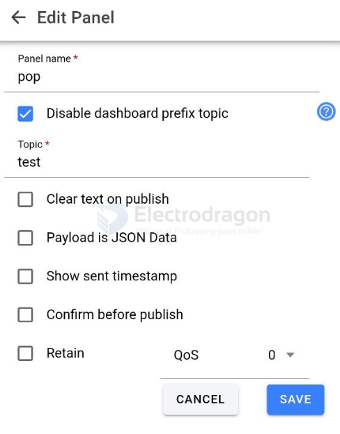

# mqtt dat 

## arduino library 

- async-mqtt-client-master 

- PubSubClient
    - https://github.com/knolleary/pubsubclient
    - examples/mqtt_esp8266.ino

- radiolib

## MQTT broker on ubuntu 

install service and check status 

    sudo apt install -y mosquitto

    sudo systemctl status mosquitto

more systemctl check 

- Stop the mosquitto service:
    - $ sudo systemctl stop mosquitto
- Start the mosquitto service:
    - $ sudo systemctl start mosquitto
- Restart the mosquitto service:
    - $ sudo systemctl restart mosquitto

Log file 

    cat /var/log/mosquitto/mosquitto.log

## Conf Setup list

Secure the Mosquitto Server

Create a default.conf under the directory.

    nano /etc/mosquitto/conf.d/default.conf

    allow_anonymous false  // not allow anonymous
    password_file /etc/mosquitto/passwd // set password

optionally 

    listener 1883  // set port 1883 public, or listener 1883 localhost for localhost only
    listener 1884 // set 1884 for wss protocol websockets

set users 

    nano /etc/mosquitto/passwd

    electrodragon:electrodragon

Restart the mosquitto service to load the new changes.

    sudo systemctl restart mosquitto

## MQTT client 

    sudo apt install -y mosquitto-clients

sub:

    mosquitto_sub -t "test"
    mosquitto_sub -u electrodragon -P electrodragon -t "test"

pub:

    mosquitto_pub -m "ON" -t "test"

A number of my IoT students make use of (the FREE plan with) BeeBotte for their remote MQTT broker.

https://beebotte.com/

It's very easy to set up and works really well with Nod-RED.

## execute 

From this point forward, you should execute any pub/sub command using the syntax below. Remember to replace electrodragon and EXAMPLE_PASSWORD with the credentials that you defined in the password file.

    mosquitto_sub -u electrodragon -P electrodragon -t "home/lights/sitting_room"
    mosquitto_pub -u electrodragon -P electrodragon -t "home/lights/sitting_room" -m "ON"

## web test 

- https://testclient-cloud.mqtt.cool/

may not working SSL not enabled

- https://www.hivemq.com/demos/websocket-client/
- https://www.emqx.io/mqtt/mqtt-websocket-toolkit

## free electrodragon MQTT broker

- 206.237.31.27
- user == electrodragon
- password == electrodragon
- SSL not enabled

## android software 

- IOT MQTT Panel

setup guide for out free MQTT broker

1. connection part 

notice in addtional options add user name and password to be electrodragon and electrodragon

2. dashboard part 

3. panel part 

4. output 

## ref 

- https://mosquitto.org/man/mosquitto-conf-5.html

