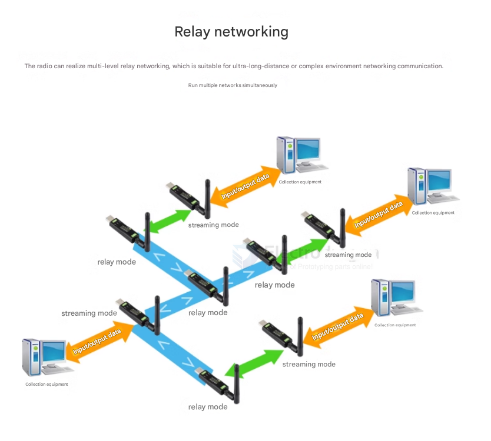
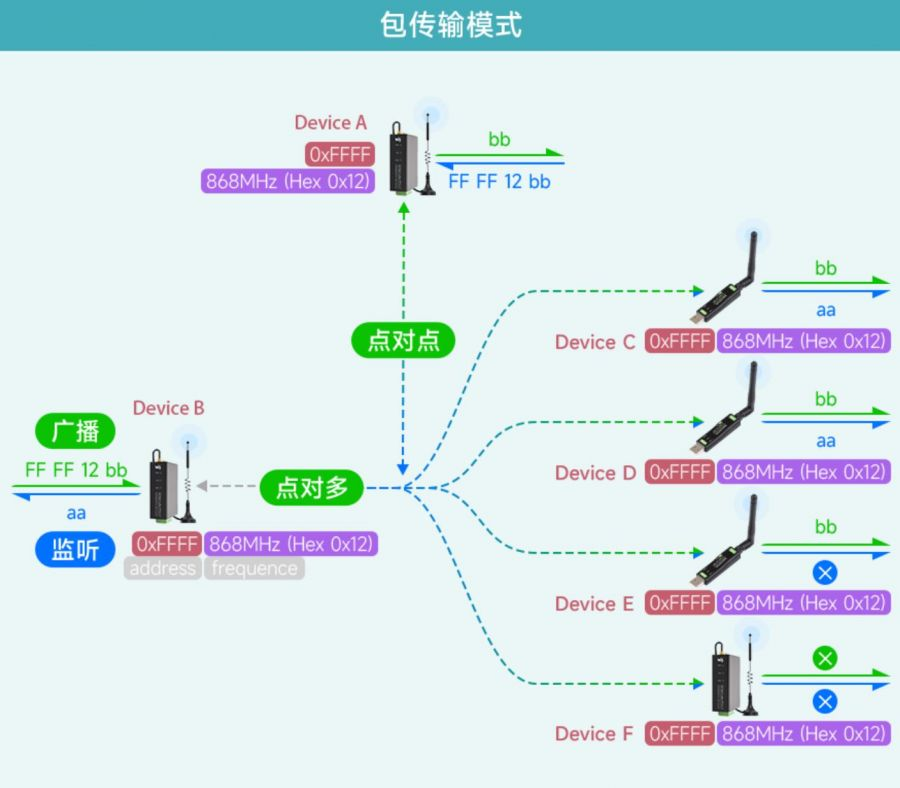
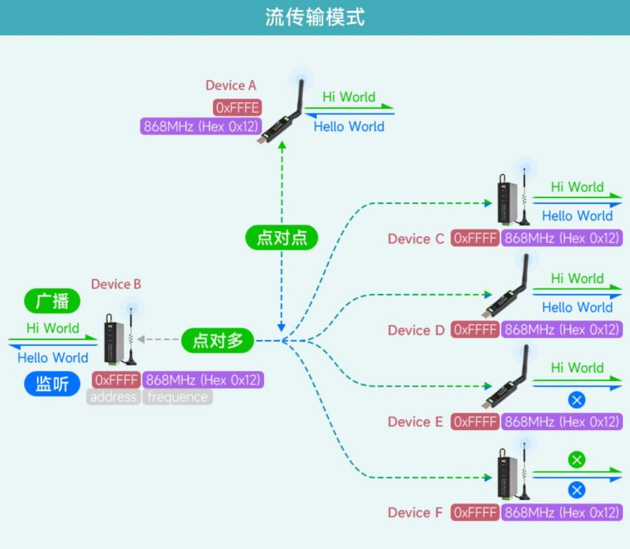

# networking-dat

## Relay Networking



Relay mode refers to a transmission mode in which some LoRa devices in a LoRa network act as relay nodes to forward data streams from stream mode or packet mode. The relay mode device's interface does not output any data, achieving the function of extending the wireless communication distance.

---

## Packet Mode

**Packet mode refers to a transmission mode in which the first 3 bytes of the data stream sent by a LoRa device specify the address and channel of the receiving device.**

The data stream uses hexadecimal (Hex) data format.

Suppose there are six LoRa devices: Device A, B, C, D, E, and F, forming a packet mode LoRa communication network. To change the address, channel, and working mode of devices in the LoRa network, refer to the communication diagram and parameter table below. Note: Use the AT command (`AT+MODE=2\r\n`) to switch to packet mode.

- Device A and Device C form point-to-point communication in packet mode.
    - Device A sends the hex data stream `FF FE 12 AA`, where `FF FE` is the address of the receiving device (Device C), `12` is the channel of the receiving device (Device C), and `AA` is the data (hexadecimal format, e.g., AA, AF, FA, etc.). Device C with matching address and channel receives it correctly.
    - Device C sends the hex data stream `00 01 12 CC`, where `00 01` is the address of the receiving device (Device A), `12` is the channel of the receiving device (Device A), and `CC` is the data. Device A with matching address and channel receives it correctly.

- Devices A, B, C, D, E, and F form point-to-multipoint communication in packet mode.
    - Device B's address is set to 65535 (Hex: 0xFFFF), making it a broadcast listening device in the LoRa network. When Device B broadcasts a data stream, all devices with addresses from 0 to 65535 on the same channel can receive the data stream. When other devices send data streams, Device B can listen to the data streams from devices with addresses from 0 to 65535 on the same channel.
    - Device B broadcasts the hex data stream `FF FF 12 BB`, where `FF FF` is the broadcast address, `12` is the channel, and `BB` is the data. Devices A, C, D, and E with matching channel (`18` Hex: `0x12`) receive it correctly. Device F with a non-matching channel (`65` Hex: `0x41`) fails to receive.
    - When Devices A, C, D, or E send data streams (e.g., Device A sends `FF FE 12 AA`), Device B can listen and receive the data stream.
    - When Device F (with a non-matching channel, `65` Hex: `0x41`) sends a data stream, Device B fails to listen and receive.



---

## Stream Mode

### Stream Mode Overview

Stream mode means that a LoRa Device (SX1262-LoRa-DTU, USB-TO-LoRa) transmits the data stream received from its interface via LoRa to another device, which demodulates and outputs the data stream from its specified interface. What you send is what you get.

### Example Network

Suppose there are six LoRa devices: Device A, B, C, D, E, and F, forming a stream mode LoRa communication network.

- To change the address, channel, and working mode of each device in the LoRa network, refer to the communication diagram and parameter table below.
- Use the AT command to switch to stream mode:  
  ```
  AT+MODE=1\r\n
  ```

---

#### 1. Point-to-Point Communication

- Device A and Device C form a point-to-point communication in stream mode.
- Device A sends `Hello World` to Device C. Device C with matching **address and channel** receives it correctly.
- Device C sends `any World` to Device A. Device A with matching **address and channel** receives it correctly.

---

#### 2. Point-to-Multipoint Communication & Broadcast Listening

- Devices A, B, C, D, E, and F form a point-to-multipoint communication network in stream mode.
- Device B's address is set to 65535 (Hex: 0xFFFF), making it a broadcast listening device in the LoRa network.
- When Device B broadcasts a data stream, all devices with addresses from 0 to 65535 on the same channel can receive the data stream.
- When other devices send data streams, Device B can listen to the data streams from devices with addresses from 0 to 65535 on the same channel.

#### Examples

- Device B broadcasts `Hi World` data stream. Devices A, C, D, and E with matching channels receive it correctly. Device F with a non-matching channel fails to receive.
- When Devices A, C, D, or E send data streams (e.g., Device A sends `Hello World`), Device B can listen and receive the data stream.
- When Device F (with a non-matching channel) sends a data stream, Device B fails to listen and receive.

---

#### Communication Diagram




