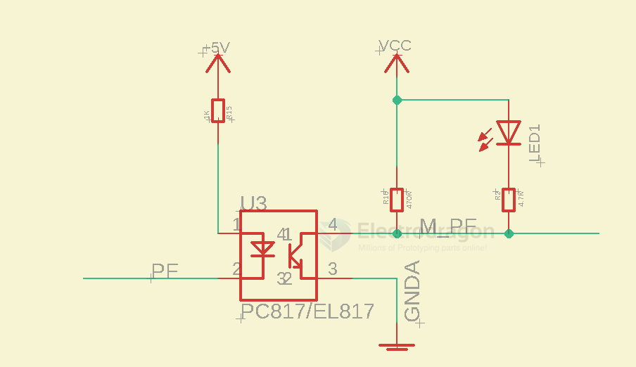

# Optical Coupler DAT

- [[PC817-DAT]]

- [[AC-isolation-dat]] - [[everlight-dat]] - [[EL357-dat]]

## brands 

- [[broadcom-dat]] - [[sharp-dat]] - [[liteon-dat]] - [[renesas-dat]] - [[Toshiba-dat]] - [[vishay-dat]]

- CPC5902G == Logic Output Optocouplers Dual Opto Isolated I2C Bus Repeater

## PC817 vs EL357 

| Specification                          | EL357                         | PC817                            |
| -------------------------------------- | ----------------------------- | -------------------------------- |
| Manufacturer                           | Everlight Electronics         | Sharp / Renesas / Lite-On / etc. |
| Type                                   | Phototransistor Optocoupler   | Phototransistor Optocoupler      |
| CTR (Current Transfer Ratio)           | 50% to 600% (varies by model) | 50% to 600% (varies by model)    |
| Input LED Forward Voltage (VF)         | 1.2V typ., 1.4V max           | 1.2V typ., 1.4V max              |
| LED Forward Current (IF)               | 50 mA max                     | 50 mA max                        |
| Output Collector-Emitter Voltage (Vce) | 80V max                       | 80V max                          |
| Output Collector Current (Ic)          | 50 mA max                     | 50 mA max                        |
| Isolation Voltage                      | 3750 Vrms                     | 5000 Vrms                        |
| Response Time (tr/tf)                  | 4 µs / 3 µs typ.              | 4 µs / 3 µs typ.                 |
| Operating Temperature                  | -55°C to +110°C               | -30°C to +100°C                  |
| Package                                | DIP-4, SOP-4                  | DIP-4, SOP-4                     |
| RoHS Compliant                         | Yes                           | Yes                              |

Both are widely used in similar applications (signal isolation, microcontroller interfaces).

The PC817 offers **higher isolation voltage**, making it more suitable for high-voltage isolation.

The EL357 has a **wider operating temperature range**, which may be beneficial in harsh environments.

## circuits 

## ref 

- [[tech-dat]]