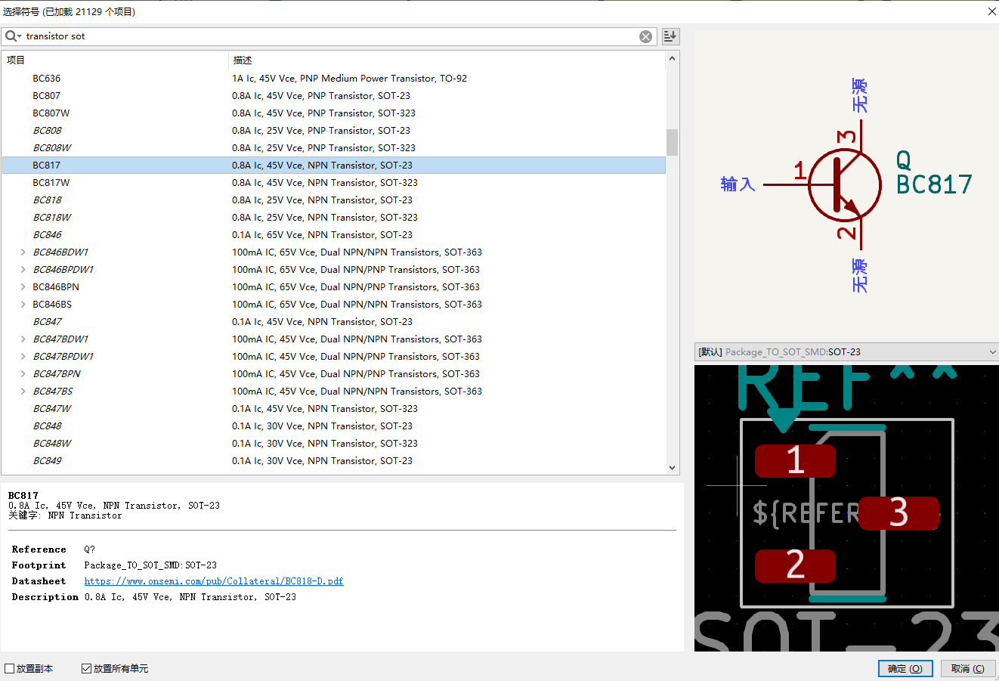

# kicad-sch-dat

### add symbol 

- search based on components type and footprint

### sort network classes network 

- schematic setup -> net classes

### assign the footprints

- add symbols and assign footprint 
  - enter "E" for properties, and assign the footprint 

