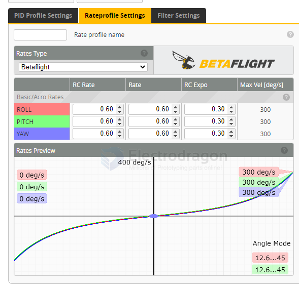

# PID-dat

## mobula8 

default profile 

| value      | Proportional | Integral | D Max | Derivative | Feedforward |
| ---------- | ------------ | -------- | ----- | ---------- | ----------- |
| Basic/Acro |              |          |       |            |             |
| ROLL       | 53           | 95       | 46    | 43         | 143         |
| PITCH      | 56           | 100      | 52    | 48         | 149         |
| YAW        | 53           | 95       | 00    | 0          | 143         |

tuned profile 

| value      | Proportional | Integral | D Max | Derivative | Feedforward |
| ---------- | ------------ | -------- | ----- | ---------- | ----------- |
| Basic/Acro |              |          |       |            |             |
| ROLL       | 48           | 100      | 41    | 43         | 143         |
| PITCH      | 41           | 105      | 48    | 48         | 149         |
| YAW        | 53           | 95       | 00    | 0          | 143         |

Damping: D Gains

Tracking: P&IGains

Stick Response: FF Gains

Dynamic Damping: D Max

Drift - Wobble: /Gains

Pitch Damping: Pitch:Roll D

Pitch Tracking: Pitch:Roll P, I & FF

Master Multiplier:

### Angle/Horizon

| set         | Strength | Transition |
| ----------- | -------- | ---------- |
| Angle       | 50       |            |
| Horizon     | 75       | 75         |
| Angle Limit | 60       |            |

optimized for indoor fly 

| set         | Strength | Transition |
| ----------- | -------- | ---------- |
| Angle       | 32       |            |
| Horizon     | 50       | 75         |
| Angle Limit | 45       |            |

- angle mode == can not full roll or flip 
- Angle == less respone 
- Angle Limit == less speed and angle, but inability to fly in wind

### screenshort 

CAUTioN: Current sllder positlons may cause flyaways, motor damage or unsafe craft behaviour. Please proceed with cautlon.

Note: Slider access and range is restricted because you are not in expert mode. Basic mode should be suitable for most builds and beginners.

Note: Slider(s) are disabled because current values are outside the Basic Mode adjustment range. Switch to Expert Mode to make changes

## PID

- [[PID-dat]]

### rateprofile settings 

Rates Type？ == Betaflight BETAFLIGHT

| set              | RC Rate | Rate RC | Expo | Max Vel [deg/s] |
| ---------------- | ------- | ------- | ---- | --------------- |
| Basic/Acro Rates |         |         |      |                 |
| ROLL             | 1.06    | 0.56    | 0.15 | 482             |
| PITCH            | 1.06    | 0.56    | 0.15 | 482             |
| YAW              | 1.06    | 0.56    | 0.05 | 482             |

Rates Type？ == Betaflight BETAFLIGHT == cinewhoop

| set              | RC Rate | Rate RC | Expo | Max Vel [deg/s] |
| ---------------- | ------- | ------- | ---- | --------------- |
| Basic/Acro Rates |         |         |      |                 |
| ROLL             | 0.6     | 0.6     | 0.3  | 300             |
| PITCH            | 0.6     | 0.6     | 0.3  | 300             |
| YAW              | 0.6     | 0.6     | 0.3  | 300             |

Lower **RC Rate** → overall slower stick response.  

- Roll:   RC Rate 1.0 | Super Rate 0.65 | Expo 0.25
- Pitch:  RC Rate 1.0 | Super Rate 0.65 | Expo 0.25
- Yaw:    RC Rate 0.8 | Super Rate 0.70 | Expo 0.30
- Throttle Mid: 0.30
- Throttle Expo: 0.25

### Rates Type？ == Actual

- **Center Sensitivity** → how responsive the quad is around stick center.  
- **Max Rate (deg/s)** → maximum rotation speed at full stick deflection.  
- **Expo** → how much the curve softens near center stick.  

## 1. Center Sensitivity
- Controls responsiveness near stick center.  
- Indoor flying → set **lower** than outdoor to avoid twitchiness.  
- Example: `Center Sensitivity = 120` (instead of 200+ for outdoors).

---

## 2. Max Rate
- Sets the maximum rotation speed (°/s).  
- Indoor = keep rotation slower to avoid overshooting in tight spaces.  
- Example: `Max Rate = 400–500°/s` (outdoor freestyle often 700–1000°/s+).

---

## 3. Expo
- Smooths stick center further while keeping full rate at stick ends.  
- Indoor = a bit more expo to help small corrections.  
- Example: `Expo = 0.3–0.4`.

- Roll:   Center Sensitivity = 120 | Max Rate = 450 | Expo = 0.35
- Pitch:  Center Sensitivity = 120 | Max Rate = 450 | Expo = 0.35
- Yaw:    Center Sensitivity = 100 | Max Rate = 400 | Expo = 0.30

| set              | RC Rate | Rate RC | Expo | Max Vel [deg/s] |
| ---------------- | ------- | ------- | ---- | --------------- |
| Basic/Acro Rates |         |         |      |                 |
| ROLL             | 70      | 670     | 0    | 670             |
| PITCH            | 70      | 670     | 0    | 670             |
| YAW              | 70      | 670     | 0    | 670             |

**Expo** (Exponential) adjusts the sensitivity of your stick inputs around the center position.

- **Expo** = 0: Stick response is linear—movements are directly proportional.
- **Higher Expo**: Makes the center of the stick less sensitive (smoother, easier for small corrections), while the ends remain more responsive.

This helps pilots make precise, gentle movements without sacrificing full stick authority for fast maneuvers.

optimized 

| set              | RC Rate  | Rate RC    | Expo     | Max Vel [deg/s] |
| ---------------- | -------- | ---------- | -------- | --------------- |
| Basic/Acro Rates |          |            |          |                 |
| ROLL             | 10 or 20 | 720 or 800 | 0 or 0.5 | 670             |
| PITCH            | 10 or 20 | 720 or 800 | 0 or 0.5 | 670             |
| YAW              | 10 or 20 | 720 or 800 | 0 or 0.5 | 670             |

| Throttle Limit | Throttle Limit %0 |
| -------------- | ----------------- |
| OFF            | 80                |

for the smooth indoor flying 
| Throttle MID | Throttle EXPO |
| ------------ | ------------- |
| 0.20         | 0.70          |

1. Enable **Throttle Expo**:
   - Set `Throttle Expo = 0.2–0.4`.  
   - Reduces sensitivity around mid-throttle.  
2. Adjust **Throttle Mid**:
   - If hover is at ~30% stick, set `Throttle Mid = 0.3`.  
   - Matches your hover point with expo curve.  

#### optimized version 2 for indoor flying 

| Throttle Limit | Throttle Limit %0 |
| -------------- | ----------------- |
| SCALE          | 55                |
| Throttle MID   | Throttle EXPO     |
| ------------   | -------------     |
| 0.50           | 0.50              |

Throttle Limit

- `Scale`: reduces power evenly across whole range.  
- `Clip`: cuts off only top-end throttle.  

### filter settings 

Profile dependent Filter Settings

D Term Lowpass Filters

## ref 

- [[PID]] - [[tech]]