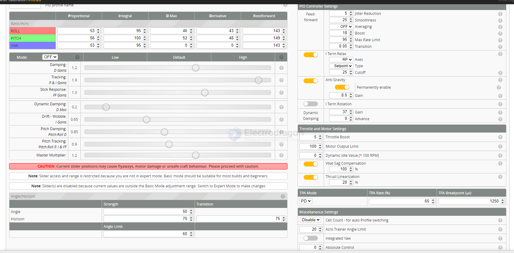
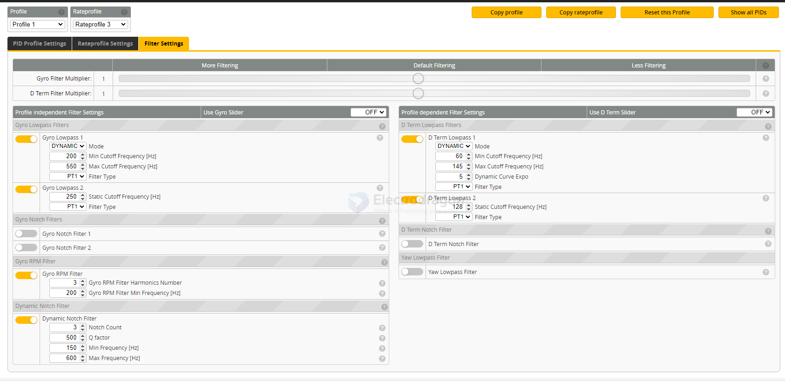

# PID-dat

## mobula8 

default profile 

| value      | Proportional | Integral | D Max | Derivative | Feedforward |
| ---------- | ------------ | -------- | ----- | ---------- | ----------- |
| Basic/Acro |              |          |       |            |             |
| ROLL       | 53           | 95       | 46    | 43         | 143         |
| PITCH      | 56           | 100      | 52    | 48         | 149         |
| YAW        | 53           | 95       | 00    | 0          | 143         |

tuned profile 

| value      | Proportional | Integral | D Max | Derivative | Feedforward |
| ---------- | ------------ | -------- | ----- | ---------- | ----------- |
| Basic/Acro |              |          |       |            |             |
| ROLL       | 48           | 100      | 41    | 43         | 143         |
| PITCH      | 41           | 105      | 48    | 48         | 149         |
| YAW        | 53           | 95       | 00    | 0          | 143         |

Damping: D Gains

Tracking: P&IGains

Stick Response: FF Gains

Dynamic Damping: D Max

Drift - Wobble: /Gains

Pitch Damping: Pitch:Roll D

Pitch Tracking: Pitch:Roll P, I & FF

Master Multiplier:

### Angle/Horizon

| set         | Strength | Transition |
| ----------- | -------- | ---------- |
| Angle       | 50       |            |
| Horizon     | 75       | 75         |
| Angle Limit | 60       |            |

### screenshort 

CAUTioN: Current sllder positlons may cause flyaways, motor damage or unsafe craft behaviour. Please proceed with cautlon.

Note: Slider access and range is restricted because you are not in expert mode. Basic mode should be suitable for most builds and beginners.

Note: Slider(s) are disabled because current values are outside the Basic Mode adjustment range. Switch to Expert Mode to make changes

## ref 

- [[PID]] - [[tech]]