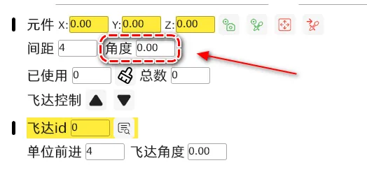

# PNP-machine-errors-dat
# PNP Machine Errors and Troubleshooting

Common Faults and Solutions

**Z-Axis Cannot Move Up or Down After Reset**

*   **Solution:** The Z-axis can move during reset, but not after, is a protective measure indicating an unsuccessful reset.

**Nozzle Calibration Error**

1.  The nozzle is not in the visual center, and the deviation value is too large. Check the reason why it is not in the visual center, or recalibrate.
2.  The nozzle diameter is entered incorrectly. Try a few parameters near the standard value.
3.  The recognition range is set too large, leading to misidentification. Reduce the range value.

**Feeder Red Light Flashes After Clicking "Forward"**

1.  The tape is blocked and cannot advance. Retract the tape and reload.
2.  The gear is stuck on a component.

**Placement Offset or Rotation**

*   **Individual Component Offset**

    *   Check if the visual image is correct. 👈 (The green box should just wrap the component and not be too large or too small.)

    

*   **Overall Component Offset**

    *   Perform placement offset calibration.

    

**Component Rotation Angle Error**

1.  Modify the component angle in the component feeder settings page.

    

2.  Open the component's package page → General → Uncheck the box for "Length and width as direction."

    

**Frequent Overall USB Disconnection**

*   Check if the USB interface is loose.
    *   Replace the computer interface.
*   Poor quality USB extension cable.
    *   Use a shielded cable with pure copper.
*   Purchase a separate USB power supply filter module.
*   Computer hardware issues.