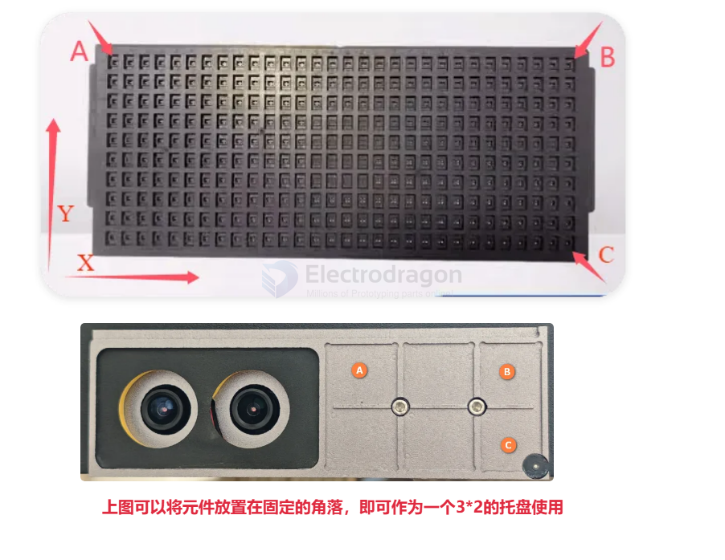
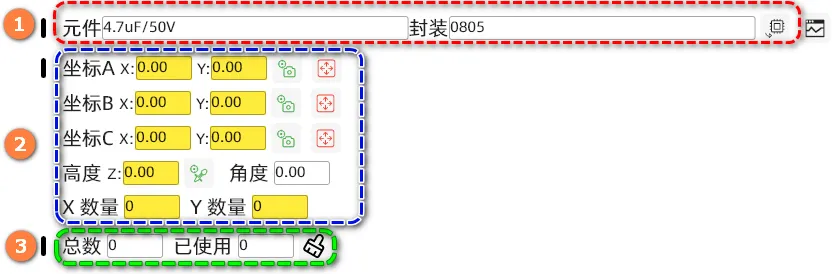

# Tray-Feeder-dat

## setup 

- 1: Set component information
- 2: Set the position and number of rows/columns of the component tray

After the tray is placed on the work surface, the top-left component is coordinate A, the top-right is coordinate B, and the bottom-right is coordinate C.

- 3: Count the number of used components. When all are used, click the clear button to reset the count.