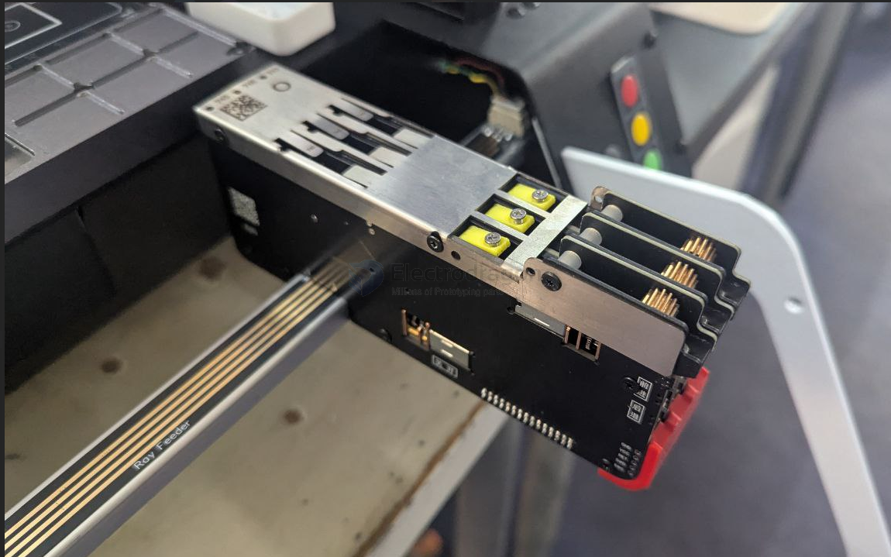
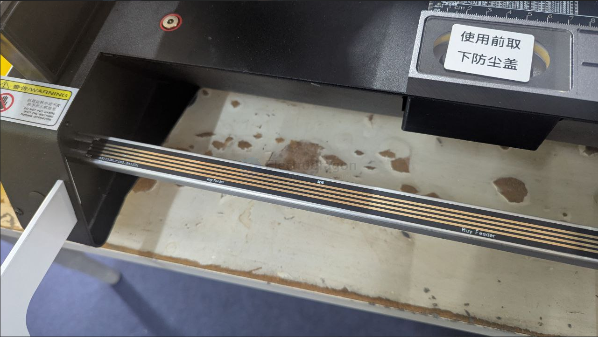
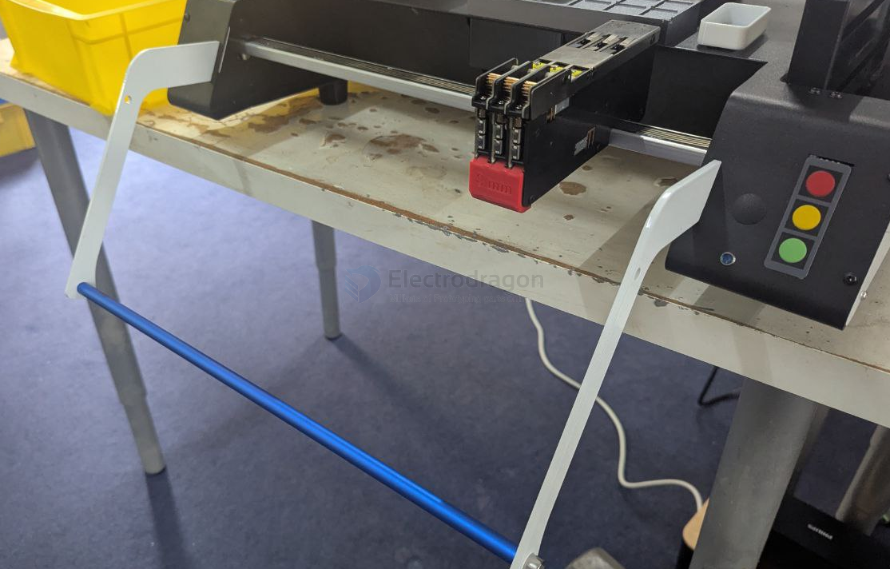
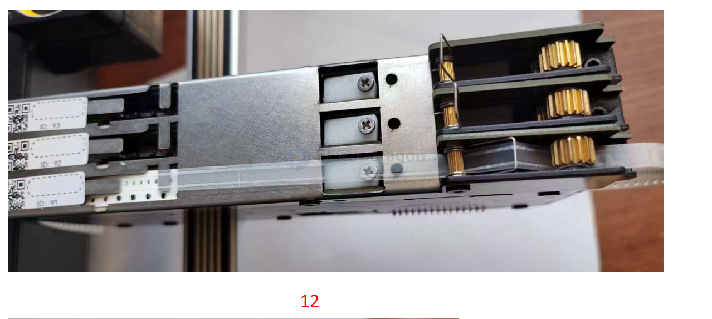
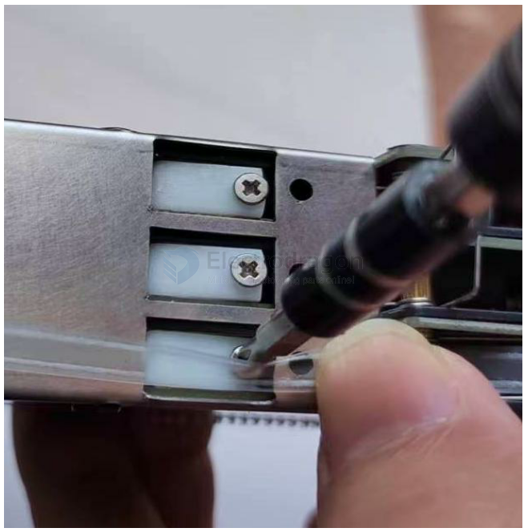
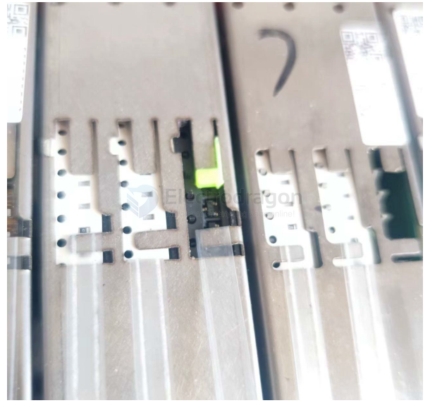

# feeder-dat

https://github.com/opulo-inc/feeder

Photon is Open-Source firmware for pick and place feeders.

https://github.com/photonfirmware/photon

## feeder 

## feeder base ray rail 

## feeder hang-out 

## feeder ID 

- Each electric feeder has a unique address number for communication with the host computer software. As shown in the figure, this feeder has three slots. The address numbers corresponding to each feeder slot, from left to right, are 571, 572, and 573.
- The QR code is used to quickly and automatically create visual identification markers for the feeders.

## feeder installation 

1-3. 

4-6. 

7-9.

10-11. 

12 

13. If the tape is broken (too tight) or the film cannot be peeled off, adjust this screw. Turn clockwise to increase the pulling force, and counterclockwise to decrease the pulling force. Rotate one-sixth of a turn each time, and click the forward button to test after rotation.

14. Because the plastic tape is too thin, the green pressure plate needs to be stuck on the metal strip and press down on the metal strip to expose the gear to the tape.

