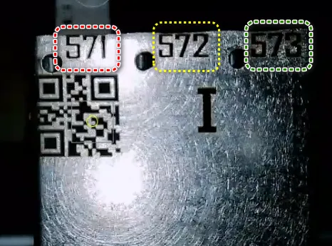
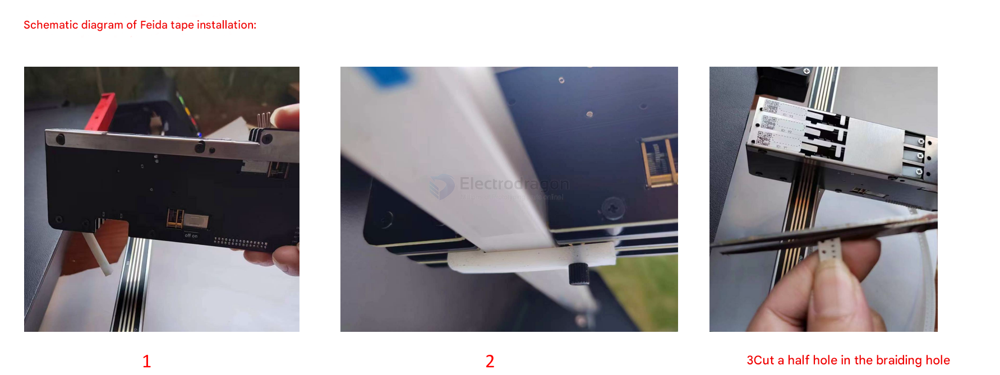
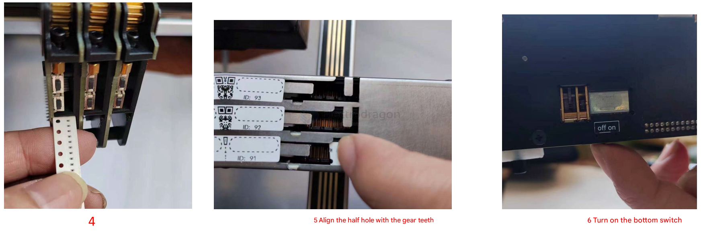
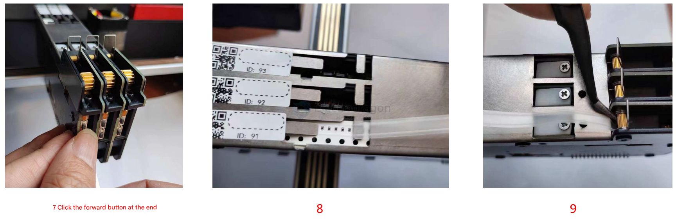
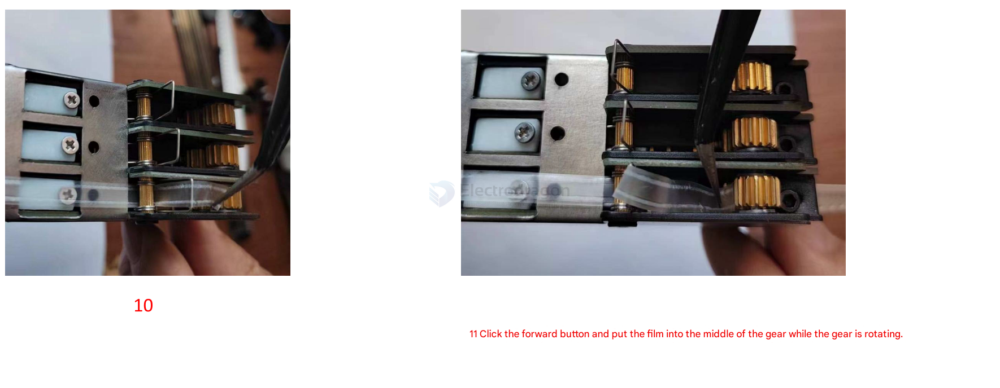

# feeder-dat

https://github.com/opulo-inc/feeder

Photon is Open-Source firmware for pick and place feeders.

https://github.com/photonfirmware/photon

## feeder ID 

- Each electric feeder has a unique address number for communication with the host computer software. As shown in the figure, this feeder has three slots. The address numbers corresponding to each feeder slot, from left to right, are 571, 572, and 573.
- The QR code is used to quickly and automatically create visual identification markers for the feeders.

## feeder installation 

