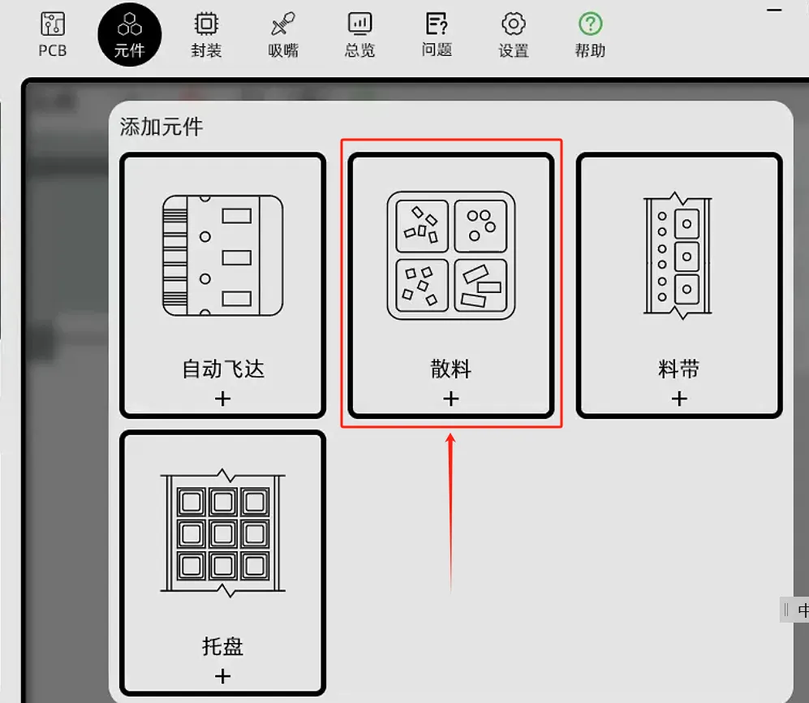

# feeder-dat

## feeder types 

- [[electric-feeder-dat]]  - [[loose-component-feeder-dat]] - [[Loose-Component-Taping-Feeder-dat]] - [[Tray-Feeder-dat]]

## other Type of Feeder Info 

https://github.com/opulo-inc/feeder

Photon is Open-Source firmware for pick and place feeders.

https://github.com/photonfirmware/photon

