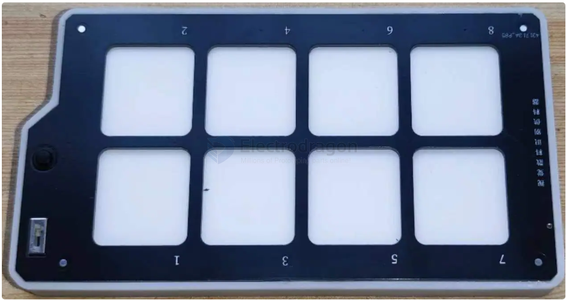
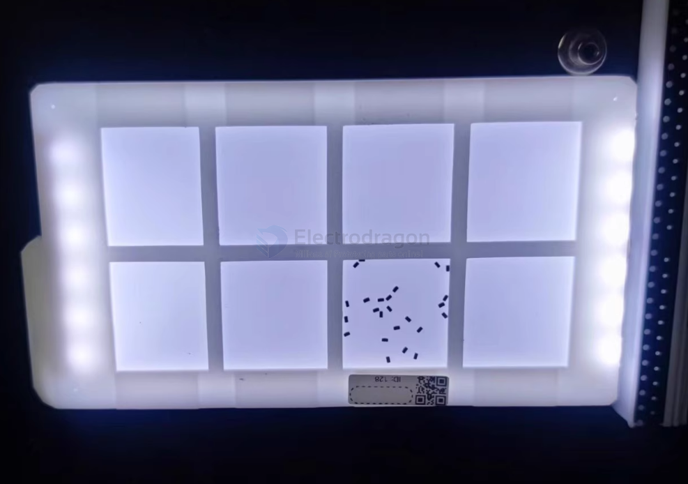
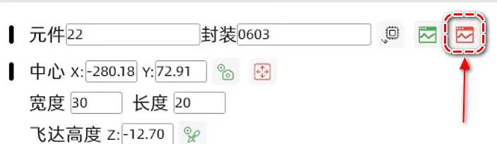
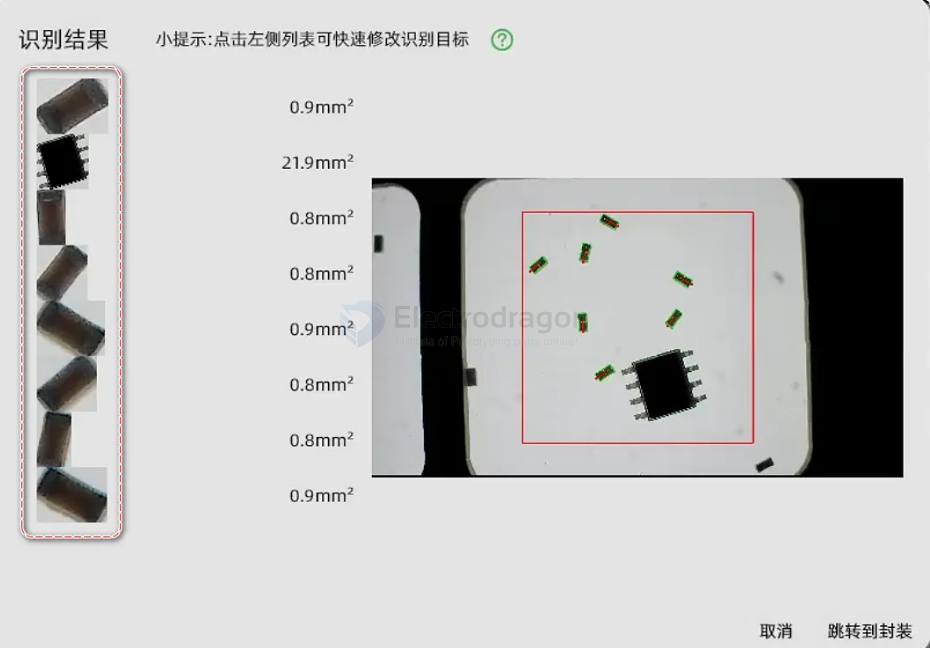

# loose-component-feeder-dat

Suitable for loose, non-taped resistors, capacitors, or non-polarized components.

turn on the back light 

## How to use

1: Add Feeder

2: Set Parameters

    1. Component properties
    2. Center point position of the grid square
    3. Length and width of the grid square
    4. Distance from the nozzle to the backlight board
    5. No need to set

Depending on the computer configuration, wait 5-20 seconds.
On the interface below, select the correct result on the left side.

