# pnp-machine-software-dat

##  motion-control-dat

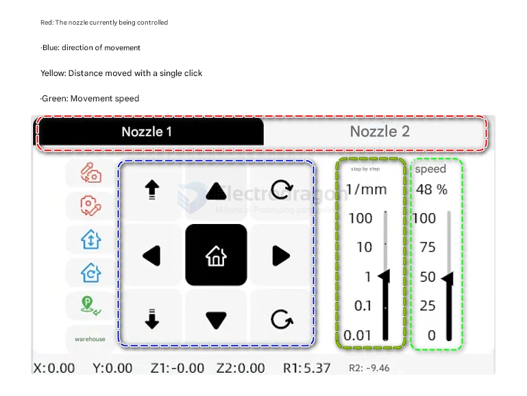

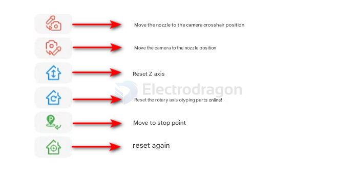

## PCB page 

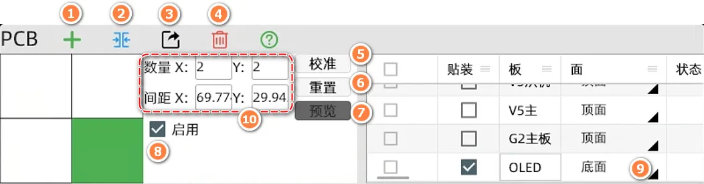

1. 导入添加PCB板
2. 以当前位置合并多个PCB板
3. 导出当前勾选的PCB文件（备份文件或者多台电脑间流转）
4. 删除当前勾选的PCB文件
5. 进入校准页面
6. 重置当前PCB为初始数据
7. 预览2D元件位置图，可以通过图片双击快速定位到元件（前提是需要先校准PCB位置）
8. 是否启动当前PCB文件，当使用拼版时可以通过这个按钮禁用拼版中的某一个文件
9. 切换PCB的贴装面，顶层/底层（底层贴装）
10. 拼版数量和PCB间距设置

1. 创建新的元件，可以手动添加创建新的元件信息
2. 复制当前选中的元件信息
3. 删除当前选中的元件
4. 开始贴装当前选中的单个或者多个元件，通常用来测试某个元件贴装是否正常
5. 连续跳转顶部视觉到下一个元件中心位置，可以通过这个按钮来观察元件位置是否准确
6. 勾选元件，跳转到该元件的供料器页面
7. 勾选元件，跳转到该元件的封装页面
8. 勾选元件，为该元件创建供料器
9. 勾选元件，为该元件创建封装
10. 勾选元件，将顶部相机的十字光标对准想要的放置点，点击图标修改元件的坐标（修改后元件贴装位置会发生变化）
11. 问题检查页面，检查该文件存在的所有问题

## Calibration page 

### 基础知识

PCB放置在夹具上后，机器并不能知道PCB所处的位置。我们通过找基准点的方式来矫正pcb的放置偏差。基准点校准分为两种手动和自动，自动通常使用mark圆点或者金属化过孔，高阶应用时也可以使用丝印或者方形焊盘。手动校准则一般使用对角的元器件，手动设置位置来校准。

以下图片是如何设置校准方式，通过选择元件类型，可以将元件设置为手动基准和自动基准

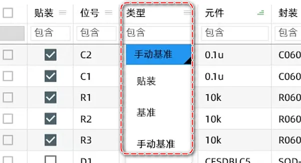

### 页面及功能介绍

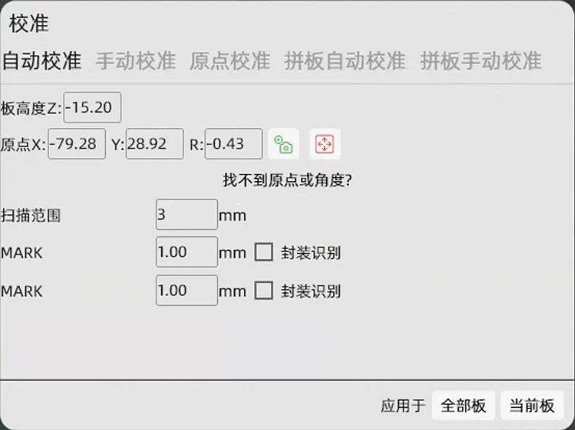

### 自动校准

推荐等级⭐⭐⭐⭐
分别移动到我们设置的基准元件中心，然后点击获取相机位置，然后点击应用。即可校准

### 原点校准

推荐等级⭐⭐
获取PCB原点位置并且输入一个角度即可校准（不建议，此方法误差较大）

### 拼版自动校准
同上

### 拼版手动校准
选择一个基准元件，分别设置这个元件在左上，右上，右下三块PCB中的位置即可完成校准

## Components page

### 供料器类型

#### 自动供料

适用范围: 整盘元件，大批量贴装的元件。优点是送料准确，不需要频繁换料	
缺点: 上料稍慢，需要注意撕膜的松紧度，塑料编带的元件需要加垫片

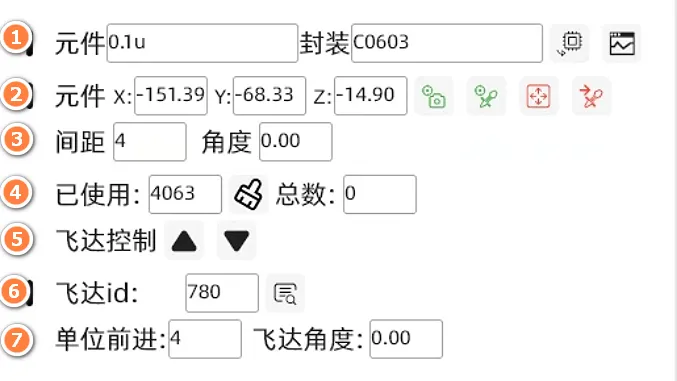

1. 选择元件信息，以及测试识别元件
    - 1.1 ------如果改元件的封装没有自动匹配到合适的封装，可以通过此按钮创建。封装的意义很重要，是为了能够正确使用吸嘴型号和正确识别元件
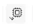
    - 1.2 ------测试吸嘴能否正确拾取元件和底部相机能否正确识别元件

2. 设置元件的拾取坐标，可以通过获取相机或者吸嘴的位置来设置坐标。视频
3. 元件在编带中相隔的距离，通常我们通过观察几个编带孔对应一个元件的方式来确定距离。例如：

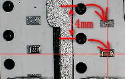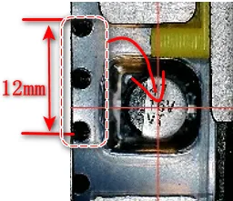

4. 使用计数，用来统计已送料的次数
5. 手动控制供料器前进后退（需要设置ID号后使用）
6. 供料器ID号填写。获取ID
7. 默认值即可，通常不用修改

#### 散料

适用范围: 适合样板，5-20片PCB的贴装，不需要判断极性的阻容器件，部署快速	
缺点: 单次只能放置几十颗料，需要调整视觉参数

#### 编带支架
适用范围: 适合样板，5-20片PCB的贴装，可以贴装有极性的元件。也可以适用24、32编带元件的贴装，是自动供料器的一个补充	
缺点: 需要固定牢固，否则撕膜时有可能元件会跳出

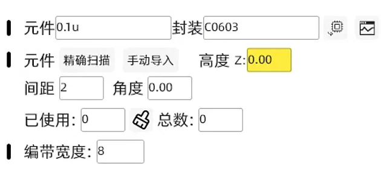

1.手动导入：根据图示导入前后两个编带的坐标后才可正常使用
2.高度Z指的是吸嘴到元件的距离

#### 托盘

适用范围: 通常用于芯片托盘或者大型元件的托盘

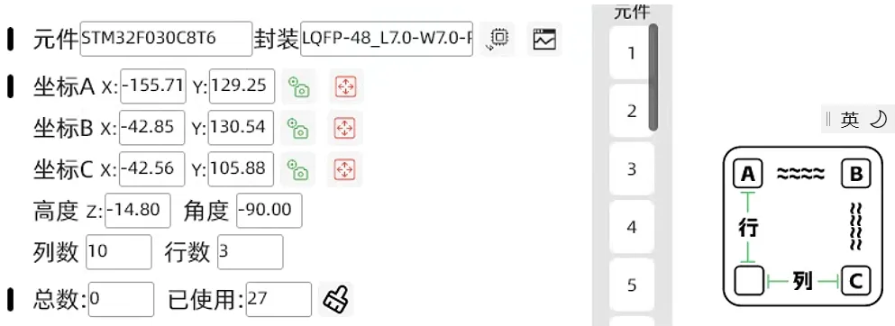

1.需要设置ABC三个点的坐标（元件中心），并且填入正确的行列数量才可以正常使用
2.如果贴装的角度不对，需要更改上图中的角度参数
3.高度Z指的是指吸嘴到元件的距离

## Footprint page 

## ref 

- [[pnp-machine-software]] - [[pnp-machine]]
