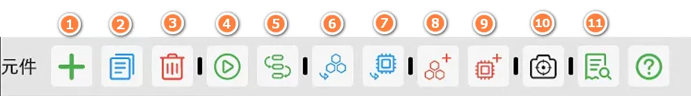
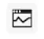
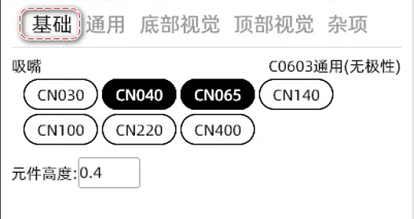
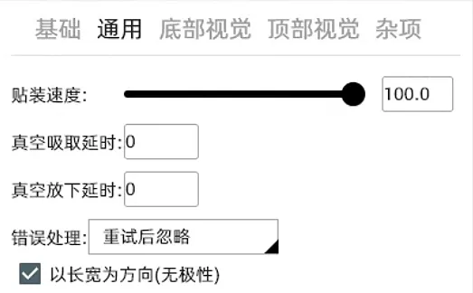
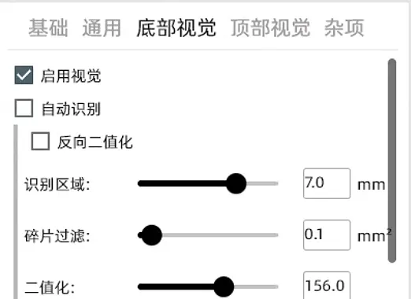
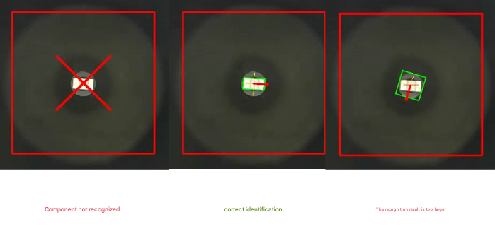
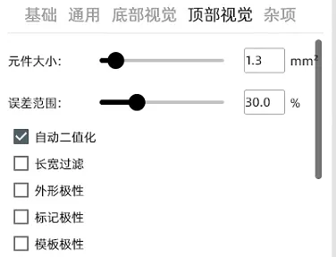

# PNP Machine Software Data

## Motion Control Data

## 1. PCB Page

1.  Import and add a PCB board.
2.  Merge multiple PCB boards at the current location.
3.  Export the currently selected PCB file (for backup or transfer between computers).
4.  Delete the currently selected PCB file.
5.  Enter the calibration page.
6.  Reset the current PCB to its initial data.
7.  Preview the 2D component location map. You can quickly locate components by double-clicking on the image (requires PCB position calibration first).
8.  Enable/disable the current PCB file. When using panelization, you can disable a specific file in the panel.
9.  Switch the PCB mounting side: Top/Bottom (bottom mounting).
10. Panelization quantity and PCB spacing settings.

1.  Create a new component. You can manually add and create new component information.
2.  Copy the currently selected component information.
3.  Delete the currently selected component.
4.  Start mounting the currently selected single or multiple components. This is usually used to test whether a component is mounted correctly.
5.  Continuously jump the top vision to the next component's center position. You can use this button to observe whether the component position is accurate.
6.  Select a component and jump to its feeder page.
7.  Select a component and jump to its footprint page.
8.  Select a component and create a feeder for it.
9.  Select a component and create a footprint for it.
10. Select a component, align the top camera's crosshair with the desired placement point, and click the icon to modify the component's coordinates (the component's mounting position will change after modification).
11. Problem check page to check for all issues in the file.

## 2. Calibration Page

### Basic Knowledge

After the PCB is placed on the fixture, the machine does not know the PCB's location. We correct the PCB placement deviation by finding fiducial points. Fiducial point calibration is divided into two types: manual and automatic. Automatic calibration usually uses mark circles or metallized vias. In advanced applications, silkscreen or square pads can also be used. Manual calibration generally uses diagonal components, and the position is manually set for calibration.

The following image shows how to set the calibration method. By selecting the component type, you can set the component as a manual fiducial or an automatic fiducial.

### Page and Function Introduction

### Automatic Calibration

Recommended Level ⭐⭐⭐⭐
Move to the center of the fiducial component we set, then click "Get Camera Position", and then click "Apply" to calibrate.

### Origin Calibration

Recommended Level ⭐⭐
Get the PCB origin position and enter an angle to calibrate (not recommended, this method has a large error).

### Panel Automatic Calibration

Same as above.

### Panel Manual Calibration

Select a fiducial component and set the position of this component in the upper left, upper right, and lower right PCBs to complete the calibration.

## 3. Components Page

Feeder Types: Automatic Feeder, Bulk Material, Tape Bracket, Tray.

#### a. Automatic Feeder

Applicable Range: Whole reel components, components for large-volume mounting. The advantage is accurate feeding and no need to change materials frequently.
Disadvantages: Slower loading, pay attention to the tightness of the tear film, and shims are required for plastic tape components.

1.  Select component information and test component recognition.
    -   1.1 ------ If the component's footprint is not automatically matched to a suitable footprint, you can create one using this button. The meaning of the footprint is very important for being able to correctly use the nozzle model and correctly identify the component.
        
    -   1.2 ------ Test whether the nozzle can correctly pick up the component and whether the bottom camera can correctly recognize the component.
        
2.  Set the component's pick-up coordinates. You can set the coordinates by getting the camera or nozzle position. Video
3.  The distance between components in the tape. We usually determine the distance by observing how many tape holes correspond to one component. For example:

    
4.  Usage count, used to count the number of times the material has been fed.
5.  Manually control the feeder to move forward and backward (requires setting the ID number before use).
6.  Feeder ID number to fill in. Get ID
7.  Default value is fine, usually no need to modify.

#### b. Bulk Material

Applicable Range: Suitable for prototypes, mounting of 5-20 PCBs, resistor-capacitor components that do not need to determine polarity, and quick deployment.
Disadvantages: Only dozens of materials can be placed at a time, and visual parameters need to be adjusted.

#### c. Tape Bracket

Applicable Range: Suitable for prototypes, mounting of 5-20 PCBs, and can mount polarized components. It can also be used for mounting 24 and 32 tape components, which is a supplement to automatic feeders.
Disadvantages: Needs to be fixed firmly, otherwise the components may jump out when tearing the film.

1.  Manual import: Import the coordinates of the front and rear tapes according to the illustration before it can be used normally.
2.  Height Z refers to the distance from the nozzle to the component.

#### d. Tray

Applicable Range: Usually used for chip trays or large component trays.

1.  You need to set the coordinates of the ABC three points (component center) and fill in the correct number of rows and columns before you can use it normally.
2.  If the mounting angle is incorrect, you need to change the angle parameter in the above figure.
3.  Height Z refers to the distance from the nozzle to the component.

## 4. Footprint Page

### a. Footprint Creation and Deletion

*   Import Footprint: Import existing footprint files.
*   Create Footprint: Create a blank footprint.
*   Copy Footprint
*   Export Footprint File: Usually used for backup or sharing.
*   Delete the specified footprint settings.

### b. Footprint Settings

*   Nozzle: Select the appropriate nozzle for the footprint.
*   Component Height: The thickness of the component (required).

#### General

*   Placement Speed: You can set the placement speed of a single component here, mainly used for large components to reduce speed and prevent displacement due to inertia.
*   Pick-up Delay: Used to increase the time required to establish vacuum when the vacuum suction is insufficient.
*   Error Handling: When the bottom vision judges that the component has not been picked up normally, the machine will perform a discard action, and then execute skip or re-pick according to the setting.

### c. Bottom Vision (This chapter is extremely important)

incorrect - correct - too big

The two main parameters that cause the above two identification failures are fragment filtering and binarization.

#### Fragment Filtering

This refers to some tiny bright spots that do not belong to the component itself. If this value is too large, it may cause the situation in the first picture. If it is too small, it may cause the situation in the third picture. It needs to be judged in combination with the binarized image.

#### Binarization

During the binarization process, we set a threshold. If the grayscale value of all pixels is higher than this threshold, it is considered white; otherwise, it is considered black. In this way, the continuous change of grayscale in the original image is converted into discrete black and white colors, which is used to highlight important features in the image, such as edges and lines.

If we drag the progress bar to the left, we will get more white areas, and to the right, we will reduce the white areas. By adjusting it left and right like this, we can obtain only the white that belongs to the component itself in the binarized image. If there are some tiny bright spots that cannot be filtered, we need to use the fragment filtering mentioned earlier to remove this feature in the final result. In order to obtain the result of our middle image, the green frame tightly wraps the complete component shape.

#### Length and Width Filtering

Refers to shielding all results outside the set size. The tolerance range refers to the allowable deviation range of the set size.

#### Large Size Components

Some component sizes exceed the bottom vision recognition range. At this time, using this function can synthesize the vision by taking pictures of different corners of the large component multiple times to calculate the center of the component.

#### Shape Polarity

Can identify the direction of special-shaped components.

#### Component Offset

Shifts the recognition result by a fixed value. Can correct placement deviations for some special components.

### d. Top Vision

This setting is usually used to set template matching MARK points or visual recognition of bulk materials.

Align the crosshair with the component to be recognized and click the top to take the top shot.

## Ref

-   [[pnp-machine-software]] - [[pnp-machine]]