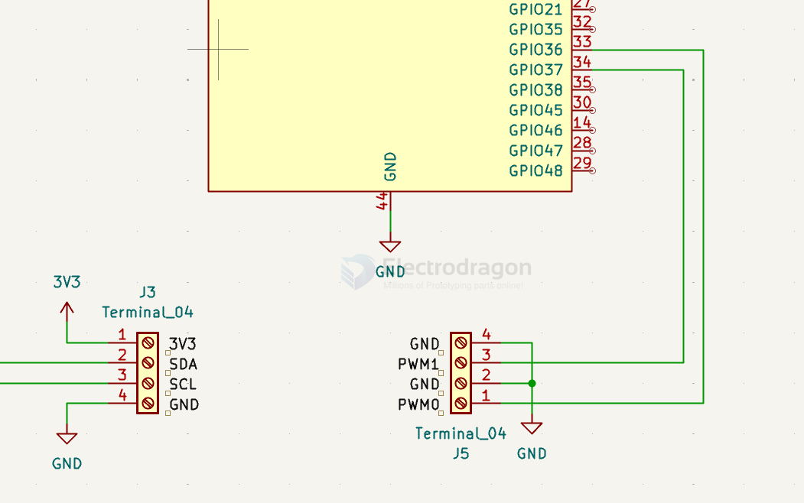

# PWM-dat

- arduino code example  - [[arduino-fading.ino]]

- [[mosfet-dat]] == [[SDR1073-dat]]

- [[pulse-in-dat]]


## analogWrite() vs writeMicroseconds() == duty-cycle vs pulse-width

|                    | `analogWrite()`                                       | `writeMicroseconds()`                                                  |
| ------------------ | ----------------------------------------------------- | ---------------------------------------------------------------------- |
| **What you set**   | `Duty cycle` as a value (0–255)                       | `Pulse width` in microseconds (e.g. 1000–2000)                         |
| **Frequency**      | Fixed ~490 Hz (or ~980 Hz on some pins)               | Fixed **50 Hz (20 ms period)** for servos/ESCs                         |
| **What changes**   | Percentage of ON-time per cycle                       | Absolute length of the ON-pulse                                        |
| **Typical use**    | LED brightness, DC motor speed via H-bridge, buzzer   | Servo angle, ESC throttle                                              |
| **Under the hood** | Hardware PWM (timer/OCRx compare) with a fixed period | Timer-generated pulses; period fixed at 20 ms, only pulse width varies |
| **Result**         | `analogWrite(127)` → ~50% duty cycle                  | `writeMicroseconds(1500)` → 1.5 ms pulse, always in a 20 ms frame      |

### The core conceptual difference

**`analogWrite()` — duty cycle percentage.**
`The frequency is fixed`, and you vary how much of each cycle is HIGH vs LOW.

```cpp
analogWrite(9, 0);    // 0%   → off
analogWrite(9, 127);  // ~50% → half brightness / half speed
analogWrite(9, 255);  // 100% → full on
```

**`writeMicroseconds()` — absolute pulse time.**
`The frame (period) is fixed at 20 ms`, and you vary the **actual duration of the HIGH pulse** in microseconds. This is what ESCs/servos decode.

```cpp
esc.writeMicroseconds(1000);  // 1 ms pulse  → stop
esc.writeMicroseconds(1500);  // 1.5 ms pulse → neutral
esc.writeMicroseconds(2000);  // 2 ms pulse  → full throttle
```

### Why it matters

- **`analogWrite()`** uses the real hardware PWM peripheral — clean, efficient, and the duty cycle is a ratio.
- **`writeMicroseconds()`** is implemented with a timer interrupt (`Servo.h`) to produce precise 50 Hz pulses. The ESC **doesn't care about duty cycle percentage** — it measures how many microseconds the pulse stays HIGH. 1000 µs is 5% duty, 2000 µs is 10% duty — but the ESC reads the **microsecond value**, not the percentage.

So: same underlying "square wave" concept, but **one encodes information in duty-cycle percentage, the other in absolute pulse width (µs)**.

## 20 ms (50 Hz)

- [[ESC-code-dat]] - [[PWM-dat]]


### Servo-style PWM & `writeMicroseconds()`

Yes — `writeMicroseconds()` generates a PWM signal, but specifically a **servo-style PWM** (sometimes called a "pulse-width" signal).

Here's what's actually happening:

**PWM in general** — A square wave where you vary the **duty cycle** (on-time vs. off-time). Arduino's `analogWrite()` uses a fixed frequency (e.g. ~490 Hz) and varies duty cycle to control things like LED brightness or motor speed via an H-bridge.

**Servo/ESC PWM** — A different flavor of PWM:

| Parameter         | Typical value                 |
| ----------------- | ----------------------------- |
| Period            | 20 ms (50 Hz)                 |
| Pulse width range | 1000 µs (min) – 2000 µs (max) |
| Neutral / mid     | 1500 µs                       |

The signal is still a square wave (on/off pulses at 50 Hz), so it **is** PWM — but the information is carried by the **pulse width (µs)**, not the duty cycle percentage. That's why `writeMicroseconds()` is used instead of `analogWrite()`.

### Visualizing 1000 µs vs 2000 µs pulses

ASCII visualization showing how the pulse width fits inside the 20 ms (50 Hz) frame. Each character ≈ 0.5 ms.

**1000 µs pulse (1 ms) — minimum / stop:**

```
  <-- 1 ms pulse (1000 µs) --><------- 19 ms low ------->
  ██                         __________________________
  ██                         |                         |
  ██                         |                         |
  ██                         |                         |
  ██                         |                         |
  ██                         |                         |
  ██                         |                         |
  └─┼────────────────────────┼─────────────────────────┼──► time
     0 ms                    10 ms                     20 ms
     (pulse high)            (pulse low)               (next pulse)
```

**2000 µs pulse (2 ms) — full throttle:**

```
  <------ 2 ms pulse (2000 µs) -----><----- 18 ms low ----->
  ████                             _______________________
  ████                             |                      |
  ████                             |                      |
  ████                             |                      |
  ████                             |                      |
  ████                             |                      |
  ████                             |                      |
  └─┼──────────────────────────────┼──────────────────────┼──► time
     0 ms                          10 ms                  20 ms
     (pulse high)                  (pulse low)            (next pulse)
```

**Side-by-side (simplified, one 20 ms frame):**

```
50 Hz frame = 20 ms, repeats forever:

1000 µs:   ██__________________________  (1 ms high + 19 ms low)
2000 µs:   ████________________________  (2 ms high + 18 ms low)

           ▲
           └── pulse starts at the same point each frame (position fixed)
```

**Key takeaways:**

- **Frequency stays fixed** at 50 Hz — every frame is exactly 20 ms.
- **Only the pulse width changes** — 1 ms vs. 2 ms of "high" time.
- The ESC measures how long the **high portion** lasts:
  - 1000 µs → motor off / full reverse
  - 1500 µs → neutral
  - 2000 µs → full forward
- The rest of the frame is "low" — the signal is only "on" for 5% (1000 µs) to 10% (2000 µs) of each cycle.

So the ESC isn't reading a duty-cycle percentage like `analogWrite()` — it reads the **absolute length of the high pulse in microseconds**.


## ESP32 LEDC (PWM) Frequency and Resolution Conflict


The Cause: If your code configures **a very high PWM frequency** (e.g., 50kHz) alongside a high bit-resolution (e.g., 12-bit or 13-bit), the maximum achievable value in code might not perfectly map to a true, solid 100% duty cycle, or it might over-heat the drivers due to high-frequency switching losses. 

Furthermore, manufacturing variances in the two 380 motors mean that at the ragged edge of a noisy signal, one will always drop off or perform worse than the other.

The Fix: Lower your ESP32 LEDC frequency to 10kHz or 20kHz with an 8-bit resolution (0-255). Ensure that "max throttle" translates to writing a clean 255 to the channel.

- [[motor-driver-dat]] - [[motor-driver-design-dat]] - [[logic-level-shifter-dat]] - [[PWM-dat]] - [[ESP32-S3-dat]] - [[ESP32-dat]]


## understand PWM 

PWM (Pulse Width Modulation) - [[PPM-dat]]

**What changes:**  
👉 **Pulse width (duty cycle)**

**What stays fixed:**  

Frequency

Pulse position


    |■■■■■■      |  60% duty
    |■■■         |  30% duty
    |■■■■■■■■    |  80% duty

Used for

- SMPS regulation
- Motor speed control
- LED dimming


## boards 

- [[SCU1063-dat]]

- [[SG3525-dat]] - [[MSP1046-dat]]


    /*
    Fade

    This example shows how to fade an LED on pin 9 using the analogWrite()
    function.

    The analogWrite() function uses PWM, so if you want to change the pin you're
    using, be sure to use another PWM capable pin. On most Arduino, the PWM pins
    are identified with a "~" sign, like ~3, ~5, ~6, ~9, ~10 and ~11.

    This example code is in the public domain.

    https://www.arduino.cc/en/Tutorial/BuiltInExamples/Fade
    */


## drive chip 

- TL494 == Pulse-Width-Modulation Control Circuits

- MIC38C42/43/44/45 - BiCMOS Current-Mode PWM Controllers - 20V, Current Mode SMPS Controller Family with Various UVLO and Max Duty Cycle - [[microchip-dat]]


## speed control - 1. PWM Speed Control (Pulse-Width Modulation — The Most Common and Most Efficient Method)


This is currently the most widespread approach in electronic control and industrial automation.

* **Principle:** Does not change the power supply voltage. Instead, it rapidly switches the supply ON and OFF at a very high frequency (e.g., 10kHz–20kHz). By adjusting the proportion of time the supply is ON within each cycle (i.e., the **duty cycle**), it changes the equivalent average voltage across the motor.
  * 100% duty cycle $\rightarrow$ motor runs at full speed.
  * 50% duty cycle $\rightarrow$ motor runs at roughly half speed.
* **Advantages:** Low heat generation, extremely high energy efficiency, good control precision, and very easy to interface with microcontrollers (e.g., MCUs, Arduino).


## build APP

build 1 - PWM - GND output socket 




## apps 

- [[tuner-dat]]

- [[motor-servo-dat]]


## ref 

- [[tech-dat]]