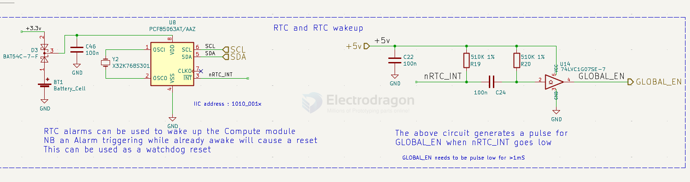

# RTC-DAT

Boards 

- [[MOT1007-dat]] - [[MOT1032-dat]]

## chip 

[[Dallas-dat]] 

[[NXP-dat]]

BL

- [[microchip-dat]] 

MCP7940N == Battery-Backed I2C™ Real-Time Clock/Calendar with SRAM

- [[Maxim-dat]]

## SCH 

INT and wakeup 

- [[PCF85063-dat]]

https://www.nxp.com/docs/en/data-sheet/PCF85063A.pdf

Tiny Real-Time Clock/Calendar with Alarm Function and I2C-Bus

- RTC alarms can be used to wake up the Compute module
- NB an Alarm triggering while already awake will cause a reset 
- This can be used as a watchdog reset 

The above circuit generates a pulse for GLOBAL_EN when nRTC_INT goes low

GLOBAL_EN needs to be pulse low for >1mS

## ref board 

[[MPC1073-DAT]]