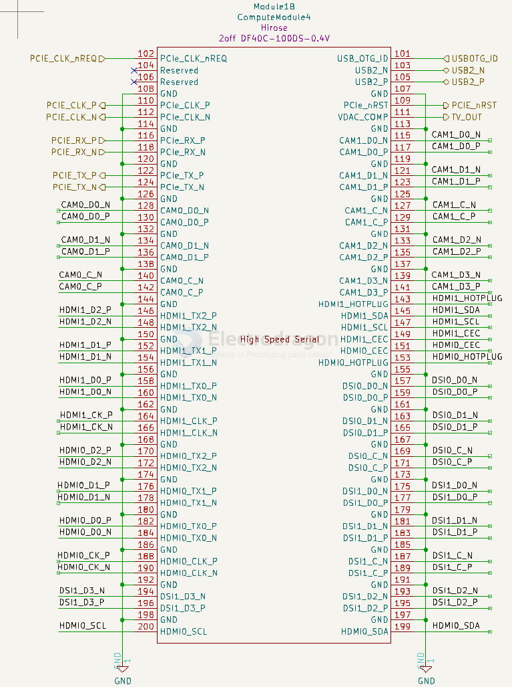

# RPI-CM4-gpio-dat

reference extra pins - https://docs.google.com/spreadsheets/d/1m27caMlk2gofswU9ZlBD_y3y81Y_0ARSmmQgm0i1AdQ/edit?gid=0#gid=0

pin definitions - [[cm4-datasheet.pdf]] - Chapter 4. Pinout

## Understanding the Discrepancy

The Compute Module 4 Datasheet uses absolute pin numbering, which is sequential across both connectors (J6 and J7). Here's how it works:

- Pins 1 to 100: Belong to J6 (Connector 1).
- Pins 101 to 200: Belong to J7 (Connector 2).
  
Thus, Pin 164 corresponds to J7-77 (Connector 2, Top Row, Pin 77) when using the relative pin numbering scheme for the J7 connector.

Summary
- HDMI1_CK_P is on J7 (Connector 2).
- Its absolute pin number in the datasheet: 164.
- Its relative pin number on J7: 77.

## pin in pictures 

- [[RPI-CM4]]

## pin note 

- 28&29 are ethernet
- 30-33 are Bluetooth
- 34-39 are Wifi (SDIO)
- 40, 41, and 43 are boot rom related.
- 42 is the activity LED
- 44&45 are I2C to the camera and display
- 46&47 are internal control
- 48-53 would appear to configured as SD card, but I believe you're right that they on dedicated pins.

## ref 

- https://forums.raspberrypi.com/viewtopic.php?t=354412

- https://forums.raspberrypi.com/viewtopic.php?t=320541

- https://forums.raspberrypi.com/viewtopic.php?t=299667

- https://docs.google.com/spreadsheets/d/1m27caMlk2gofswU9ZlBD_y3y81Y_0ARSmmQgm0i1AdQ/edit?gid=0#gid=0

## pin table 

| Pin |        | Signal            | Description                                                                                                                                                                                                                                                                    |
| --- | ------ | ----------------- | ------------------------------------------------------------------------------------------------------------------------------------------------------------------------------------------------------------------------------------------------------------------------------ |
| 1   |        | GND               | Ground (0V)                                                                                                                                                                                                                                                                    |
| 2   |        | GND               | Ground (0V)                                                                                                                                                                                                                                                                    |
| 3   |        | Ethernet_Pair3_P  | Ethernet pair 3 positive (connect to transformer or MagJack)                                                                                                                                                                                                                   |
| 4   |        | Ethernet_Pair1_P  | Ethernet pair 1 positive (connect to transformer or MagJack)                                                                                                                                                                                                                   |
| 5   |        | Ethernet_Pair3_N  | Ethernet pair 3 negative (connect to transformer or MagJack)                                                                                                                                                                                                                   |
| 6   |        | Ethernet_Pair1_N  | Ethernet pair 1 negative (connect to transformer or MagJack)                                                                                                                                                                                                                   |
| 7   |        | GND               | Ground (0V)                                                                                                                                                                                                                                                                    |
| 8   |        | GND               | Ground (0V)                                                                                                                                                                                                                                                                    |
| 9   |        | Ethernet_Pair2_N  | Ethernet pair 2 negative (connect to transformer or MagJack)                                                                                                                                                                                                                   |
| 10  |        | Ethernet_Pair0_N  | Ethernet pair 0 negative (connect to transformer or MagJack)                                                                                                                                                                                                                   |
| 11  |        | Ethernet_Pair2_P  | Ethernet pair 2 positive (connect to transformer or MagJack)                                                                                                                                                                                                                   |
| 12  |        | Ethernet_Pair0_P  | Ethernet pair 0 positive (connect to transformer or MagJack)                                                                                                                                                                                                                   |
| 13  |        | GND               | Ground (0V)                                                                                                                                                                                                                                                                    |
| 14  |        | GND               | Ground (0V)                                                                                                                                                                                                                                                                    |
| 15  |        | Ethernet_nLED3    | Active-low Ethernet activity indicator (CM4_3.3V signal): typically a green LED is connected to this pin. IOL = 8mA @ VOL < 0.4V                                                                                                                                               |
| 16  |        | Ethernet_SYNC_IN  | IEEE1588 SYNC Input pin (CM4_3.3V signal: IOL = 8mA @ VOL < 0.4V)                                                                                                                                                                                                              |
| 17  |        | Ethernet_nLED2    | Active-low Ethernet speed indicator (`CM4_3.3V`signal): typically a yellow LED is connected to this pin. A low state indicates the 1Gbit or 100Mbit link: IOL = 8mA @ VOL < 0.4V                                                                                               |
| 18  |        | Ethernet_SYNC_OUT | IEEE1588 SYNC Output pin (CM4_3.3V signal: IOL = 8mA @ VOL < 0.4V)                                                                                                                                                                                                             |
| 19  |        | Ethernet_nLED1    | Active-low Ethernet speed indicator (CM4_3.3V signal): typically a yellow LED is connected to this pin. A low state indicates the 1Gbit or 10Mbit link: IOL = 8mA @ VOL < 0.4V                                                                                                 |
| 20  |        | EEPROM_nWP        | Leave floating NB internally pulled up to CM4_3.3V via 100kΩ (VIL < 0.8V), but can be grounded to prevent writing to the on-board EEPROM which stores the bootcode                                                                                                             |
| 21  |        | Pi_nLED_Activity  | Active-low Pi activity LED. 20mA Max, 5V tolerant (VOL < 0.4V). (this is the signal that drives the green LED on the Raspberry Pi 4 Model B)                                                                                                                                   |
| 22  |        | GND               | Ground (0V)                                                                                                                                                                                                                                                                    |
| 23  |        | GND               | Ground (0V)                                                                                                                                                                                                                                                                    |
| 24  |        | GPIO26            | GPIO: typically a 3.3V signal, but can be a 1.8V signal by connecting GPIO_VREF to CM4_1.8V                                                                                                                                                                                    |
| 25  |        | GPIO21            | GPIO: typically a 3.3V signal, but can be a 1.8V signal by connecting GPIO_VREF to CM4_1.8V                                                                                                                                                                                    |
| 26  |        | GPIO19            | GPIO: typically a 3.3V signal, but can be a 1.8V signal by connecting GPIO_VREF to CM4_1.8V                                                                                                                                                                                    |
| 27  |        | GPIO20            | GPIO: typically a 3.3V signal, but can be a 1.8V signal by connecting GPIO_VREF to CM4_1.8V                                                                                                                                                                                    |
| 28  |        | GPIO13            | GPIO: typically a 3.3V signal, but can be a 1.8V signal by connecting GPIO_VREF to CM4_1.8V                                                                                                                                                                                    |
| 29  |        | GPIO16            | GPIO: typically a 3.3V signal, but can be a 1.8V signal by connecting GPIO_VREF to CM4_1.8V                                                                                                                                                                                    |
| 30  |        | GPIO6             | GPIO: typically a 3.3V signal, but can be a 1.8V signal by connecting GPIO_VREF to CM4_1.8V                                                                                                                                                                                    |
| 31  |        | GPIO12            | GPIO: typically a 3.3V signal, but can be a 1.8V signal by connecting GPIO_VREF to CM4_1.8V                                                                                                                                                                                    |
| 32  |        | GND               | Ground (0V)                                                                                                                                                                                                                                                                    |
| 33  |        | GND               | Ground (0V)                                                                                                                                                                                                                                                                    |
| 34  |        | GPIO5             | GPIO: typically a 3.3V signal, but can be a 1.8V signal by connecting GPIO_VREF to CM4_1.8V                                                                                                                                                                                    |
| 35  | GPIO1  | ID_SC             | (BCM2711 GPIO 1) GPIO: typically a 3.3V signal, but can be a 1.8V signal by connecting GPIO_VREF to CM4_1.8V                                                                                                                                                                   |
| 36  | GPIO0  | ID_SD             | (BCM2711 GPIO 0) GPIO: typically a 3.3V signal, but can be a 1.8V signal by connecting GPIO_VREF to CM4_1.8V                                                                                                                                                                   |
| 37  |        | GPIO7             | GPIO: typically a 3.3V signal, but can be a 1.8V signal by connecting GPIO_VREF to CM4_1.8V                                                                                                                                                                                    |
| 38  |        | GPIO11            | GPIO: typically a 3.3V signal, but can be a 1.8V signal by connecting GPIO_VREF to CM4_1.8V                                                                                                                                                                                    |
| 39  |        | GPIO8             | GPIO: typically a 3.3V signal, but can be a 1.8V signal by connecting GPIO_VREF to CM4_1.8V                                                                                                                                                                                    |
| 40  |        | GPIO9             | GPIO: typically a 3.3V signal, but can be a 1.8V signal by connecting GPIO_VREF to CM4_1.8V                                                                                                                                                                                    |
| 41  |        | GPIO25            | GPIO: typically a 3.3V signal, but can be a 1.8V signal by connecting GPIO_VREF to CM4_1.8V                                                                                                                                                                                    |
| 42  |        | GND               | Ground (0V)                                                                                                                                                                                                                                                                    |
| 43  |        | GND               | Ground (0V)                                                                                                                                                                                                                                                                    |
| 44  |        | GPIO10            | GPIO: typically a 3.3V signal, but can be a 1.8V signal by connecting GPIO_VREF to CM4_1.8V                                                                                                                                                                                    |
| 45  |        | GPIO24            | GPIO: typically a 3.3V signal, but can be a 1.8V signal by connecting GPIO_VREF to CM4_1.8V                                                                                                                                                                                    |
| 46  |        | GPIO22            | GPIO: typically a 3.3V signal, but can be a 1.8V signal by connecting GPIO_VREF to CM4_1.8V                                                                                                                                                                                    |
| 47  |        | GPIO23            | GPIO: typically a 3.3V signal, but can be a 1.8V signal by connecting GPIO_VREF to CM4_1.8V                                                                                                                                                                                    |
| 48  |        | GPIO27            | GPIO: typically a 3.3V signal, but can be a 1.8V signal by connecting GPIO_VREF to CM4_1.8V                                                                                                                                                                                    |
| 49  |        | GPIO18            | GPIO: typically a 3.3V signal, but can be a 1.8V signal by connecting GPIO_VREF to CM4_1.8V                                                                                                                                                                                    |
| 50  |        | GPIO17            | GPIO: typically a 3.3V signal, but can be a 1.8V signal by connecting GPIO_VREF to CM4_1.8V                                                                                                                                                                                    |
| 51  |        | GPIO15            | GPIO: typically a 3.3V signal, but can be a 1.8V signal by connecting GPIO_VREF to CM4_1.8V                                                                                                                                                                                    |
| 52  |        | GND               | Ground (0V)                                                                                                                                                                                                                                                                    |
| 53  |        | GND               | Ground (0V)                                                                                                                                                                                                                                                                    |
| 54  |        | GPIO4             | GPIO: typically a 3.3V signal, but can be a 1.8V signal by connecting GPIO_VREF to CM4_1.8V                                                                                                                                                                                    |
| 55  |        | GPIO14            | GPIO: typically a 3.3V signal, but can be a 1.8V signal by connecting GPIO_VREF to CM4_1.8V                                                                                                                                                                                    |
| 56  |        | GPIO3             | GPIO: typically a 3.3V signal, but can be a 1.8V signal by connecting GPIO_VREF to CM4_1.8V. Internal 1.8kΩ pull up to GPIO_VREF                                                                                                                                               |
| 57  |        | SD_CLK            | SD card clock signal (only available on CM4Lite)                                                                                                                                                                                                                               |
| 58  |        | GPIO2             | GPIO: typically a 3.3V signal, but can be a 1.8V signal by connecting GPIO_VREF to CM4_1.8V. Internal 1.8kΩ pull up to GPIO_VREF                                                                                                                                               |
| 59  |        | GND               | Ground (0V)                                                                                                                                                                                                                                                                    |
| 60  |        | GND               | Ground (0V)                                                                                                                                                                                                                                                                    |
| 61  |        | SD_DAT3           | SD card/eMMC Data3 signal (only available on CM4Lite)                                                                                                                                                                                                                          |
| 62  |        | SD_CMD            | SD card/eMMC Command signal (only available on CM4Lite)                                                                                                                                                                                                                        |
| 63  |        | SD_DAT0           | SD card/eMMC Data0 signal (only available on CM4Lite)                                                                                                                                                                                                                          |
| 64  |        | SD_DAT5           | SD card/eMMC Data5 signal (only available on CM4Lite)                                                                                                                                                                                                                          |
| 65  |        | GND               | Ground (0V)                                                                                                                                                                                                                                                                    |
| 66  |        | GND               | Ground (0V)                                                                                                                                                                                                                                                                    |
| 67  |        | SD_DAT1           | SD card/eMMC Data1 signal (only available on CM4Lite)                                                                                                                                                                                                                          |
| 68  |        | SD_DAT4           | SD card/eMMC Data4 signal (only available on CM4Lite)                                                                                                                                                                                                                          |
| 69  |        | SD_DAT2           | SD card/eMMC Data2 signal (only available on CM4Lite)                                                                                                                                                                                                                          |
| 70  |        | SD_DAT7           | SD card/eMMC Data7 signal (only available on CM4Lite)                                                                                                                                                                                                                          |
| 71  |        | GND               | Ground (0V)                                                                                                                                                                                                                                                                    |
| 72  |        | SD_DAT6           | SD card/eMMC Data6 signal (only available on CM4Lite)                                                                                                                                                                                                                          |
| 73  |        | SD_VDD_OVERRIDE   | Connect to CM4_3.3V to force SD card/eMMC interface to 1.8V signalling instead of 3.3V, otherwise leave unconnected. Typically only used if external eMMC is connected.                                                                                                        |
| 74  |        | GND               | Ground (0V)                                                                                                                                                                                                                                                                    |
| 75  |        | SD_PWR_ON         | Output to power-switch for the SD card. The CM4 sets this pin high (3.3V) to signal that power to the SD card should be turned on. If booting from the SD card is required then a pullup should also be fitted so the power-switch defaults to on. (only available on CM4Lite) |
| 76  |        | Reserved          | Do not connect anything to this pin.                                                                                                                                                                                                                                           |
| 77  |        | +5V               | (Input) 4.75V-5.25V. Main power input                                                                                                                                                                                                                                          |
| 78  |        | GPIO_VREF         | Must be connected to CM4_3.3V (pins 84 and 86) for 3.3V GPIO or CM4_1.8V (pins 88 and 90) for 1.8V GPIO. This pin cannot be floating or connected to ground.                                                                                                                   |
| 79  |        | +5V               | (Input) 4.75V-5.25V. Main power input                                                                                                                                                                                                                                          |
| 80  | GPIO45 | SCL0              | I2C clock pin (BCM2711 GPIO45): typically used for Camera and Display. Internal 1.8kΩ pull up to CM4_3.3V                                                                                                                                                                      |
| 81  |        | +5V               | (Input) 4.75V-5.25V. Main power input                                                                                                                                                                                                                                          |
| 82  | GPIO44 | SDA0              | I2C Data pin (BCM2711 GPIO44): typically used for Camera and Display. Internal 1.8kΩ pull up to CM4_3.3V                                                                                                                                                                       |
| 83  |        | +5V (Input)       | 4.75V-5.25V. Main power input                                                                                                                                                                                                                                                  |
| 84  |        | CM4_3.3V (Output) | 3.3V ± 2.5%. Power Output max 300mA per pin for a total of 600mA. This will be powered down during power-off or GLOBAL_EN being set low                                                                                                                                        |
| 85  |        | +5V (Input)       | 4.75V-5.25V. Main power input                                                                                                                                                                                                                                                  |
| 86  |        | CM4_3.3V (Output) | 3.3V ± 2.5%. Power Output max 300mA per pin for a total of 600mA. This will be powered down during power-off or GLOBAL_EN being set low                                                                                                                                        |
| 87  |        | +5V (Input)       | 4.75V-5.25V. Main power input                                                                                                                                                                                                                                                  |
| 88  |        | CM4_1.8V (Output) | 1.8V ± 2.5%. Power Output max 300mA per pin for a total of 600mA. This will be powered down during power-off or GLOBAL_EN being set low                                                                                                                                        |
| 89  |        | WL_nDisable       | Can be left floating; if driven low the wireless interface will be disabled. Internally pulled up via 1.8kΩ to CM4_3.3V                                                                                                                                                        |
| 90  |        | CM4_1.8V (Output) | 1.8V ± 2.5%. Power Output max 300mA per pin for a total of 600mA. This will be powered down during power-off or GLOBAL_EN being set low                                                                                                                                        |
| 91  |        | BT_nDisable       | Can be left floating; if driven low the Bluetooth interface will be disabled. Internally pulled up via 1.8kΩ to CM4_3.3V                                                                                                                                                       |
| 92  |        | RUN_PG            | Bidirectional pin. Can be driven low (via a 220Ω resistor) to reset the CM4 CPU. As an output, a high signals that power is good and CPU is running. Internally pulled up to +3.3V via 10kΩ                                                                                    |
| 93  |        | nRPIBOOT          | A low on this pin forces booting from an RPI server (e.g. PC or a Raspberry Pi); if not used leave floating. Internally pulled up via 10kΩ to +3.3V                                                                                                                            |
| 94  |        | AnalogIP1         | Analogue input of the MXL7704: typically connected to CC pin of Type C power connector                                                                                                                                                                                         |
| 95  |        | PI_LED_nPWR       | Active-low output to drive Power On LED. This signal needs to be buffered.                                                                                                                                                                                                     |
| 96  |        | AnalogIP0         | Analogue input of the MXL7704: typically connected to CC pin of Type C power connector                                                                                                                                                                                         |
| 97  |        | Camera_GPIO       | Typically used to shut down the camera to reduce power. Reassigning this pin to another function isn’t recommended. CM4_3.3V signalling                                                                                                                                        |
| 98  |        | GND Ground (0V)   |
| 99  |        | GLOBAL_EN         | Input. Drive low to power off CM4. Internally pulled up with a 100kΩ to +5V                                                                                                                                                                                                    |
| 100 |        | nEXTRST           | Output. Driven low during reset; Driven high (CM4_3.3V) once CM4 CPU has started to boot                                                                                                                                                                                       |
| 101 |        | USB_OTG_ID        | Input (3.3V signal) USB OTG Pin. Internally pulled up. When grounded the CM4 becomes a USB host but the correct OS driver also needs to be used                                                                                                                                |
| 102 |        | PCIe_CLK_nREQ     | Input (3.3V signal) PCIe clock request pin (low to request PCI clock). Internally pulled up                                                                                                                                                                                    |
| 103 |        | USB_N             | USB D104 Reserved Do not connect anything to this pin.                                                                                                                                                                                                                         |
| 105 |        | USB_P             | USB D+                                                                                                                                                                                                                                                                         |
| 106 |        | Reserved          | Do not connect anything to this pin.                                                                                                                                                                                                                                           |
| 107 |        | GND               | Ground (0V)                                                                                                                                                                                                                                                                    |
| 108 |        | GND               | Ground (0V)                                                                                                                                                                                                                                                                    |
| 109 |        | PCIe_nRST         | Output (+3.3V signal) PCIe reset active-low                                                                                                                                                                                                                                    |
| 110 |        | PCIe_CLK_P        | PCIe clock Out positive (100MHz) NB AC coupling capacitor included on CM4                                                                                                                                                                                                      |
| 111 |        | VDAC_COMP         | Video DAC output (TV OUT)                                                                                                                                                                                                                                                      |
| 112 |        | PCIe_CLK_N        | PCIe clock Out negative (100MHz) NB AC coupling capacitor included on CM4                                                                                                                                                                                                      |
| 113 |        | GND               | Ground (0V)                                                                                                                                                                                                                                                                    |
| 114 |        | GND               | Ground (0V)                                                                                                                                                                                                                                                                    |
| 115 |        | CAM1_D0_N         | Input Camera1 D0 negative                                                                                                                                                                                                                                                      |
| 116 |        | PCIe_RX_P         | Input PCIe GEN 2 RX positive NB external AC coupling capacitor required                                                                                                                                                                                                        |
| 117 |        | CAM1_D0_P         | Input Camera1 D0 positive                                                                                                                                                                                                                                                      |
| 118 |        | PCIe_RX_N         | Input PCIe GEN 2 RX negative NB external AC coupling capacitor required                                                                                                                                                                                                        |
| 119 |        | GND               | Ground (0V)                                                                                                                                                                                                                                                                    |
| 120 |        | GND               | Ground (0V)                                                                                                                                                                                                                                                                    |
| 121 |        | CAM1_D1_N         | Input Camera1 D1 negative                                                                                                                                                                                                                                                      |
| 122 |        | PCIe_TX_P         | Output PCIe GEN 2 TX positive NB AC coupling capacitor included on CM4                                                                                                                                                                                                         |
| 123 |        | CAM1_D1_P         | Input Camera1 D1 positive                                                                                                                                                                                                                                                      |
| 124 |        | PCIe_TX_N         | Output PCIe GEN 2 TX positive NB AC coupling capacitor included on CM4                                                                                                                                                                                                         |
| 125 |        | GND               | Ground (0V)                                                                                                                                                                                                                                                                    |
| 126 |        | GND               | Ground (0V)                                                                                                                                                                                                                                                                    |
| 127 |        | CAM1_C_N          | Input Camera1 clock negative                                                                                                                                                                                                                                                   |
| 128 |        | CAM0_D0_N         | Input Camera0 D0 negative                                                                                                                                                                                                                                                      |
| 129 |        | CAM1_C_P          | Input Camera1 clock positive                                                                                                                                                                                                                                                   |
| 130 |        | CAM0_D0_P         | Input Camera0 D0 positive                                                                                                                                                                                                                                                      |
| 131 |        | GND               | Ground (0V)                                                                                                                                                                                                                                                                    |
| 132 |        | GND               | Ground (0V)                                                                                                                                                                                                                                                                    |
| 133 |        | CAM1_D2_N         | Input Camera1 D2 negative                                                                                                                                                                                                                                                      |
| 134 |        | CAM0_D1_N         | Input Camera0 D1 negative                                                                                                                                                                                                                                                      |
| 135 |        | CAM1_D2_P         | Input Camera1 D2 positive                                                                                                                                                                                                                                                      |
| 136 |        | CAM0_D1_P         | Input Camera0 D1 positive                                                                                                                                                                                                                                                      |
| 137 |        | GND               | Ground (0V)                                                                                                                                                                                                                                                                    |
| 138 |        | GND               | Ground (0V)                                                                                                                                                                                                                                                                    |
| 139 |        | CAM1_D3_N         | Input Camera1 D3 negative                                                                                                                                                                                                                                                      |
| 140 |        | CAM0_C_N          | Input Camera0 clock negative                                                                                                                                                                                                                                                   |
| 141 |        | CAM1_D3_P         | Input Camera1 D3 positive                                                                                                                                                                                                                                                      |
| 142 |        | CAM0_C_P          | Input Camera0 clock positive                                                                                                                                                                                                                                                   |
| 143 |        | HDMI1_HOTPLUG     | Input HDMI1 hotplug. Internally pulled down with a 100kΩ. 5V tolerant. (It can be connected directly to a HDMI connector; a small amount of ESD protection is provided on the CM4 by an on-board HDMI05-CL02F3)                                                                |
| 144 |        | GND               | Ground (0V)                                                                                                                                                                                                                                                                    |
| 145 |        | HDMI1_SDA         | Bidirectional HDMI1 SDA. Internally pulled up with a 1.8kΩ. 5V tolerant. (It can be connected directly to a HDMI connector; a small amount of ESD protection is provided on the CM4 by an on-board HDMI05-CL02F3)                                                              |
| 146 |        | HDMI1_TX2_P       | Output HDMI1 TX2 positive                                                                                                                                                                                                                                                      |
| 147 |        | HDMI1_SCL         | Bidirectional HDMI1 SCL. Internally pulled up with a 1.8kΩ. 5V tolerant. (It can beconnected directly to a HDMI connector; a small amount of ESD protection is provided onthe CM4 by an on-board HDMI05-CL02F3)                                                                |
| 148 |        | HDMI1_TX2_N       | Output HDMI1 TX2 negative                                                                                                                                                                                                                                                      |
| 149 |  GPIO28      | HDMI1_CEC         | Input HDMI1 CEC. Internally pulled up with a 27kΩ. 5V tolerant. (It can be connecteddirectly to a HDMI connector; a small amount of ESD protection is provided on the CM4by an on-board HDMI05-CL02F3)                                                                         |
| 150 |        | GND               | Ground (0V)                                                                                                                                                                                                                                                                    |
| 151 |        | HDMI0_CEC         | Input HDMI0 CEC. Internally pulled up with a 27kΩ. 5V tolerant (It can be connecteddirectly to a HDMI connector; a small amount of ESD protection is provided on the CM4by an on-board HDMI05-CL02F3)                                                                          |
| 152 |        | HDMI1_TX1_P       | Output HDMI1 TX1 positive                                                                                                                                                                                                                                                      |
| 153 |        | HDMI0_HOTPLUG     | Input HDMI0 hotplug. Internally pulled down 100kΩ. 5V tolerant. (It can be connecteddirectly to a HDMI connector; a small amount of ESD protection is provided on the CM4by an on-board HDMI05-CL02F3)                                                                         |
| 154 |        | HDMI1_TX1_N       | Output HDMI1 TX1 negative                                                                                                                                                                                                                                                      |
| 155 |        | GND               | Ground (0V)                                                                                                                                                                                                                                                                    |
| 156 |        | GND               | Ground (0V)                                                                                                                                                                                                                                                                    |
| 157 |        | DSI0_D0_N         | Output Display0 D0 negative                                                                                                                                                                                                                                                    |
| 158 |        | HDMI1_TX0_P       | Output HDMI1 TX0 positive                                                                                                                                                                                                                                                      |
| 159 |        | DSI0_D0_P         | Output Display0 D0 positive                                                                                                                                                                                                                                                    |
| 160 |        | HDMI1_TX0_N       | Output HDMI1 TX0 negative                                                                                                                                                                                                                                                      |
| 161 |        | GND               | Ground (0V)                                                                                                                                                                                                                                                                    |
| 162 |        | GND               | Ground (0V)                                                                                                                                                                                                                                                                    |
| 163 |        | DSI0_D1_N         | Output Display0 D1 negative                                                                                                                                                                                                                                                    |
| 164 |        | HDMI1_CLK_P       | Output HDMI1 clock positive                                                                                                                                                                                                                                                    |
| 165 |        | DSI0_D1_P         | Output Display0 D1 positive                                                                                                                                                                                                                                                    |
| 166 |        | HDMI1_CLK_N       | Output HDMI1 clock negative                                                                                                                                                                                                                                                    |
| 167 |        | GND               | Ground (0V)                                                                                                                                                                                                                                                                    |
| 168 |        | GND               | Ground (0V)                                                                                                                                                                                                                                                                    |
| 169 |        | DSI0_C_N          | Output Display0 clock negative                                                                                                                                                                                                                                                 |
| 170 |        | HDMI0_TX2_P       | Output HDMI0 TX2 positive                                                                                                                                                                                                                                                      |
| 171 |        | DSI0_C_P          | Output Display0 clock positive                                                                                                                                                                                                                                                 |
| 172 |        | HDMI0_TX2_N       | Output HDMI0 TX2 negative                                                                                                                                                                                                                                                      |
| 173 |        | GND               | Ground (0V)                                                                                                                                                                                                                                                                    |
| 174 |        | GND               | Ground (0V)                                                                                                                                                                                                                                                                    |
| 175 |        | DSI1_D0_N         | Output Display1 D0 negative                                                                                                                                                                                                                                                    |
| 176 |        | HDMI0_TX1_P       | Output HDMI0 TX1 positive                                                                                                                                                                                                                                                      |
| 177 |        | DSI1_D0_P         | Output Display1 D0 positive                                                                                                                                                                                                                                                    |
| 178 |        | HDMI0_TX1_N       | Output HDMI0 TX1 negative                                                                                                                                                                                                                                                      |
| 179 |        | GND               | Ground (0V)                                                                                                                                                                                                                                                                    |
| 180 |        | GND               | Ground (0V)                                                                                                                                                                                                                                                                    |
| 181 |        | DSI1_D1_N         | Output Display1 D1 negative                                                                                                                                                                                                                                                    |
| 182 |        | HDMI0_TX0_P       | Output HDMI0 TX0 positive                                                                                                                                                                                                                                                      |
| 183 |        | DSI1_D1_P         | Output Display1 D1 positive                                                                                                                                                                                                                                                    |
| 184 |        | HDMI0_TX0_N       | Output HDMI0 TX0 negative                                                                                                                                                                                                                                                      |
| 185 |        | GND               | Ground (0V)                                                                                                                                                                                                                                                                    |
| 186 |        | GND               | Ground (0V)                                                                                                                                                                                                                                                                    |
| 187 |        | DSI1_C_N          | Output Display1 clock negative                                                                                                                                                                                                                                                 |
| 188 |        | HDMI0_CLK_P       | Output HDMI0 clock positive                                                                                                                                                                                                                                                    |
| 189 |        | DSI1_C_P          | Output Display1 clock positive                                                                                                                                                                                                                                                 |
| 190 |        | HDMI0_CLK_N       | Output HDMI0 clock negative                                                                                                                                                                                                                                                    |
| 191 |        | GND               | Ground (0V)                                                                                                                                                                                                                                                                    |
| 192 |        | GND               | Ground (0V)                                                                                                                                                                                                                                                                    |
| 193 |        | DSI1_D2_N         | Output Display1 D2 negative                                                                                                                                                                                                                                                    |
| 194 |        | DSI1_D3_N         | Output Display1 D3 negative                                                                                                                                                                                                                                                    |
| 195 |        | DSI1_D2_P         | Output Display1 D2 positive                                                                                                                                                                                                                                                    |
| 196 |        | DSI1_D3_P         | Output Display1 D3 positive                                                                                                                                                                                                                                                    |
| 197 |        | GND               | Ground (0V)                                                                                                                                                                                                                                                                    |
| 198 |        | GND               | Ground (0V)                                                                                                                                                                                                                                                                    |
| 199 |        | HDMI0_SDA         | Bidirectional HDMI0 SDA. Internally pulled up with a 1.8kΩ. 5V tolerant. (It can be connected directly to a HDMI connector; a small amount of ESD protection is provided on the CM4 by an on-board HDMI05-CL02F3)                                                              |
| 200 |        | HDMI0_SCL         | Bidirectional HDMI0 SCL. Internally pulled up with a 1.8kΩ. 5V tolerant. (It can be connected directly to a HDMI connector; a small amount of ESD protection is provided on the CM4 by an on-board HDMI05-CL02F3)                                                              |