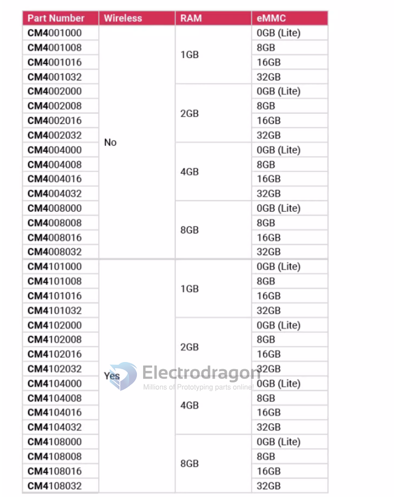
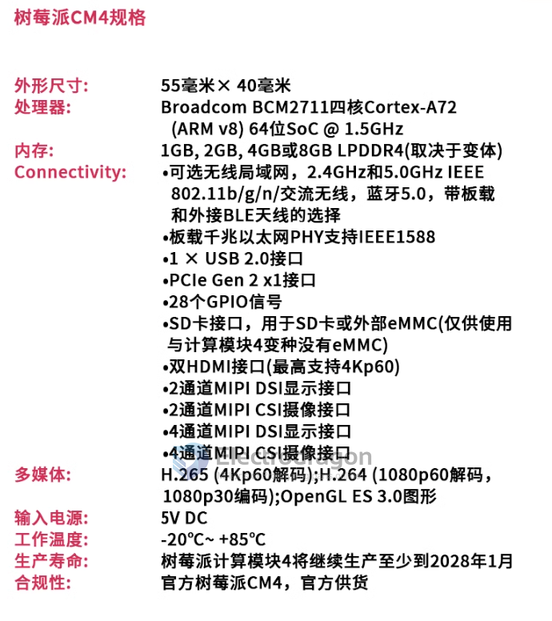

# RPI-CM4-dat

- [[RPI-dat]]

[COMPUTE MODULE OPERATING INSTRUCTIONS](https://www.farnell.com/datasheets/1830506.pdf)

- [[README-CM-dat]]

- [[RPI-CM4-dat]] - [[RPI-CM3-dat]]

- [[RPI-CM4-expansion-board-dat]]

## CM4 

CM4 exposes GPIO Bank 0, which covers GPIOs 0 to 27. Naming is identical between 2711 and CM4.
Bank 1 (GPIOs 28 to 45) is largely used by ethernet functions and wireless LAN.
Bank 2 (GPIOs 46 to 57) is used for eMMC/SD card.

CM4 also has GPIOs 44&45 from Bank 1 exposed for the I2C bus normally connected to the camera or DSI displays. See CM4 datasheet section 2.9 "I2C (SDA0 SCL0)"

default UARTs: https://forums.raspberrypi.com/viewtopic.php?t=345086

## Specs 

## Names 

- CM4001008

## hardware 

- [[BCM2711-dat]]

- [[EMMC-dat]] - [[WIFI-dat]] - [[PHY-dat]] - [[ethernet-dat]]

- Connector - 【 DF40HC (3.0)-100DS-0.4V(51)】

- [[RMP-RPI-CM4-dat]]

### Pins 

- [[RPI-CM4-gpio-dat]]

## Features 

- on module CPU BCM2711 

### On module storage EMMC 

- flash into [[raspbian-os-dat]]

### On module wifi 

## ref 

- [[RPI-CM4-expansion-board-dat]]

- datasheet [[cm4-datasheet.pdf]]

- [[RPI-CM4]]

- https://www.raspberrypi.com/products/compute-module-4/?variant=raspberry-pi-cm4001000

- [[kicad-dat]]

- [[DF40-dat]]

## design ref 

footprint 

- https://github.com/Kedarius/RPi-CM4-Kicad

- https://gitlab.com/m10cube/m10

- https://github.com/ShawnHymel/rpi-cm4-carrier-template

https://elinux.org/RPi_BCM2711_GPIOs