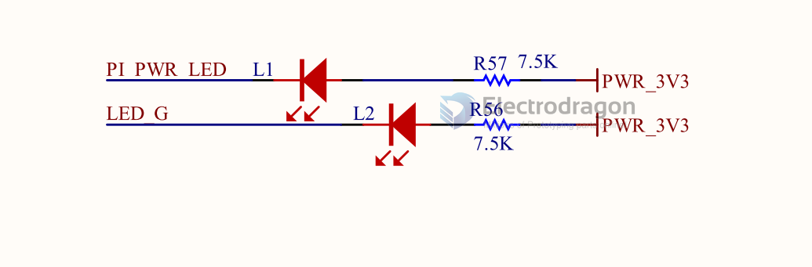

# RPI-CM4-expansion-board-dat

## Expansion Board 

### IO Expansion board 

diagram 

- USB2_HUB
  - nEXTRST
  - USB2_P
  - USB2_N
  - USBOTG
- CM4_HighSpeed
  - GPIO_VREF
  - CAM_GPIO
  - TV_OUT
  - ID_SD (cam/display)
  - IS_SC (cam/display)
- PCIe-connector
- RTC, wakeup, fan
    - SDA
    - SCL
    - global_EN
- CM4_GPIO 
  - GPIO_VREF
  - CAM_GPIO
  - TV_OUT
  - ID_SD (cam/display)
  - IS_SC (cam/display)
- PSUs

- [[kicad-dat]]

#### Functions 

- nRPIBOOT = pin 93 = [[raspbian-os-dat]]

## RPI CM4IO Board 

- full scale large size image - https://pi4j.com/1.3/images/pi4j-rpi-cm4-header.png

### ref 

- https://www.raspberrypi.com/products/compute-module-4-io-board/
- datasheet https://datasheets.raspberrypi.com/cm4/cm4-datasheet.pdf
- kicad file - 

## Variation Board 

- [[RMP-RPI-CM4-dat]]

- RPI-CM4-POE
- RPI-CM4-POE_4G

- RPI-CM4-Base_ETH2
- RPI-CM4-NANO

### RPI-CM4-Base_B

- SCH - [[CM4-IO-BASE-B_V4_SchDoc.pdf]]

### minimum carrier board 
- Small carrier board for Raspberry Pi CM4 - [mincab](https://uplab.pro/2021/10/mincab/)
- [Minimal_carrier_board_for_CM4](https://github.com/dronecz/Minimal_carrier_board_for_CM4)

## periperal 

- protocol [[HDMI-dat]] - [[M2-dat]] - [[CSI-dat]] - [[DSI-dat]] - [[SDIO-dat]] 

- network [[ethernet-dat]] 

- misc [[fan-driver-dat]]  

- power supply [[dcdc-down-dat]] 

- USB [[USB-switch-dat]] - [[type-c-dat]] - [[USB-hub-dat]]

- VDDIO 

- Mode select 

- LEDs 

## board note 

- Board thickness  : 1.56mm
- Finished copper weight inners : 1oz
- Finished copper weight outers : 1oz

- Board finish : OSP
- Material type : FR4
- Colour of solder resists : Green
- Colour of silk screens : White Only on the top side
- Board to : UL94-V0
- TG >=130

- 50R trace width 0.13mm@ 3GHz
- 90R diff pair width 0.147 spacing 0.253mm @ 2.5GHz
- 100R diff pair width 0.127 spacing 0.253mm @ 2GHz

- on board SDCARD slot == NB uSDCARD only used for CM4 modules without eMMC

## jumpers 

- GND - nRPIBOOT == Fit jumper to disable eMMC Boot
- GND - EEPROM_nWP == Fit jumper to disable writing to EEPROM
- J3 - GND - BT_nDis == Fit jumper to disable Bluetooth

J2 
- A button between pins 13-14 can be used to wake up compute module from power down
- If compute modules is awake RUN_PG will be high so the button doesn't do anything
- If the compute module is asleep then RUN_PG will be at 0v and so pull global enable low

## ref

- [[diodes-dat]] - [[richtek-dat]] - [[RTC-dat]]

- [[power-protection-dat]] - [[fan-dat]]

- [[USB-hub-dat]] - [[USB-switch-dat]]

- [[RPI-CM4-expansion-board]]

- official clone - https://oshwlab.com/stateblood/compute-module-4