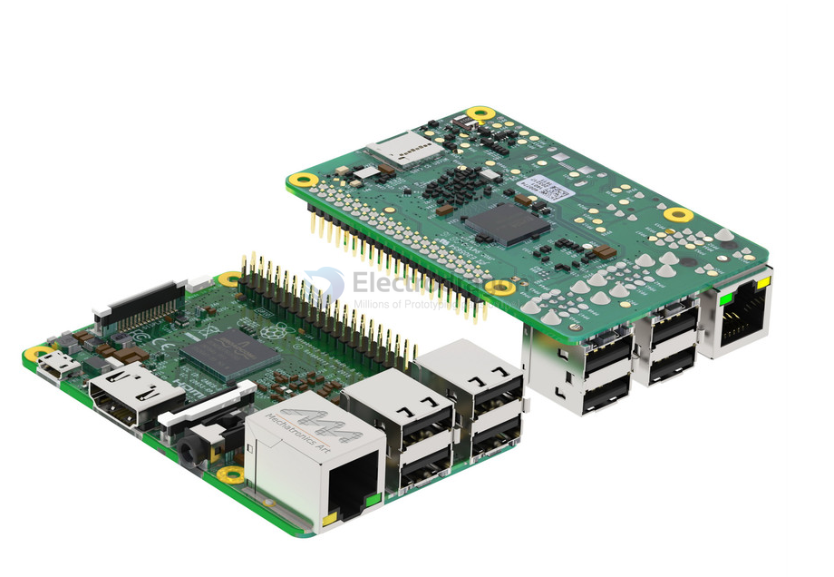
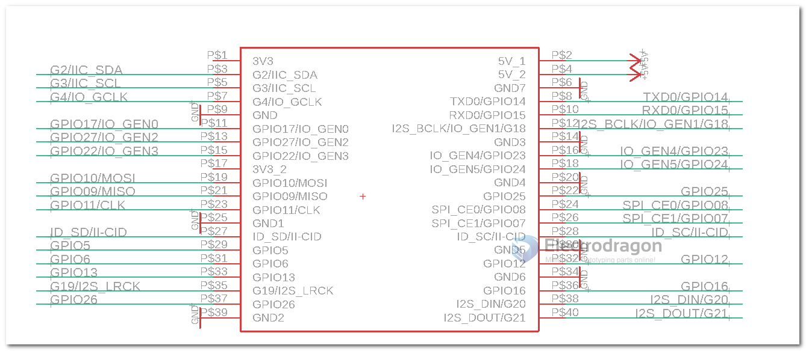

# RPI3-dat

- RPI3 datasheet - https://datasheets.raspberrypi.com/rpi3/raspberry-pi-3-b-plus-product-brief.pdf

## look 

## Pin Definitions 

Version 1 from [[MPC1111-dat]]

The Raspberry Pi 3 has 26 available GPIO pins on its 40-pin header. Some pins are reserved for power, ground, and special functions, but 26 can be used as general-purpose input/output (GPIO).

| usage | Physical Pin | GPIO Number | setup |
| ----- | ------------ | ----------- | ----- |
| x     | 1            | 3.3V        |       |
| x     | 2            | 5V          |       |
|       | 3            | GPIO2       |       |
| x     | 4            | 5V          |       |
|       | 5            | GPIO3       |       |
| x     | 6            | GND         |       |
|       | 7            | GPIO4       |       |
|       | 8            | GPIO14      |       |
| x     | 9            | GND         |       |
|       | 10           | GPIO15      |       |
|       | 11           | GPIO17      |       |
|       | 12           | GPIO18      |       |
|       | 13           | GPIO27      |       |
| x     | 14           | GND         |       |
|       | 15           | GPIO22      |       |
|       | 16           | GPIO23      |       |
| x     | 17           | 3.3V ???    |       |
|       | 18           | GPIO24      |       |
|       | 19           | GPIO10      |       |
| x     | 20           | GND         |       |
|       | 21           | GPIO9       |       |
|       | 22           | GPIO25      |       |
|       | 23           | GPIO11      |       |
|       | 24           | GPIO8       |       |
| x     | 25           | GND         |       |
|       | 26           | GPIO7       |       |
|       | 27           | ID_SD       |       |
|       | 28           | ID_SC       |       |
|       | 29           | GPIO5       |       |
| x     | 30           | GND         |       |
|       | 31           | GPIO6       |       |
|       | 32           | GPIO12      |       |
|       | 33           | GPIO13      |       |
| x     | 34           | GND         |       |
|       | 35           | GPIO19      |       |
|       | 36           | GPIO16      |       |
|       | 37           | GPIO26      |       |
|       | 38           | GPIO20      |       |
| x     | 39           | GND         |       |
|       | 40           | GPIO21      |       |

## CAD version 

- STL or solidworks - https://grabcad.com/library/raspberry-pi-3-reference-design-model-b-rpi-raspberrypi-raspberry-pi-1

- mechanical drawings - https://www.raspberrypi.com/documentation/computers/raspberry-pi.html#raspberry-pi-3-model-b

- sketchup - https://3dwarehouse.sketchup.com/model/b709cb4f71b8864fbfc5d4ab5e803838/Raspberry-Pi-Model-B-Ethernet

## ref 

- [[RPI3]] - [[RPI]]

