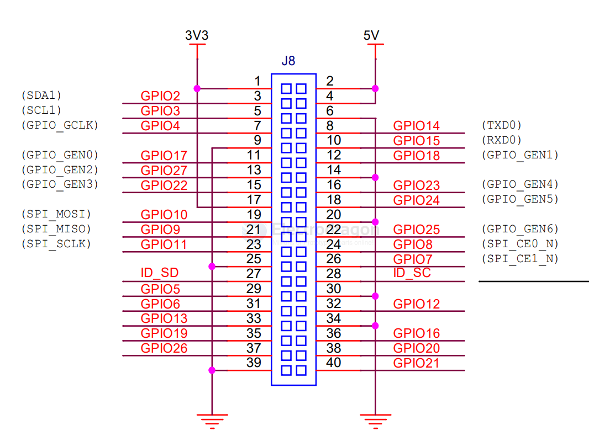

# RPI4-dat

schematic 

https://datasheets.raspberrypi.com/rpi4/raspberry-pi-4-reduced-schematics.pdf

pin definition

ID_SD and ID_SC PINS:

These pins are reserved for HAT ID EEPROM.

At boot time this I2C interface will be interrogated to look for an EEPROM that identifes the attached board and allows automagic setup of the GPIOs (and optionally, Linux drivers).

DO NOT USE these pins for anything other than attaching an I2C ID EEPROM. Leave unconnected if ID EEPROM not required.

