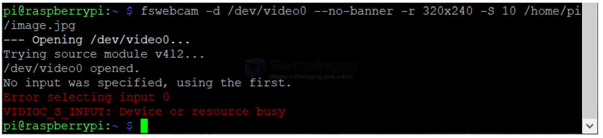
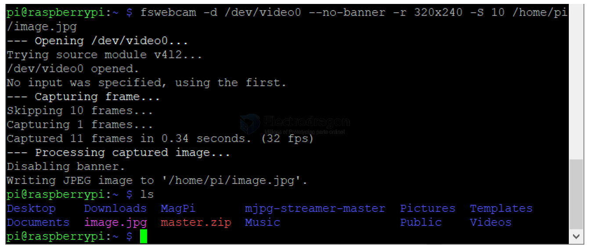

# RPI-camera-dat

projects - [[pi-camera-stream-flask]]

network or local streaming - [[pi-MJPEG-Streamer]] - [[pi-cam-opencv]]

camera stream and GPIOs control - [[pi-cam-flask-control]]

## and 

### mplayer + fswebcam

player and software 

    sudo apt-get install mplayer -y
    sudo apt-get install fswebcam -y

Input following command to view USB camera picture.

    sudo mplayer tv://

After confirming the screen, you need to exit through “ctrl+c” before proceeding to the next operation.

If you run mplayer and use the fswebcam command at the same time, the system will prompt an error that the camera is busy. As shown below.

Input following command to generate a real-time photo taken by the current camera in the /home/pi directory

    fswebcam -d /dev/video0 --no-banner -r 320x240 -S 10 /home/pi/image.jpg

#### Parameter explanation:

- -d -- configure which camera device to use
- --no-banner --- There is no watermark in the photos taken. If this parameter is not used, the system may prompt a wrong font
- -r -- Size of picture
- -S -- Visibility, the range is from 1 to 10. If this parameter is not set or this parameter is set to 0, the photo will be black.
- /home/pi/image.jpg -- Save the image path (if you do not add the path, picture will be saved in the current directory /home/pi/ by default ).

### raspistill

    raspistill -o image.jpg

### raspivid

    raspivid -o video.h264

### picamera
    
        sudo apt-get install python3-picamera

## ref 

- [[RPI-dat]]