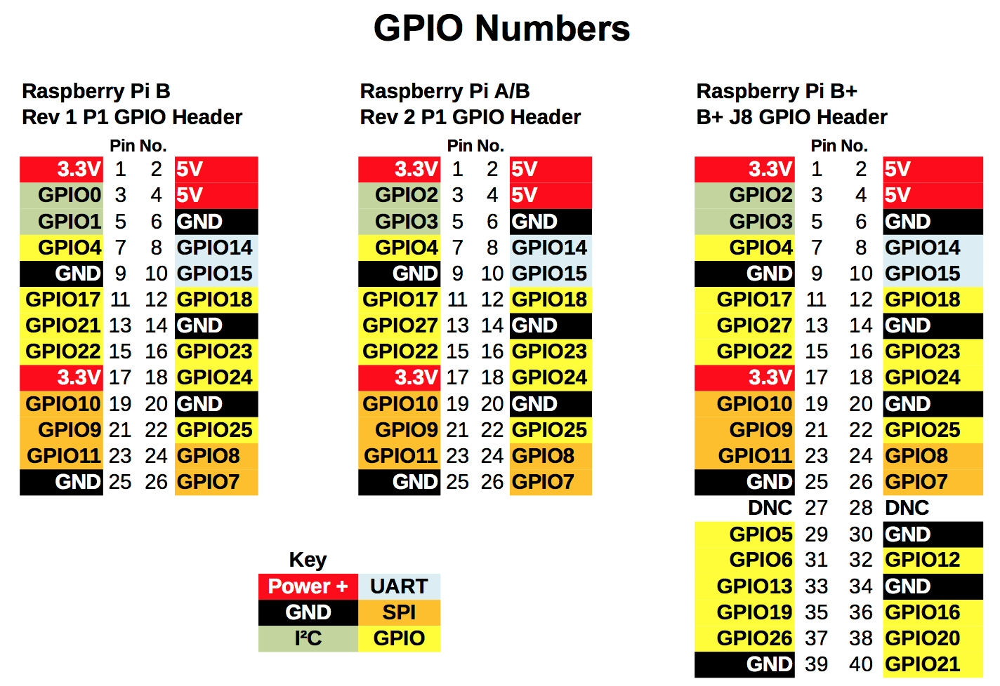
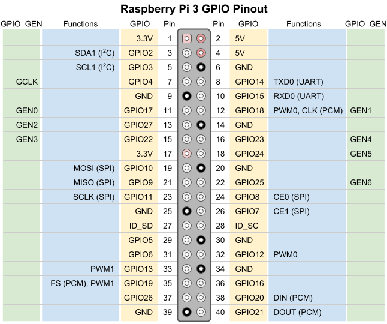

# RPI-pin-dat

## RPI-26P-dat

## pin 

| note   | GPIO | pin | pin | GPIO | note2  |
| ------ | ---- | --- | --- | ---- | ------ |
| 3V3    | -    | 1   | 2   | -    | 5V     |
| SDA    | 2    | 3   | 4   | -    | 5V     |
| SCL    | 3    | 5   | 6   | -    | Ground |
|        | 4    | 7   | 8   | 14   | TXD    |
| Ground | -    | 9   | 10  | 15   | RXD    |
| ce1    | 17   | 11  | 12  | 18   | ce0    |
|        | 27   | 13  | 14  | -    | Ground |
|        | 22   | 15  | 16  | 23   |        |
| 3V3    | -    | 17  | 18  | 24   |        |  
| MOSI   | 10   | 19  | 20  | -    | Ground |
| MISO   | 9    | 21  | 22  | 25   |        |
| SCLK   | 11   | 23  | 24  | 8    | CE0    |
| Ground | -    | 25  | 26  | 7    | CE1    |
| ID_SD  | 0    | 27  | 28  | 1    | ID_SC  |
|        | 5    | 29  | 30  | -    | Ground |
|        | 6    | 31  | 32  | 12   |        |
|        | 13   | 33  | 34  | -    | Ground |
| miso   | 19   | 35  | 36  | 16   | ce2    |
|        | 26   | 37  | 38  | 20   | mosi   |
| Ground | -    | 39  | 40  | 21   | sclk   |

