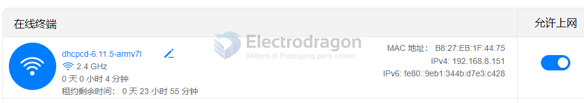

# RPI-setup-dat

- [[RMP-driver-dat-setup]]

## version check 

- "uname -m": is a Linux command that displays the machine architecture.
- "armv7l": indicates a 32-bit ARM architecture, which is used in older Raspberry Pi models.
- "aarch64": indicates a 64-bit ARM architecture, which is used in newer Raspberry Pi models like the Raspberry Pi 4.

## download OS image 

- https://www.raspberrypi.com/software/
- https://www.raspberrypi.com/software/operating-systems/

- 64 bit lite OS - https://downloads.raspberrypi.com/raspios_lite_arm64/images/raspios_lite_arm64-2024-07-04/2024-07-04-raspios-bookworm-arm64-lite.img.xz

## headless 

### login 

- default login user = pi, pass = raspberry  

- reset password - https://forums.raspberrypi.com/viewtopic.php?t=319398

### prewritten wifi config 

create a text file called wpa_supplicant.conf, and place it in the root directory of the microSD card. You will need the following text in the file.

    country=US
    ctrl_interface=DIR=/var/run/wpa_supplicant GROUP=netdev
    update_config=1

    network={
        scan_ssid=1
        ssid="111"
        psk="electrodragon"
    }

### turn on ssh

For Windows: Create a file named ssh, without any extension, on the boot partition of the SD card.

### network 

- [[rpi-dat]] has built-in wifi 

iwconfig

    eth0      no wireless extensions.

    lo        no wireless extensions.

    wlan0     IEEE 802.11  ESSID:"111"  
            Mode:Managed  Frequency:2.472 GHz  Access Point: D0:05:E4:E2:CD:A1   
            Bit Rate=72.2 Mb/s   Tx-Power=31 dBm   
            Retry short limit:7   RTS thr:off   Fragment thr:off
            Encryption key:off
            Power Management:on
            Link Quality=65/70  Signal level=-45 dBm  
            Rx invalid nwid:0  Rx invalid crypt:0  Rx invalid frag:0
            Tx excessive retries:1  Invalid misc:0   Missed beacon:0

- iwgetid will give you the SSID

#### multipe wifi 

https://raspberrypi.stackexchange.com/questions/11631/how-to-setup-multiple-wifi-networks

Edit /etc/wpa_supplicant/wpa_supplicant.conf and add id_str="school" under the schools wpa info and id_str="home" under your homes wpa info. Your file should now look similar to this:

    ctrl_interface=DIR=/var/run/wpa_supplicant GROUP=netdev
    update_config=1

    network={
        ssid="111"
        psk="electrodragon"
        id_str="school"
    }

    network={
        ssid="FF_W"
        psk="123456789"
        id_str="home"
    }

## remove extra apps 

- libreoffice-common
- chromium
- python2.7

## updates 

- check architectures armv7l or aarch64

### sources list 

- /etc/apt/sources.list.d/raspi.list 是存放额外软件源的目录。
- /etc/apt/sources.list 是主要的系统软件源文件。
- /etc/sources.list.d/raspi.list 是与 Raspberry Pi 相关的软件源配置文件。

### setup the CN GFW mirror updating sources 

首先通过 uname -m 确定你使用的系统的架构。

编辑镜像站后，请使用sudo apt-get update命令，更新软件源列表，同时检查您的编辑是否正确。

https://mirrors.tuna.tsinghua.edu.cn/help/raspbian/

选择你的 Raspbian 对应的 Debian 版本 Debian 12 (bookworm)

    deb https://mirrors.tuna.tsinghua.edu.cn/raspberrypi/ bookworm main

- ref https://mirrors.tuna.tsinghua.edu.cn/help/raspberrypi/

## ref 

- [[RPI-dat]]