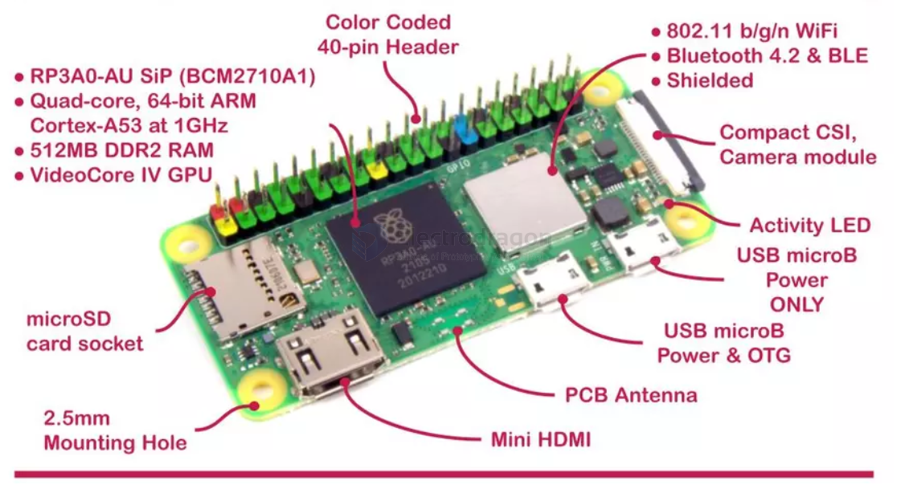

# RPI-zero-dat

【Raspberry Pi Zero 2W Features】

- Broadcom BCM2710A1, 1GHz quad-core 64-bit Arm Cortex-A53 CPU
- 512MB LPDDR2 SDRAM
- 2.4GHz 802.11 b/g/n wireless LAN
- Bluetooth 4.2, Bluetooth Low Energy (BLE), onboard antenna
- Mini HDMI-compatible port and micro USB On-The-Go (OTG) port
- microSD card slot
- CSI-2 camera connector
- HAT-compatible 40-pin header footprint (unpopulated)
- Micro USB power
- Composite video and reset pins via solder test points
- H.264, MPEG-4 decode (1080p30); H.264 encode (1080p30)
- OpenGL ES 1.1, 2.0 graphics

## Common Needed Accessories 

- micro HDMI cable or converter 
- microUSB expansion USB hub or cable 
- MicroUSB power cable 

