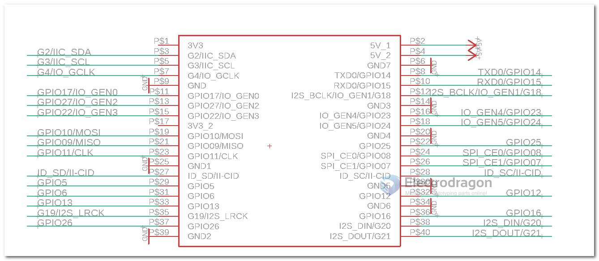

# RPI3-dat

- RPI3 datasheet - https://datasheets.raspberrypi.com/rpi3/raspberry-pi-3-b-plus-product-brief.pdf

## look 

## Pin Definitions 

Version 1 from [[MPC1111-dat]]

## CAD version 

- STL or solidworks - https://grabcad.com/library/raspberry-pi-3-reference-design-model-b-rpi-raspberrypi-raspberry-pi-1

- mechanical drawings - https://www.raspberrypi.com/documentation/computers/raspberry-pi.html#raspberry-pi-3-model-b

- sketchup - https://3dwarehouse.sketchup.com/model/b709cb4f71b8864fbfc5d4ab5e803838/Raspberry-Pi-Model-B-Ethernet

