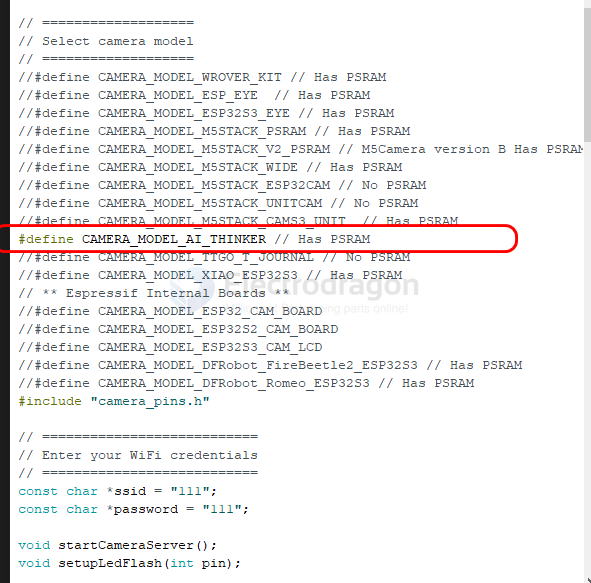
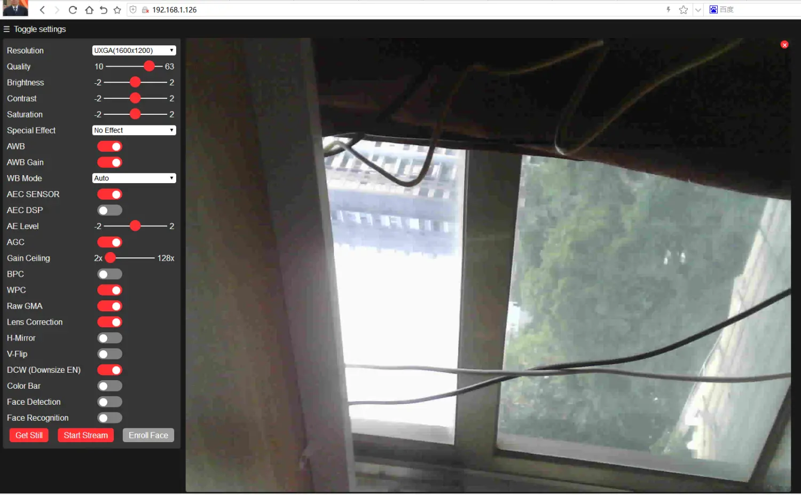
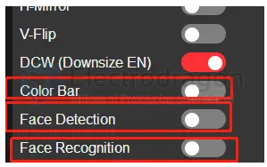

# CAM-dat

- [[OV2640-dat]]

- GC0328

- OV5640
- OV7740
- OV5642
- GC0328 dual camera (horizontal screen) for MF1 only
- OS08A20 camera for M4Ndock

## ESP32 CAM HDK setup 

### official code 

official ESP32 code in examples - ESP32 - camera 

    #elif defined(CAMERA_MODEL_AI_THINKER)
    #define PWDN_GPIO_NUM  32
    #define RESET_GPIO_NUM -1
    #define XCLK_GPIO_NUM  0
    #define SIOD_GPIO_NUM  26
    #define SIOC_GPIO_NUM  27

    #define Y9_GPIO_NUM    35
    #define Y8_GPIO_NUM    34
    #define Y7_GPIO_NUM    39
    #define Y6_GPIO_NUM    36
    #define Y5_GPIO_NUM    21
    #define Y4_GPIO_NUM    19
    #define Y3_GPIO_NUM    18
    #define Y2_GPIO_NUM    5
    #define VSYNC_GPIO_NUM 25
    #define HREF_GPIO_NUM  23
    #define PCLK_GPIO_NUM  22

    // 4 for flash led or 33 for normal led
    #define LED_GPIO_NUM   4

output log 

    [17:36:35.541] ets Jun  8 2016 00:22:57

    rst:0x1 (POWERON_RESET),boot:0x13 (SPI_FAST_FLASH_BOOT)
    configsip: 0, SPIWP:0xee
    clk_drv:0x00,q_drv:0x00,d_drv:0x00,cs0_drv:0x00,hd_drv:0x00,wp_drv:0x00
    mode:DIO, clock div:1
    load:0x3fff0018,len:4
    load:0x3fff001c,len:1100
    load:0x40078000,len:10088
    load:0x40080400,len:6380
    entry 0x400806a4
    [17:36:37.594] 
    [17:36:39.044] .
    [17:36:39.551] .
    WiFi connected
    Starting web server on port: '80'
    Starting stream server on port: '81'
    Camera Ready! Use 'http://192.168.1.126' to connect

Access according to the prompted IP address and connect to the same wifi;
Video is to connect to output more pictures; the larger the picture, the greater the delay;

    [17:40:29.055] MJPG: 45493B 168ms (6.0fps), AVG: 255ms (3.9fps), 0+0+0+0=0 0
    [17:40:29.211] MJPG: 45793B 155ms (6.5fps), AVG: 253ms (4.0fps), 0+0+0+0=0 0
    [17:40:29.370] MJPG: 46325B 159ms (6.3fps), AVG: 255ms (3.9fps), 0+0+0+0=0 0
    [17:40:29.567] MJPG: 46507B 196ms (5.1fps), AVG: 255ms (3.9fps), 0+0+0+0=0 0
    [17:40:29.681] MJPG: 46692B 116ms (8.6fps), AVG: 255ms (3.9fps), 0+0+0+0=0 0
    [17:40:29.860] MJPG: 47077B 176ms (5.7fps), AVG: 255ms (3.9fps), 0+0+0+0=0 0
    [17:40:30.010] MJPG: 47449B 149ms (6.7fps), AVG: 255ms (3.9fps), 0+0+0+0=0 0
    [17:40:30.168] MJPG: 47684B 157ms (6.4fps), AVG: 255ms (3.9fps), 0+0+0+0=0 0
    [17:40:30.330] MJPG: 48014B 166ms (6.0fps), AVG: 256ms (3.9fps), 0+0+0+0=0 0
    [17:40:30.488] MJPG: 48215B 157ms (6.4fps), AVG: 255ms (3.9fps), 0+0+0+0=0 0
    [17:40:30.648] MJPG: 48396B 160ms (6.2fps), AVG: 256ms (3.9fps), 0+0+0+0=0 0
    [17:40:30.811] MJPG: 48359B 159ms (6.3fps), AVG: 255ms (3.9fps), 0+0+0+0=0 0
    [17:40:30.970] MJPG: 48432B 163ms (6.1fps), AVG: 254ms (3.9fps), 0+0+0+0=0 0
    [17:40:31.139] MJPG: 48454B 168ms (6.0fps), AVG: 256ms (3.9fps), 0+0+0+0=0 0
    [17:40:31.296] MJPG: 48644B 154ms (6.5fps), AVG: 256ms (3.9fps), 0+0+0+0=0 0
    [17:40:31.451] MJPG: 48676B 153ms (6.5fps), AVG: 160ms (6.2fps), 0+0+0+0=0 0
    [17:40:31.610] MJPG: 48759B 162ms (6.2fps), AVG: 165ms (6.1fps), 0+0+0+0=0 0
    [17:40:31.797] MJPG: 48763B 183ms (5.5fps), AVG: 161ms (6.2fps), 0+0+0+0=0 0
    [17:40:31.928] MJPG: 48757B 131ms (7.6fps), AVG: 159ms (6.3fps), 0+0+0+0=0 0
    [17:40:32.100] MJPG: 48791B 175ms (5.7fps), AVG: 160ms (6.2fps), 0+0+0+0=0 0
    [17:40:32.249] MJPG: 48805B 144ms (6.9fps), AVG: 159ms (6.3fps), 0+0+0+0=0 0
    [17:40:32.418] MJPG: 48861B 167ms (6.0fps), AVG: 159ms (6.3fps), 0+0+0+0=0 0
    [17:40:32.569] MJPG: 48839B 156ms (6.4fps), AVG: 159ms (6.3fps), 0+0+0+0=0 0
    [17:40:32.747] MJPG: 48830B 173ms (5.8fps), AVG: 158ms (6.3fps), 0+0+0+0=0 0
    [17:40:34.268] MJPG: 48848B 1526ms (0.7fps), AVG: 228ms (4.4fps), 0+0+0+0=0 0
    [17:40:34.348] MJPG: 48822B 75ms (13.3fps), AVG: 223ms (4.5fps), 0+0+0+0=0 0
    [17:40:34.660] MJPG: 48825B 311ms (3.2fps), AVG: 232ms (4.3fps), 0+0+0+0=0 0
    [17:40:34.817] MJPG: 49600B 158ms (6.3fps), AVG: 232ms (4.3fps), 0+0+0+0=0 0
    [17:40:34.978] MJPG: 48805B 160ms (6.2fps), AVG: 231ms (4.3fps), 0+0+0+0=0 0

You can adjust various parameters, such as brightness and white balance.
esp32-cam can even perform face recognition, which is amazing;

You can capture pictures or transmit face recognition to the backend server;

- For example, use a transparent transmission chip similar to sim800l;
- https://github.com/carrascoacd/ArduinoSIM800L
- You can also send data through at commands;
- https://github.com/erdemarslan/GSMSim
- You can also run mqtt;
- https://github.com/martinhol221/SIM800L_MQTT
- nb-iot Arduino development, sim7020 chip
- https://github.com/pornpol/NB_Meter_SIM7020E
- https://create.arduino.cc/projecthub/voske65/arduino-nb-iot-with-sim7020-and-t-mobile-027f8f
- Image reporting reference
- https://github.com/raphaelbs/esp32-cam-ai-thinker
- https://github.com/yoursunny/ESP32-CAM-OV2640/blob/master/examples/WiFiCam/WifiCam.ino

### more repo

- https://github.com/Ai-Thinker-Open/Ai-Thinker-Open_ESP32-S2-CAMERA_LAN
- https://github.com/Ai-Thinker-Open/Ai-Thinker-Open_ESP32-CAMERA_WAN
- https://github.com/Ai-Thinker-Open/Ai-Thinker-Open_ESP32-CAMERA_LAN
- https://docs.m5stack.com/#/zh_CN/unit/esp32cam

