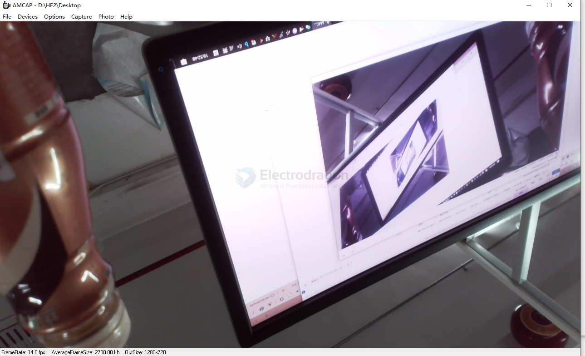

# USB-camera-dat

the usb camera is a camera that can be connected to a computer via USB interface, and based on the UVC protocol, it can be used as a camera device on the computer.

## software 

- ancient fotware AMCAM == [[AMCap.exe]] or [[AMCap.zip]]

an image capture of nescafe and PC

## ref

- [[camera-dat]]