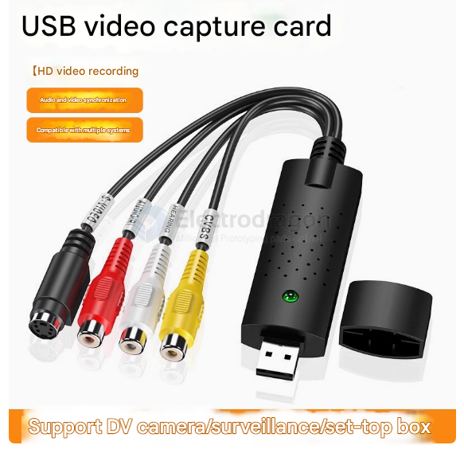
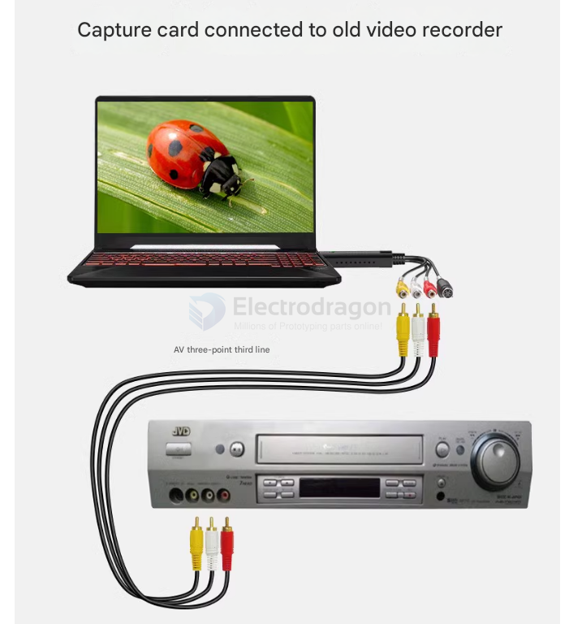
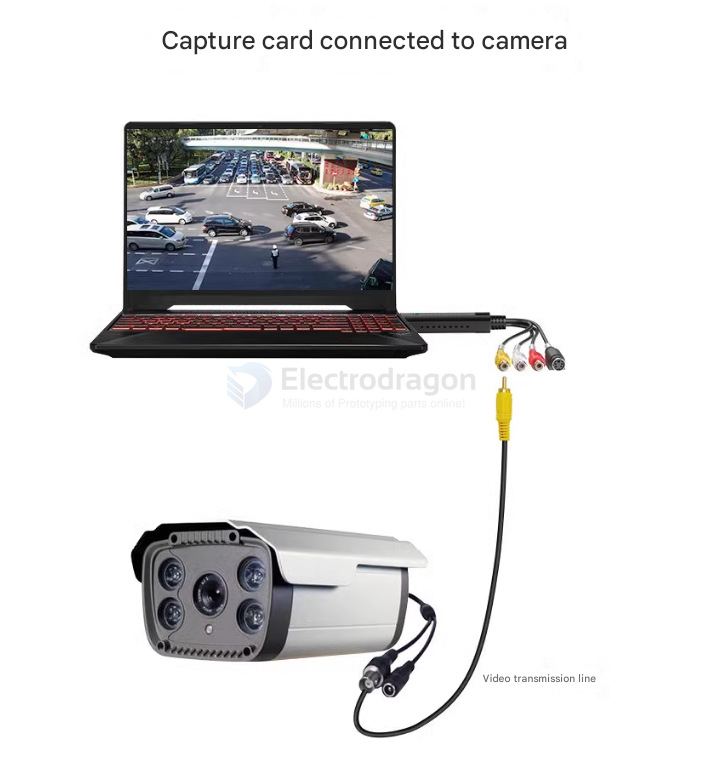

# analog-video-dat

- [[s-video-dat]]

## Get the Necessary Equipment

**Analog-to-Digital Converter (Video Capture Device)**

USB video capture card (e.g., EZCAP, Elgato Video Capture, or similar)

PCIe capture card (for desktops)

**Cables & Adapters**

RCA (Composite) or S-Video cables (depending on your video source)

SCART adapter (if using older European devices)

**A VCR, camcorder, or other playback device**

If you're converting VHS, you'll need a working VCR

For Hi8, you'll need a compatible camcorder

## Connect the Hardware
   
**Plug the video source into the capture device**

Connect the RCA (yellow, red, white) or S-Video cables from the VCR/camcorder to the capture device.

**Connect the capture device to your PC**

Most video capture devices connect via USB.

**Power on the video source**

Insert the VHS tape or video cassette and start playback.