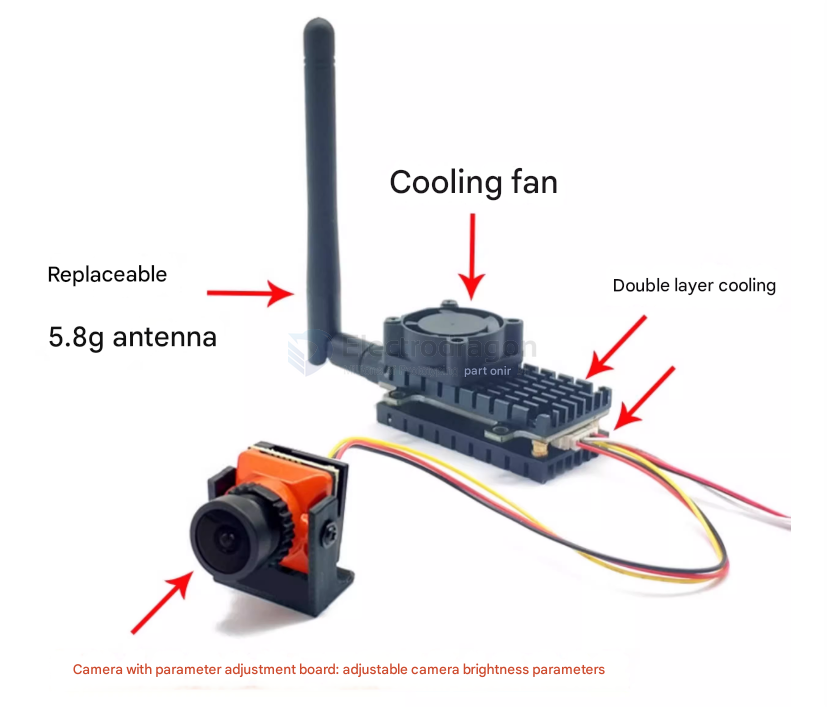
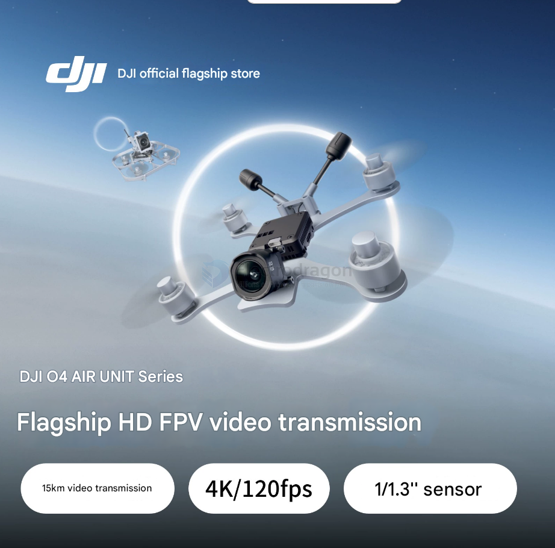

# wireless-camera-dat

- [[wifi-camera-dat]]

## applications 

- [[FPV-dat]] - [[surveillance-dat]]

## FPV transmission

### DJI O4 vs Analog Video Camera

Comparing DJI O4 and analog video cameras involves several aspects. Here's a breakdown:

**Summary Table**

| Feature       | DJI O4 (Digital) | Analog Video Camera |
| ------------- | ---------------- | ------------------- |
| Image Quality | **High**         | Low                 |
| Range         | **Long**         | Short               |
| Features      | **Advanced**     | Basic               |
| Complexity    | High             | **Low**             |
| Cost          | High             | **Low**             |
| Interference  | **Low**          | High                |

### Can a 2W Analog FPV Transmission System Run 24/7?

**Yes, but with precautions:**

#### ✅ Conditions for Safe 24/7 Operation:
- **Good cooling** (heatsink + fan recommended)
- **Stable power supply**
- **Antenna always connected**
- **High-quality VTX components**

#### ⚠️ Risks:
- Overheating
- Component wear/failure
- Possible RF interference

#### 🔧 Tips:
- Add active cooling
- Use lower power if long range isn’t needed
- Monitor temperature
- Consider industrial-grade VTX or digital systems for reliability

## Analog FPV Transmission System

## DJI O4 Air FPV Transmission System

## ref 

- [[camera-dat]]